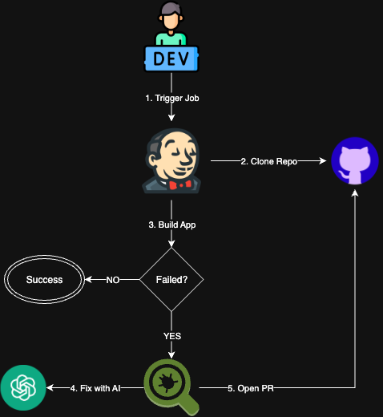

# AI Agent for bugfix
This repository contains an AI agent designed to assist in identifying and fixing bugs in code. The agent leverages advanced machine learning techniques to analyze codebases, detect potential issues, and open pull request with appropriate fixes.

We're using this both repositories as two demo project for the AI agent. It is a simple Spring Boot application with a few intentional bugs.
And a backend in NODE.JS

https://github.com/codegik/springboot-context-jdk24

https://github.com/cireneuguilhermeteixeira/node-backend

## Overview



## Setup .env
Create `.env` file and add make sure you have your OpenAI API token and SSL certificate file ready.

```shell
# Jenkins Admin Credentials
JENKINS_ADMIN_USER=admin
JENKINS_ADMIN_PASSWORD=your-secure-password-here

# SSL Certificate (adjust path as needed)
JENKINS_SSL_CERT_FILE=/path/to/your/certificate.pem

# API Tokens (if needed)
OPENAI_API_TOKEN=your-openai-token-here
GITHUB_TOKEN=your-github-token-here
```

### Installation

1. **Install Python 3.11.13 using pyenv:**
   ```bash
   pyenv install 3.11.13
   pyenv local 3.11.13  # Set for current project
   ```

2. **Install uv package manager:**
   ```bash
   pip install uv==0.7.11
   ```

3. **Create and activate virtual environment:**
   ```bash
   uv venv
   source .venv/bin/activate
   ```

4. **Install dependencies:**
   ```bash
   uv pip install -r requirements.txt
   ```
   
## Running

1. Start the application using Podman Compose.
```shell
podman compose up
```

2. Access Jenkins at `http://localhost:8080` and log in with the default user `admin` and the password you can find the Jenkins logs.

3. Go to Job `springboot-context-jdk24` and click on `Build`.

4. Have fun! The AI agent will analyze the code, identify bugs, and open pull requests with fixes.

## Extra helpers

* Clean docker env
```shell
./clean.sh
```

* Get jenkins password
```shell
./get-jenkins-password.sh
```
