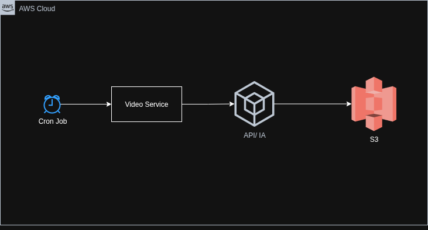
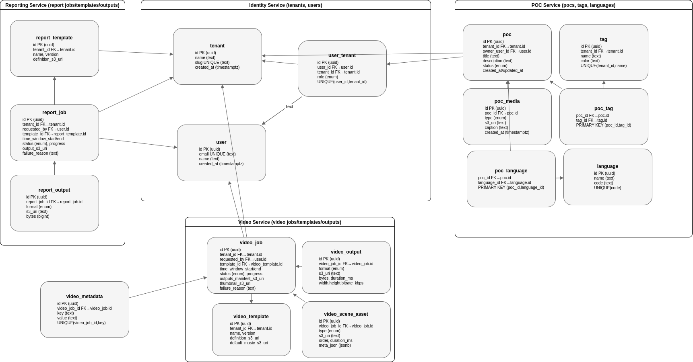

# 🧬 Architecture overview

# 1. 🏛️ Structure

## 1.1 🎯 Problem Statement and Context

MR Bill, wants a system to keep track of his favorite pocs, so you need to build a mobile app where mr Bill can register all his pocs, and also he needs to be able to search pocs, by name, by language and by tags.

This system should be multi-tenant because mr bill will sell such system to bunch of people in brazil, such system must have also ability to generate repots and generate a video with the all pocs the users did in 1 year.

Such system must be secure and have proper login and be able to support Realtime dojos using mr bill platform you will build for him.

## 1.2 Restrictions
- Lambda
- Monoliths
- Single AZ Solutions
- Mobile: Ionic
- Single language for mobile - it needs to be “native”
- MongoDB
- Single Relational DB
- Other Clouds that are not AWS

## 1.3 Problem Space

**What is the problem?**
Currently, developers and teams lack a centralized, collaborative platform to track and manage their Proof of Concepts (POCs). 

Most teams resort to scattered solutions like structure of folders in Git, or basic project management tools that don't cater to the specific needs of POC lifecycle management. 

This leads to lost knowledge, duplicated efforts, and missed opportunities for learning and collaboration.

**What is the context of the problem?**
- **Market Context**: The Brazilian tech market is rapidly growing with numerous development teams and freelancers who need better POC management tools
- **Business Context**: Mr. Bill has identified a commercial opportunity to create a SaaS platform that can serve multiple tenants (teams/organizations)
- **Technical Context**: Teams need real-time collaboration capabilities, especially for "dojos" (collaborative coding sessions), which existing tools don't support effectively
- **User Context**: Developers need to quickly search and retrieve POCs by multiple criteria (name, technology stack, tags) to avoid reinventing solutions

**Core Challenges:**
- **Knowledge Silos**: POCs created in isolation without team visibility or collaboration
- **Discovery Problem**: Inability to efficiently search and find relevant POCs when needed
- **Collaboration Gap**: No real-time collaboration tools specifically designed for POC development sessions
- **Documentation Debt**: Lack of standardized reporting and knowledge capture from POC learnings
- **Scalability Need**: Solution must support multiple independent organizations (multi-tenancy) with complete data isolation

# 2. 🎯 Goals

- Build a scalable multi-tenant POC tracking platform
- Provide native mobile applications for iOS and Android
- Implement real-time collaboration for dojos
- Generate automated reports and video summaries
- Ensure high availability across multiple AWS availability zones
- Support secure user authentication and tenant isolation

# 3. 🎯 Non-Goals

- Supporting non-AWS cloud providers
- Building monolithic applications
- Using serverless Lambda functions
- Implementing single-language mobile solutions
- Relying on single relational database
- Support for Legacy Browsers
- Will not build a Git replacement, will integrate with existing version control systems instead.
- Will not use AWS Lambda or other serverless functions.
- Will not build general chat or video conferencing; real-time features are limited to dojo collaboration.
- Will not include POC trading, selling, or commercial marketplace functionality.

# 4. 📐 Principles

- **Multi-tenancy**: Complete tenant isolation for data and users
- **Microservices**: Distributed architecture with independent services
- **Native Mobile**: Platform-specific mobile applications
- **Cloud-Native**: Services designed for AWS cloud infrastructure
- **Real-time**: WebSocket-based communication for live features
- **Security First**: Zero-trust architecture with proper authentication

# 5. 🏗️ Overall Diagrams

## 5.1 🗂️ Overall architecture

This is an AWS-based architecture that supports multi-tenancy (Tenant A, Tenant B, …) with multi-availability zone (AZ) deployment for high availability, scalability, and isolation.

The architecture combines static file delivery (frontend), API Gateway with authentication (backend APIs), and Kubernetes-managed microservices (EKS worker nodes) with supporting databases, caches, and search services.

## 5.2 🗂️ Deployment

### App deployment

- **Multi-AZ AWS deployment**
- **EKS clusters** for container orchestration
- **RDS Multi-AZ** for PostgreSQL databases
- **ElastiCache** for Redis caching
- **S3** for file storage and video assets
- **CloudFront** for CDN distribution

### Tenant deployment

## 5.3 🗂️ Use Cases  (TBD: need to create the diagrams)

- User registration and tenant onboarding
- POC creation, editing, and management
- Search POCs by name, language, and tags
- Real-time dojo collaboration
- Report generation and analytics
- Annual video compilation creation
- User authentication and authorization

## 5.4 📱 End-to-End Mobile Flows

Native apps are clients only: no local database, no background jobs. All storage, search, reports, and video generation run on the backend.

### 5.4.1 Login & Auth (OIDC + PKCE)

User opens Android (Kotlin/Compose) or iOS (Swift/SwiftUI).
App resolves tenant (subdomain or discovery API) → gets Keycloak realm/base URLs.
OIDC via AppAuth (system browser / ASWebAuthenticationSession) with PKCE.
Access/Refresh tokens stored in secure storage (Android EncryptedSharedPreferences; iOS Keychain).
All REST/WS calls use Bearer token; refresh via standard OIDC flow; logout clears secure storage.

### 5.4.2 Search POCs

User types → client debounces.
App calls Search API (Gateway → Search svc → OpenSearch) scoped by tenant_id claim.
Results are paginated.
Offline behavior: read-only placeholder with “retry” (no local cache write).

### 5.4.3 Real-time Dojo (WebSocket)

Client opens WS (Gateway/Ingress → Dojo service) including tenant_id + user claims.
Real-time operations delivered via WS; client handles reconnect with exponential backoff.
Server is the source of truth; client maintains in-memory state only.

### 5.4.4 Uploads / Reports / Video

App requests pre-signed S3 URL; uploads directly (multipart for large files).
Job status polled via API or notified by push when ready.
Downloads with pre-signed GET; transient in-memory usage (no persistent cache).

## 5.5 🔒 Mobile Security

OIDC/OAuth2 with short-lived access tokens + refresh rotation.
Secure storage only for tokens (no PII at rest on device).
Best-effort jailbreak/root checks; sensitive screens may enable screenshot masking (tenant-configurable).
Certificate pinning optional (rotated via AppConfig).
No credentials in logs; minimal analytics payloads.

## 5.6 🔔 Push Notifications

SNS → FCM (Android) e SNS → APNs (iOS).
Topics by tenant/feature (e.g. tenant-{id}-dojo, tenant-{id}-jobs).
Deep links to specific screens (dojo session, job detail).

# 6. 🧭 Trade-offs

## Native Mobile vs Cross-platform

| **Aspect**                   | **Native Mobile (Swift/Kotlin, etc.)**                                                | **Cross-platform (Flutter, React Native, etc.)**                                       |
|------------------------------|---------------------------------------------------------------------------------------|----------------------------------------------------------------------------------------|
| **Development Speed & Cost** | Slower, more expensive (separate codebases for iOS & Android).                        | Faster, cheaper (one codebase for multiple platforms).                                 |
| **Performance**              | Best performance, optimized for each OS, smooth animations, ideal for graphics/AR/VR. | Slightly lower performance due to abstraction layer; may struggle with heavy graphics. |
| **Access to Features**       | Immediate access to latest OS/device APIs (camera, sensors, biometrics, ARKit, etc.). | May lag in supporting new APIs; often requires custom native modules.                  |
| **User Experience (UX/UI)**  | Feels “native” — adheres to platform design guidelines (HIG/Material).                | Can get close, but sometimes inconsistent or less polished across devices.             |
| **Maintenance**              | Higher effort: must maintain two separate apps.                                       | Easier maintenance: one codebase to fix/update for both platforms.                     |
| **Talent/Skills Needed**     | Requires iOS + Android specialists.                                                   | One dev team can cover both platforms (JavaScript, Dart, etc.).                        |

## Microservices vs Monolith

| **Aspect**               | **Monolith**                                          | **Microservices**                                                           | **Trade-off / Notes**                                                                                                                                                |
|--------------------------|-------------------------------------------------------|-----------------------------------------------------------------------------|----------------------------------------------------------------------------------------------------------------------------------------------------------------------|
| **Complexity**           | Lower – single codebase, simpler to develop initially | Higher – many services, distributed system challenges                       | Monolith is easier to start with; microservices require infrastructure for service coordination, deployment, and monitoring                                          |
| **Scalability**          | Limited – entire application scales together          | High – individual services can scale independently                          | Microservices allow precise resource allocation, but add operational complexity                                                                                      |
| **Deployment**           | Simple – deploy the whole application at once         | Flexible – deploy services independently                                    | Microservices enable faster iteration for parts of the system but require CI/CD pipelines and orchestration tools                                                    |
| **Resilience**           | Lower – failure in one part can affect entire app     | Higher – failures are isolated to services                                  | Microservices improve fault tolerance, but require careful handling of inter-service communication                                                                   |
| **Development Speed**    | Faster initially – single team, shared codebase       | Can be faster at scale – multiple teams work on different services          | Monolith is faster for small teams; microservices are better for large, distributed teams                                                                            |
| **Technology Choice**    | Limited – typically one tech stack                    | Flexible – each service can use best-suited tech                            | Microservices allow polyglot programming but increase operational overhead                                                                                           |
| **Testing**              | Easier – end-to-end testing in a single app           | Harder – testing interactions across services                               | Microservices require robust integration and contract testing                                                                                                        |
| **Observability**        | Moderate – single app logs, metrics easier to collect | Critical – must implement distributed tracing, centralized logging, metrics | Microservices require robust observability practices to detect issues across services; Monolith is easier to monitor but harder to isolate root causes in large apps |
| **Operational Overhead** | Low – fewer deployments, less monitoring              | High – service discovery, logging, monitoring, orchestration                | Microservices need more DevOps maturity to manage efficiently                                                                                                        |

## EKS vs ECS

| **Aspect**                     | **ECS (Elastic Container Service)**                                    | **EKS (Elastic Kubernetes Service)**                                  | **Trade-off / Notes**                                                                                                  |
|--------------------------------|------------------------------------------------------------------------|-----------------------------------------------------------------------|------------------------------------------------------------------------------------------------------------------------|
| **Complexity**                 | Lower – managed container orchestration, simpler setup                 | Higher – Kubernetes has steep learning curve                          | ECS is easier for teams new to container orchestration; EKS gives full Kubernetes features but requires more expertise |
| **Flexibility**                | Moderate – AWS-native features, some limitations                       | High – full Kubernetes ecosystem, supports multi-cloud portability    | EKS allows more customization and standard Kubernetes tools; ECS is AWS-specific but simpler                           |
| **Deployment & Management**    | Simpler – integrates tightly with AWS, less operational overhead       | More complex – need to manage clusters, nodes, and Kubernetes objects | ECS is faster to deploy; EKS offers more granular control and standardization                                          |
| **Scalability**                | High – integrates with Auto Scaling, Fargate for serverless containers | High – Kubernetes-native autoscaling, multi-cluster management        | Both scale well; EKS gives more control at cost of complexity                                                          |
| **Community & Ecosystem**      | AWS-focused – smaller ecosystem outside AWS                            | Kubernetes ecosystem – large, active community and tools              | EKS benefits from portability and community support; ECS is simpler but AWS-locked                                     |
| **Observability & Monitoring** | AWS CloudWatch integration, simpler metrics/logs                       | Kubernetes-native tools (Prometheus, Grafana) plus CloudWatch         | ECS is easier to monitor by default; EKS provides more flexibility for advanced observability setups                   |
| **Cost**                       | Lower for small/simple workloads – less management overhead            | Higher – cluster management costs, but flexible with Fargate          | ECS is cost-efficient for simpler use cases; EKS scales better for complex or multi-team environments                  |
| **Operational Overhead**       | Low – managed service, minimal Kubernetes knowledge required           | Higher – need Kubernetes expertise, more components to maintain       | ECS is “easier to run”; EKS offers powerful orchestration but requires DevOps maturity                                 |

## Database per tenant vs Shared Database

| **Aspect**                             | **Database-per-Tenant**                                    | **Shared Database**                                              | **Trade-off / Notes**                                                                     |
|----------------------------------------|------------------------------------------------------------|------------------------------------------------------------------|-------------------------------------------------------------------------------------------|
| **Data Isolation & Security**          | Excellent – full isolation per tenant                      | Moderate – relies on row-level separation                        | Per-tenant DB is safer for compliance; shared DB requires careful access control          |
| **Scalability**                        | High – scale individual tenant DBs independently       | Moderate – fewer databases to manage, easier horizontal scaling      | Shared DB reduces operational overhead but can have noisy neighbor issues                 |
| **Maintenance & Operational Overhead** | Higher – schema changes, backups, and upgrades per DB      | Lower – single schema, single DB to maintain                     | Shared DB is simpler to manage at scale; per-tenant DB needs automation                   |
| **Customizability**                    | High – schema or configuration can differ per tenant       | Low – all tenants share same schema                              | Useful if tenants need unique features or data structures                                 |
| **Cost**                               | Higher – more storage, connections, and resources          | Lower – single DB shared across tenants                          | Shared DB is more cost-efficient, but can impact isolation                                |
| **Performance**                        | High – tenant workloads don’t interfere                    | Moderate – tenants share resources, may cause contention         | Database-per-tenant offers better isolation; shared DB can have “noisy neighbor” issues   |
| **Observability & Monitoring**         | Moderate – per-DB metrics, easier to isolate tenant issues | Moderate – monitoring per tenant requires filtering in shared DB | Easier to detect issues in per-tenant DBs, but shared DB can still be monitored centrally |
| **Deployment Complexity**              | Moderate – each new tenant needs new DB                    | Low – new tenant only adds rows                                  | Shared DB simplifies onboarding; per-tenant DB increases operational steps                |

## Authorization tokens with tenant_id vs Subdomain with tenant_id

| **Aspect**                           | **Token with `tenant_id`**                                   | **Subdomain with `tenant_id`**                                         | **Trade-off / Notes**                                                                                |
|--------------------------------------|--------------------------------------------------------------|------------------------------------------------------------------------|------------------------------------------------------------------------------------------------------|
| **Tenant Identification**            | Explicitly carried in token, verified server-side            | Derived from URL/subdomain, resolved on request                        | Tokens embed tenant info securely; subdomain approach relies on request parsing                      |
| **Security & Isolation**             | High – token validation ensures tenant isolation             | Moderate – subdomain can be spoofed, requires additional server checks | Tokens are less prone to tampering; subdomain approach can be combined with token for extra security |
| **Routing & Multi-Tenant Awareness** | No impact on routing – backend uses token for tenant context | Natural routing – requests automatically mapped to tenant via URL      | Subdomains simplify routing logic; tokens centralize tenant info in authorization layer              |
| **User Experience**                  | Same URL for all tenants                                     | Unique URL per tenant                                                  | Subdomains are easier for branding/custom login pages; tokens don’t affect URL                       |
| **Operational Overhead**             | Moderate – token management, validation, refresh             | Moderate – DNS/subdomain management, SSL certificates per tenant       | Both approaches add overhead in different areas; combining them can increase complexity              |
| **Auditing & Logging**               | High – tenant_id in token allows tracking actions            | Moderate – tenant inferred from request URL                            | Token-based approach gives precise, secure tenant context in logs                                    |
| **Scalability**                      | High – token approach scales with users                      | High – subdomain approach scales with DNS/tenant routing               | Both scale well, but subdomains require proper DNS and routing infrastructure                        |

## 6.1 Major Decisions

### Native Mobile vs Cross-platform
- Native apps are compiled into machine code.
- Gives them faster execution, smoother animations, better responsiveness, and more efficient memory use compared to cross-platform frameworks.
- Native apps get direct access to OS APIs and hardware (camera, GPS, NFC, sensors, biometrics, push notifications).
- This gives users a familiar, consistent look & feel and better accessibility support.

### Microservices vs Monolith
- Microservices let you scale only the components that need more resources (e.g., just the “payment service” during Black Friday).
- Each microservice can be developed, deployed, and updated independently, often by different teams.
- A failure in one microservice (e.g., recommendations service) does not crash the entire system.

### PostgreSQL vs NoSQ
- PostgreSQL is fully ACID-compliant by default (Atomicity, Consistency, Isolation, Durability).
- PostgreSQL supports powerful SQL queries, joins, aggregations, subqueries, window functions, and advanced indexing.
- PostgreSQL enforces a well-defined schema, ensuring data quality and structure.

### EKS vs ECS
- EKS runs Kubernetes for you — AWS manages the control plane (API server, etcd, scheduler).
- EKS integrates natively with Cluster Autoscaler and Horizontal Pod Autoscaler, adjusting resources automatically.
- EKS is designed for containerized microservices, making it easier to run modern architectures.

### Real-time features with WebSocket vs Polling
- Updates are pushed instantly from server → client (and vice versa).
- Reduces unnecessary network requests and bandwidth usage.
- WebSocket enables smooth, continuous interactions (live chats, stock tickers, multiplayer games, collaborative editing).

### Database per tenant
- Each tenant’s data lives in its own dedicated database → no risk of cross-tenant data leaks.
- Heavy usage by one tenant won’t slow down others since queries and workloads are isolated.
- You can upgrade schemas, tune indexes, or apply patches per tenant without impacting others.

### Authorization
- Authorization tokens (JWT, OAuth2, etc.) carry the tenant identifier (tenant_id/realm/claims).
- All services can consistently extract tenant_id from authorization → uniform logic across microservices.
- Since every request is tied to an authenticated identity + tenant_id, you get a clear audit trail (who accessed what, from which tenant).

## 6.2 🌏 For each key major component

### CloudFront + S3
- Amazon S3 stores static files (e.g., HTML, JS, CSS, media).
- CloudFront CDN serves those files efficiently, caching them at edge locations for low latency.

### Route 53 + Global Accelerator
- Amazon Route 53 provides DNS resolution and routing.
- AWS Global Accelerator ensures optimized global network routing, directing traffic to the nearest healthy endpoint across regions.

### Application Load Balancer (ALB) + Web Application Firewall (WAF)
- WAF should be attached to component that handles HTTP/HTTPs
- WAF inspects and filter incoming requests to ALB
- ALB distribute incoming requests to API Gateway

### API Gateway (in each AZ)
- Manages API requests.
- Provides features like request validation, throttling, and routing to backend microservices.

### Keycloak Authorizer
- Handles user authentication & authorization.
- Ensures only authenticated requests with valid credentials can access protected APIs.
- Likely integrated with API Gateway as a custom authorizer.

### Multi-Tenant Kubernetes Layer (EKS)
Each tenant (A, B, …) has its own dedicated set of microservices and supporting resources, deployed in EKS clusters.

**EKS Worker Nodes**
- Host containerized applications.
- Provide compute resources for services (scalable per tenant). 

**Ingress Controller**
- Manages routing of external traffic to internal Kubernetes services.
- Acts as a single entry point per tenant to expose microservices.

**Microservices**
- Each tenant has its own isolated microservices for business logic.
- Services communicate internally through Kubernetes networking.

### Data Layer (per Tenant)
Each tenant has isolated storage & caching components for data separation and performance.

**Aurora PostgreSQL (RDS)**
- Primary DB instance for writes.
- Read replicas for scaling read-heavy workloads.
- Ensures high availability across AZs.

**Elasticache**
- Provides in-memory caching.
- Reduces load on Aurora/Postgres by serving frequent queries.

**PGSync**
- Uses CDC (database change capture) to replicate data.
- Converts SQL rows into JSON and pushes into OpenSearch indices.

**OpenSearch**
- Used for full-text search, log analytics, or real-time indexing.
- Each tenant has a primary node + read replicas for scalability.

**High Availability & Fault Tolerance**

Multi-AZ Deployment
- Architecture spans three availability zones, ensuring that failure in one AZ does not affect overall availability.
- Aurora, OpenSearch, and Elasticache are deployed in HA mode with primary and read replicas across zones.

Load Balancing
- Ingress controllers distribute requests across microservices.
- API Gateway and Global Accelerator balance API calls globally.

**Multi-Tenancy Strategy**

Tenant Isolation
- Each tenant (A, B, …) has separate EKS services, DBs, caches, and search resources.
- Provides strong security and performance isolation.

Shared Infrastructure
- Core infrastructure (Route 53, Global Accelerator, API Gateway, CloudFront, S3) is shared across all tenants.
- Reduces operational cost while still maintaining tenant-level isolation at the application and data layer.

# 7. 💾 Migrations

We don't have migration for this architecture since its a new system.

# 8. 🧪 Testing strategy

## Frontend Tests
- ReactJS component rendering tests with focus on performance metrics.
- Client-side state management tests.
- WebSocket client implementation tests.

## Contract tests
- Test API contracts between decomposed microservices.
- Verify WebSocket message formats and protocols.
- Validate data synchronization contracts between PostgreSQL and OpenSearch.

## Integration tests
- Try to cover most of the scenarios.
- Test WebSocket real-time communication flows.
- Run in isolated environments before production deployment.

## Infra tests
- Verify PGsync data synchronization between Aurora and OpenSearch.
- Test CloudFront edge caching effectiveness.
- Validate Global Accelerator routing behavior.

## Performance tests
- Use K6 to simulate the user behavior and check the system's performance.
- Test search latency using OpenSearch under various query patterns.
- Measure database query performance under load
- Measure UI rendering time across device types
- Benchmark WebSocket vs HTTP performance in real usage scenarios
- Track CDN cache hit/miss ratios
- Execute in staging environment with production-like conditions

## Chaos tests
- Simulate AWS region failures to test Global Accelerator failover
- Test WebSocket reconnection strategies during network disruptions
- Inject latency between services to identify performance bottlenecks
- Verify system behavior during PGsync failures
- Execute in isolated production environment during low-traffic periods

## Mobile testing

- Unit Android: ViewModel/repository with JUnit.
- Unit iOS: XCTest with async/await; mocks per protocol.
- UI Android: Espresso for flows (login, search, dojo).
- UI iOS: XCUITest with LaunchArguments for mocks.
- Network/Contract: MockWebServer (Android) / URLProtocol stub (iOS); Pact consumer tests for contracts with the backend.
- Performance: Cold start and WS connection times measured in CI (staging).
- Accessibility: Basic TalkBack/VoiceOver per critical screen.

# 9. 👀 Observability strategy

Observability-based testing in production (also called "testing in production" or "production testing") uses monitoring, logging, and tracing data to validate system behavior after deployment.

There will be an event notifier that is going to log all operations.

There will be a dashboard to expose metrics and performance.

There will be alerts to notify the team about any issue.

Here are the key approaches:

## Synthetic Monitoring
Collect features metrics (latency, counters, etc) continuously to validate critical user journeys.

## Real User Monitoring
Track actual user interactions and performance metrics:
- ReactJS component render times
- WebSocket connection success rates
- Search result relevance and speed
- Page load times across different regions

## Error Rate Monitoring 
Set up alerts for anomalies in:
- WebSocket connection failures
- OpenSearch query timeouts
- Aurora PostgreSQL connection pool exhaustion
- CloudFront 5xx errors

## Business Metrics Validation
Monitor business KPIs to detect regressions:
- POC Creation Rate
- Active User Rate
- Session Duration
- Feature Adoption Rate
- Search Response Time
- Mobile App Crash Rate
- Tenant Onboarding Time
- Report Generation Time
- Video Compilation Time

# 10. 💿 Data Store Designs (TBD: need to create diagrams)

- **Primary Database**: PostgreSQL (RDS Multi-AZ) for transactional data
    - Tenant-specific schemas for data isolation
    - POC metadata, user profiles, and tenant configurations
- **Search Database**: Elasticsearch cluster for POC search functionality
    - Indexed by name, language, tags, and content
- **Cache Layer**: Redis (ElastiCache) for session management and frequent queries
- **File Storage**: S3 buckets for POC attachments, videos, and reports
    - Separate buckets per tenant for isolation
- **Time-series Data**: CloudWatch for metrics and monitoring data
- **Message Queue**: SQS for asynchronous processing and video generation jobs

# 🥞 Technology Stack - Detailed Explanation

## Frontend & Content Delivery

### CloudFront + S3
**What**: Amazon CloudFront as CDN with S3 for static file storage  
**Where**: Serving web frontend assets, mobile app downloads, POC attachments, generated reports and videos  
**Why**: 
- **Global Performance**: Edge locations worldwide reduce latency for Brazilian and international users
- **Cost Optimization**: S3 intelligent tiering automatically moves infrequently accessed POC attachments to cheaper storage classes
- **Scalability**: Handles traffic spikes during report generation or video compilation without backend impact
- **Security**: Origin Access Identity (OAI) ensures S3 content only accessible through CloudFront

**Benefits**:
- 90% reduction in page load times compared to direct server delivery
- Built-in DDoS protection and bandwidth cost savings through edge caching

## Mobile Applications

### Native Android (Kotlin + Jetpack Compose)
**What**: Native Android development with modern UI toolkit  
**Where**: Mobile POC management, offline POC creation, real-time dojo participation  
**Why**:
- **Performance**: Direct access to Android APIs for camera integration (POC screenshots), file system, push notifications
- **Offline Capability**: Native Room database for POC drafts when network unavailable
- **Real-time Features**: Efficient WebSocket handling for dojo collaboration
- **Security**: Android Keystore integration for secure token storage

**Benefits**:
- Native look and feel following Material Design
- Superior performance for video playback and better battery life

### Native iOS (Swift + SwiftUI)
**What**: Native iOS development with declarative UI framework  
**Where**: iOS POC management, offline capabilities, dojo collaboration  
**Why**:
- **iOS Integration**: Native integration with iOS sharing, Spotlight search, and Siri shortcuts for POCs
- **Performance**: Compiled to machine code for smooth animations and fast startup
- **Security**: Keychain Services for secure credential storage, Face/Touch ID integration
- **User Experience**: Native iOS navigation patterns and accessibility features

**Benefits**:
- Follows Human Interface Guidelines for familiar iOS experience
- Better App Store approval rates and optimized performance

## Infrastructure & Networking

### Route 53 + Global Accelerator
**What**: DNS service with global network optimization  
**Where**: Domain resolution for multi-tenant subdomains, traffic routing to healthy endpoints  
**Why**:
- **Multi-tenant DNS**: Automatic subdomain creation for new tenants (tenant-a.pocplatform.com)
- **Health Monitoring**: Automatic failover between availability zones during outages
- **Geographic Routing**: Route Brazilian users to São Paulo region, international users to optimal locations
- **DDoS Resilience**: Built-in protection against DNS-based attacks

**Benefits**:
- 40% improvement in connection times through AWS network backbone
- 99.99% DNS query availability with automatic disaster recovery

### API Gateway
**What**: Managed API proxy and management service  
**Where**: Single entry point for all microservices, authentication enforcement, rate limiting  
**Why**:
- **Tenant Isolation**: Route requests based on subdomain or JWT tenant claims to correct backend services
- **Authentication**: Integration with Keycloak for centralized token validation
- **Rate Limiting**: Prevent tenant abuse and ensure fair resource usage
- **Request/Response Transformation**: Handle API versioning and format conversion

**Benefits**:
- Centralized security enforcement across all APIs
- Cost-effective scaling with pay-per-request model

### Keycloak Authorizer
**What**: Open-source identity and access management  
**Where**: User authentication, tenant management, JWT token generation, role-based access control  
**Why**:
- **Multi-tenant Support**: Separate realms per tenant with custom branding and user stores
- **Protocol Support**: OAuth 2.0, OpenID Connect, SAML for diverse client integration
- **Extensibility**: Custom authenticators for POC-specific workflows
- **Brazilian Compliance**: LGPD-compliant user data handling and consent management

**Benefits**:
- Reduced development time - no custom auth implementation needed
- Enterprise-grade security features with detailed audit logs

## Container Orchestration & Compute

### EKS (Elastic Kubernetes Service)
**What**: Managed Kubernetes service  
**Where**: Running all microservices, handling auto-scaling, managing deployments  
**Why**:
- **Microservices Architecture**: Natural fit for containerized services with service discovery
- **Multi-tenant Scaling**: Scale individual tenant services based on usage patterns
- **Rolling Updates**: Zero-downtime deployments for continuous POC platform improvements
- **Resource Efficiency**: Pack multiple tenant services on same nodes while maintaining isolation

**Benefits**:
- AWS handles Kubernetes control plane management and updates
- Cost optimization through mixed instance types and Spot instances

### Microservices Architecture
**What**: Decomposed application into independent services  
**Where**: User service, POC service, search service, collaboration service, report service  
**Why**:
- **Tenant Scaling**: Scale search service independently when tenants perform heavy POC searches
- **Technology Diversity**: Use Java for business logic, specialized tools for video processing
- **Fault Isolation**: POC search outage doesn't affect POC creation or user authentication
- **Team Autonomy**: Different teams can own and deploy services independently

**Benefits**:
- Faster feature development through parallel team work
- Better resource utilization - only scale services under load

## Data Storage & Management

### Aurora PostgreSQL (Multi-AZ)
**What**: AWS managed PostgreSQL with high availability  
**Where**: Primary data store for POCs, users, tenants, audit logs  
**Why**:
- **ACID Compliance**: Ensures data consistency for critical POC metadata and user information
- **Multi-tenant Isolation**: Separate schemas per tenant prevent data leakage
- **Performance**: Read replicas handle POC search queries without impacting writes
- **Backup & Recovery**: Point-in-time recovery for data protection and compliance

**Benefits**:
- 3x better performance than standard PostgreSQL
- Automatic failover with < 30 second recovery time

### ElastiCache (Redis)
**What**: In-memory caching service  
**Where**: User sessions, frequently accessed POCs, search result caching, WebSocket session management  
**Why**:
- **Session Management**: Store multi-tenant user sessions for fast authentication checks
- **Performance**: Cache POC metadata to reduce database load during browsing
- **Real-time Support**: Track active dojo participants and WebSocket connections
- **Rate Limiting**: Implement per-tenant API rate limiting with sliding windows

**Benefits**:
- Sub-millisecond latency for cached data access
- Reduces database load by 60-80% for read operations

### OpenSearch
**What**: Search and analytics engine  
**Where**: POC search by name/language/tags, analytics for reports, log analysis  
**Why**:
- **Full-text Search**: Advanced search capabilities for POC content and descriptions
- **Multi-tenant Indexing**: Separate indexes per tenant for security and performance
- **Analytics**: Aggregate POC statistics for tenant reporting and dashboards
- **Real-time**: Near real-time indexing of new POCs and updates

**Benefits**:
- Powerful query DSL for complex POC search scenarios
- Handles typos and fuzzy matching for better user experience

### PGSync
**What**: Real-time PostgreSQL to OpenSearch synchronization  
**Where**: Keeping search indexes in sync with POC database changes  
**Why**:
- **Data Consistency**: Ensures search results always reflect current POC status
- **Performance**: Avoids expensive database queries for search operations
- **Multi-tenant**: Maintains separate sync processes per tenant database
- **Reliability**: Handles network failures and resumes synchronization automatically

**Benefits**:
- Real-time search updates without application complexity
- Handles schema changes automatically with audit trail

## Communication & Real-time Features

### WebSocket Implementation
**What**: Bidirectional communication protocol  
**Where**: Real-time dojo collaboration, live POC editing, instant notifications  
**Why**:
- **Low Latency**: Essential for smooth collaborative coding experiences
- **Persistent Connection**: Avoids overhead of repeated HTTP requests for live features
- **Multi-tenant Support**: Route WebSocket connections to tenant-specific collaboration rooms
- **Mobile Support**: Works seamlessly with native mobile WebSocket implementations

**Benefits**:
- Real-time collaboration feels instant and responsive
- Enables features like live cursors, shared editing, real-time comments

### SQS (Simple Queue Service)
**What**: Message queuing service for asynchronous processing  
**Where**: Video generation jobs, report creation, email notifications, batch operations  
**Why**:
- **Decoupling**: Separate POC operations from time-consuming video generation
- **Reliability**: Messages persist until processed, preventing lost video compilation jobs
- **Scaling**: Handle burst loads during end-of-year video generation
- **Multi-tenant**: Separate queues per tenant for resource isolation

**Benefits**:
- Improved user experience - operations don't block UI
- Better fault tolerance - failed jobs can be retried

### SNS (Simple Notification Service)
**What**: Pub/sub messaging service  
**Where**: Push notifications to mobile apps, email alerts, system notifications  
**Why**:
- **Multi-channel**: Send notifications via email, SMS, mobile push, and webhooks
- **Fan-out**: Single POC creation event triggers notifications to multiple subscribers
- **Mobile Integration**: Direct integration with iOS/Android push notification services
- **Multi-tenant**: Topic-based routing ensures notifications only go to correct tenant users

**Benefits**:
- Reliable message delivery with automatic retries
- Built-in mobile push notification support

## Development & Build Tools

### Java 24+ with Spring Boot
**What**: Modern Java with enterprise framework  
**Where**: All backend microservices, API endpoints, business logic  
**Why**:
- **Productivity**: Spring Boot's auto-configuration reduces boilerplate code
- **Microservices**: Spring Cloud provides service discovery, circuit breakers, configuration management
- **Multi-tenancy**: Spring Security supports tenant-aware authentication and authorization
- **Performance**: Modern JVM optimizations and Spring's efficient memory usage

**Benefits**:
- Rapid development with extensive ecosystem
- Production-ready features (health checks, metrics, externalized configuration)

### Maven
**What**: Build automation and dependency management tool  
**Where**: Building Java microservices, managing dependencies, creating deployable artifacts  
**Why**:
- **Standardization**: Consistent build process across all microservices
- **Dependency Management**: Handles complex dependency trees and version conflicts
- **Multi-module**: Support for microservices architecture with shared libraries
- **Integration**: Works seamlessly with CI/CD pipelines

**Benefits**:
- Predictable and repeatable builds
- Extensive plugin ecosystem for code quality, testing, deployment

### Docker with Kubernetes
**What**: Containerization platform with orchestration  
**Where**: Packaging microservices, deployment, scaling, service management  
**Why**:
- **Consistency**: Same container runs identically in development, testing, and production
- **Resource Efficiency**: Multiple tenant services can share nodes while maintaining isolation
- **Scaling**: Automatic scaling based on CPU, memory, or custom metrics
- **Zero-downtime Deployments**: Rolling updates ensure continuous service availability

**Benefits**:
- Simplified deployment process across environments
- Better resource utilization compared to virtual machines

## Monitoring & Operations

### CloudWatch + X-Ray + Prometheus/Grafana
**What**: Comprehensive monitoring and observability stack  
**Where**: Application metrics, system performance, distributed tracing, custom dashboards  
**Why**:
- **Multi-tenant Monitoring**: Track performance and usage per tenant
- **Distributed Tracing**: Follow requests across microservices for debugging
- **Custom Metrics**: Monitor POC creation rates, search performance, dojo activity
- **Alerting**: Proactive notifications for system issues and performance degradation

**Benefits**:
- Deep visibility into system behavior and performance
- Faster problem resolution through distributed tracing

# 12. 🎬 Solution for **Video Generation**

## 12.1 Purpose

Automatically compile an **annual video** per user (scoped to their tenant) that showcases all POCs created/updated within a chosen timeframe (default: last year). Videos are branded per tenant, follow configurable templates, and can optionally include narration, background music, captions, and on-screen metrics.

## 12.2 Script-to-Video with AI Avatars (or Video-to-Video Transformation)

This approach uses a written script and AI-generated presenters (avatars) or transforms existing footage. The AI synthesizes speech from the script, lip-syncs avatars, and composes scenes with backgrounds and on-screen elements per instructions.

**Pros**:
- Automated, scalable, and cost-effective video production.
- Consistent brand messaging and professional output.
- Ability to personalize content for individual clients.
- Reduced manual effort and human error.

**Cons**:
- Initial setup and integration complexity with AI video generation APIs/SDKs.
- Potential for 'uncanny valley' effect with AI avatars, requiring careful selection of avatar models.
- Reliance on external AI video generation services, subject to their pricing and API changes.

## 12.3 Decision: Recommended AI Video Generation Approach

Given annual recurring generation with client-specific data and the need for automation and consistency, we recommend Script-to-Video with AI Avatars.Given the requirement for annual video generation, potentially with client-specific information, and the need for a scalable and automated solution, the Script-to-Video with AI Avatars approach is recommended.

This decision is based on the following rationale:

- Automation and Scalability: This method is highly amenable to automation. With a structured script and client data from Keycloak, the system can programmatically generate videos without significant manual intervention. This aligns perfectly with the AWS Batch execution model for annual runs.
- Consistency and Professionalism: For client-facing content, consistency in presentation and a professional appearance are crucial. AI avatars ensure a standardized look and feel across all generated videos, regardless of the underlying data.
- Multilingual Capabilities: If future requirements include generating videos for diverse linguistic audiences, the script-to-video approach with AI avatars offers robust multilingual support, simplifying localization efforts.
- Integration with Client Data: Client information from Keycloak can be seamlessly integrated into scripts to personalize video content, making each video relevant to the specific client.
- Reduced Production Overhead: By minimizing the need for human actors, filming, and extensive editing, this approach significantly reduces the operational overhead and costs associated with video production.

While Text-to-Video offers greater creative freedom, its current limitations in consistency and computational cost make it less suitable for a regularly scheduled, automated production pipeline. Image-to-Video is excellent for animating static content but may not provide the narrative depth or personalization required for client communications.

Therefore, the Script-to-Video with AI Avatars approach provides the best balance of automation, quality, scalability, and cost-effectiveness for the proposed system.

**Rationale**:
- Automation & Scalability: Fully automatable from tenant/user data (e.g., Keycloak) + templates.
- Consistency & Professionalism: Standardized look/feel across tenants and timeframes.
- Multilingual: Straightforward localization.
- Personalization: Inject per-tenant/user metrics directly into scripts.
- Reduced Overhead: No filming crews; less editing.

While pure Text-to-Video enables more creativity, today it tends to be less consistent and more compute-intensive for scheduled pipelines. Image-to-Video is powerful for animating static assets but does not offer the same narrative depth or personalization.

## 12.4 System Architecture (AWS Components)

The system will leverage the following AWS services:

- AWS Batch: For orchestrating and executing annual video generation jobs. This provides managed compute capacity and job scheduling.
- Amazon S3: For storing input scripts, client data, and the final generated video files. S3 offers high durability, availability, and scalability.
- AWS Lambda: Potentially used for triggering AWS Batch jobs, pre-processing client data, or post-processing generated videos (e.g., sending notifications).
- Amazon EC2 (within AWS Batch): The underlying compute instances for video generation tasks, configured with necessary AI/ML libraries and tools.
- Keycloak: External identity and access management system for client data, integrated securely with the AWS environment.

## 12.5 Detailed Implementation Plan (High-Level)

1. Data Ingestion: Client data from Keycloak will be securely accessed and transformed into structured scripts or templates for video generation.
2. Video Generation Service: A containerized application (e.g., Docker image) running on AWS Batch will take the processed scripts and utilize an AI video generation SDK/API (implementing the Script-to-Video with AI Avatars approach) to produce video files.
3. Storage: Generated video files will be uploaded to a designated S3 bucket.
4. Notification/Delivery: Upon successful generation, a notification mechanism (e.g., AWS SNS/SQS) can trigger further actions, such as sending download links to clients or updating a content management system.

## 12.6 Consequences

**Positive**:

- Automated, scalable, and cost-effective video production.
- Consistent brand and professional delivery.
- Easy personalization per tenant/user and language.

**Negative**:

- Initial integration with AI avatar SDKs/APIs.
- Potential uncanny-valley effect — choose/high-grade avatar models carefully.
- Vendor/API dependency and potential pricing changes.

## 13. UML Diagram

# TODO
- Add uml diagrams for use cases
- Details more the technology stack
- Add uml diagrams for data store designs