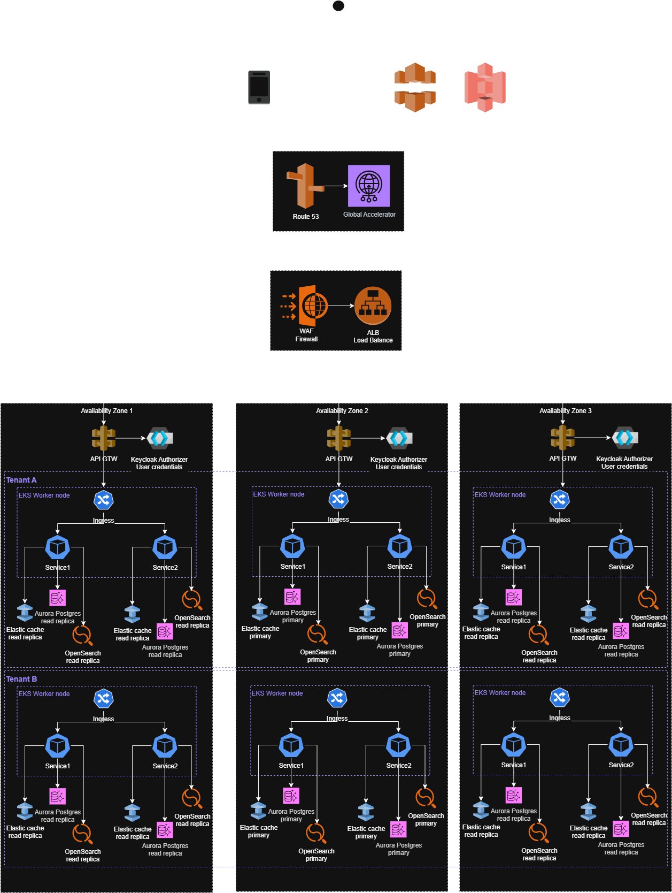

# 🧬 Architecture overview

# 1. 🏛️ Structure

## 1.1 🎯 Problem Statement and Context

MR Bill, wants a system to keep track of his favorite pocs, so you need to build a mobile app where mr Bill can register all his pocs, and also he needs to be able to search pocs, by name, by language and by tags.

This system should be multi-tenant because mr bill will sell such system to bunch of people in brazil, such system must have also ability to generate repots and generate a video with the all pocs the users did in 1 year.

Such system must be secure and have proper login and be able to support Realtime dojos using mr bill platform you will build for him.

## 1.2 Restrictions
- Lambda
- Monoliths
- Single AZ Solutions
- Mobile: Ionic
- Single language for mobile - it needs to be “native”
- MongoDB
- Single Relational DB
- Other Clouds that are not AWS

## 1.3 Problem Space

**What is the problem?**
Currently, developers and teams lack a centralized, collaborative platform to track and manage their Proof of Concepts (POCs). 

Most teams resort to scattered solutions like structure of folders in Git, or basic project management tools that don't cater to the specific needs of POC lifecycle management. 

This leads to lost knowledge, duplicated efforts, and missed opportunities for learning and collaboration.

**What is the context of the problem?**
- **Market Context**: The Brazilian tech market is rapidly growing with numerous development teams and freelancers who need better POC management tools
- **Business Context**: Mr. Bill has identified a commercial opportunity to create a SaaS platform that can serve multiple tenants (teams/organizations)
- **Technical Context**: Teams need real-time collaboration capabilities, especially for "dojos" (collaborative coding sessions), which existing tools don't support effectively
- **User Context**: Developers need to quickly search and retrieve POCs by multiple criteria (name, technology stack, tags) to avoid reinventing solutions

**Core Challenges:**
- **Knowledge Silos**: POCs created in isolation without team visibility or collaboration
- **Discovery Problem**: Inability to efficiently search and find relevant POCs when needed
- **Collaboration Gap**: No real-time collaboration tools specifically designed for POC development sessions
- **Documentation Debt**: Lack of standardized reporting and knowledge capture from POC learnings
- **Scalability Need**: Solution must support multiple independent organizations (multi-tenancy) with complete data isolation

# 2. 🎯 Goals

- Build a scalable multi-tenant POC tracking platform
- Provide native mobile applications for iOS and Android
- Implement real-time collaboration for dojos
- Generate automated reports and video summaries
- Ensure high availability across multiple AWS availability zones
- Support secure user authentication and tenant isolation

# 3. 🎯 Non-Goals

- Supporting non-AWS cloud providers
- Building monolithic applications
- Using serverless Lambda functions
- Implementing single-language mobile solutions
- Relying on single relational database
- Support for Legacy Browsers
- Will not build a Git replacement, will integrate with existing version control systems instead.
- Will not use AWS Lambda or other serverless functions.
- Will not build general chat or video conferencing; real-time features are limited to dojo collaboration.
- Will not include POC trading, selling, or commercial marketplace functionality.

# 4. 📐 Principles

- **Multi-tenancy**: Complete tenant isolation for data and users
- **Microservices**: Distributed architecture with independent services
- **Native Mobile**: Platform-specific mobile applications
- **Cloud-Native**: Services designed for AWS cloud infrastructure
- **Real-time**: WebSocket-based communication for live features
- **Security First**: Zero-trust architecture with proper authentication

# 5. 🏗️ Overall Diagrams

## 5.1 🗂️ Overall architecture

This is an AWS-based architecture that supports multi-tenancy (Tenant A, Tenant B, …) with multi-availability zone (AZ) deployment for high availability, scalability, and isolation.

The architecture combines static file delivery (frontend), API Gateway with authentication (backend APIs), and Kubernetes-managed microservices (EKS worker nodes) with supporting databases, caches, and search services.

## 5.2 🗂️ Deployment

### App deployment

- **Multi-AZ AWS deployment**
- **EKS clusters** for container orchestration
- **RDS Multi-AZ** for PostgreSQL databases
- **ElastiCache** for Redis caching
- **S3** for file storage and video assets
- **CloudFront** for CDN distribution

### Tenant deployment

## 5.3 🗂️ Use Cases  (TBD: need to create the diagrams)

- User registration and tenant onboarding
- POC creation, editing, and management
- Search POCs by name, language, and tags
- Real-time dojo collaboration
- Report generation and analytics
- Annual video compilation creation
- User authentication and authorization

# 6. 🧭 Trade-offs

## Native Mobile vs Cross-platform

| **Aspect**                   | **Native Mobile (Swift/Kotlin, etc.)**                                                | **Cross-platform (Flutter, React Native, etc.)**                                       |
|------------------------------|---------------------------------------------------------------------------------------|----------------------------------------------------------------------------------------|
| **Development Speed & Cost** | Slower, more expensive (separate codebases for iOS & Android).                        | Faster, cheaper (one codebase for multiple platforms).                                 |
| **Performance**              | Best performance, optimized for each OS, smooth animations, ideal for graphics/AR/VR. | Slightly lower performance due to abstraction layer; may struggle with heavy graphics. |
| **Access to Features**       | Immediate access to latest OS/device APIs (camera, sensors, biometrics, ARKit, etc.). | May lag in supporting new APIs; often requires custom native modules.                  |
| **User Experience (UX/UI)**  | Feels “native” — adheres to platform design guidelines (HIG/Material).                | Can get close, but sometimes inconsistent or less polished across devices.             |
| **Maintenance**              | Higher effort: must maintain two separate apps.                                       | Easier maintenance: one codebase to fix/update for both platforms.                     |
| **Talent/Skills Needed**     | Requires iOS + Android specialists.                                                   | One dev team can cover both platforms (JavaScript, Dart, etc.).                        |

## Microservices vs Monolith

| **Aspect**               | **Monolith**                                          | **Microservices**                                                           | **Trade-off / Notes**                                                                                                                                                |
|--------------------------|-------------------------------------------------------|-----------------------------------------------------------------------------|----------------------------------------------------------------------------------------------------------------------------------------------------------------------|
| **Complexity**           | Lower – single codebase, simpler to develop initially | Higher – many services, distributed system challenges                       | Monolith is easier to start with; microservices require infrastructure for service coordination, deployment, and monitoring                                          |
| **Scalability**          | Limited – entire application scales together          | High – individual services can scale independently                          | Microservices allow precise resource allocation, but add operational complexity                                                                                      |
| **Deployment**           | Simple – deploy the whole application at once         | Flexible – deploy services independently                                    | Microservices enable faster iteration for parts of the system but require CI/CD pipelines and orchestration tools                                                    |
| **Resilience**           | Lower – failure in one part can affect entire app     | Higher – failures are isolated to services                                  | Microservices improve fault tolerance, but require careful handling of inter-service communication                                                                   |
| **Development Speed**    | Faster initially – single team, shared codebase       | Can be faster at scale – multiple teams work on different services          | Monolith is faster for small teams; microservices are better for large, distributed teams                                                                            |
| **Technology Choice**    | Limited – typically one tech stack                    | Flexible – each service can use best-suited tech                            | Microservices allow polyglot programming but increase operational overhead                                                                                           |
| **Testing**              | Easier – end-to-end testing in a single app           | Harder – testing interactions across services                               | Microservices require robust integration and contract testing                                                                                                        |
| **Observability**        | Moderate – single app logs, metrics easier to collect | Critical – must implement distributed tracing, centralized logging, metrics | Microservices require robust observability practices to detect issues across services; Monolith is easier to monitor but harder to isolate root causes in large apps |
| **Operational Overhead** | Low – fewer deployments, less monitoring              | High – service discovery, logging, monitoring, orchestration                | Microservices need more DevOps maturity to manage efficiently                                                                                                        |

## EKS vs ECS

| **Aspect**                     | **ECS (Elastic Container Service)**                                    | **EKS (Elastic Kubernetes Service)**                                  | **Trade-off / Notes**                                                                                                  |
|--------------------------------|------------------------------------------------------------------------|-----------------------------------------------------------------------|------------------------------------------------------------------------------------------------------------------------|
| **Complexity**                 | Lower – managed container orchestration, simpler setup                 | Higher – Kubernetes has steep learning curve                          | ECS is easier for teams new to container orchestration; EKS gives full Kubernetes features but requires more expertise |
| **Flexibility**                | Moderate – AWS-native features, some limitations                       | High – full Kubernetes ecosystem, supports multi-cloud portability    | EKS allows more customization and standard Kubernetes tools; ECS is AWS-specific but simpler                           |
| **Deployment & Management**    | Simpler – integrates tightly with AWS, less operational overhead       | More complex – need to manage clusters, nodes, and Kubernetes objects | ECS is faster to deploy; EKS offers more granular control and standardization                                          |
| **Scalability**                | High – integrates with Auto Scaling, Fargate for serverless containers | High – Kubernetes-native autoscaling, multi-cluster management        | Both scale well; EKS gives more control at cost of complexity                                                          |
| **Community & Ecosystem**      | AWS-focused – smaller ecosystem outside AWS                            | Kubernetes ecosystem – large, active community and tools              | EKS benefits from portability and community support; ECS is simpler but AWS-locked                                     |
| **Observability & Monitoring** | AWS CloudWatch integration, simpler metrics/logs                       | Kubernetes-native tools (Prometheus, Grafana) plus CloudWatch         | ECS is easier to monitor by default; EKS provides more flexibility for advanced observability setups                   |
| **Cost**                       | Lower for small/simple workloads – less management overhead            | Higher – cluster management costs, but flexible with Fargate          | ECS is cost-efficient for simpler use cases; EKS scales better for complex or multi-team environments                  |
| **Operational Overhead**       | Low – managed service, minimal Kubernetes knowledge required           | Higher – need Kubernetes expertise, more components to maintain       | ECS is “easier to run”; EKS offers powerful orchestration but requires DevOps maturity                                 |

## Database per tenant vs Shared Database

| **Aspect**                             | **Database-per-Tenant**                                    | **Shared Database**                                              | **Trade-off / Notes**                                                                     |
|----------------------------------------|------------------------------------------------------------|------------------------------------------------------------------|-------------------------------------------------------------------------------------------|
| **Data Isolation & Security**          | Excellent – full isolation per tenant                      | Moderate – relies on row-level separation                        | Per-tenant DB is safer for compliance; shared DB requires careful access control          |
| **Scalability**                        | Moderate – scale individual tenant DBs independently       | High – fewer databases to manage, easier horizontal scaling      | Shared DB reduces operational overhead but can have noisy neighbor issues                 |
| **Maintenance & Operational Overhead** | Higher – schema changes, backups, and upgrades per DB      | Lower – single schema, single DB to maintain                     | Shared DB is simpler to manage at scale; per-tenant DB needs automation                   |
| **Customizability**                    | High – schema or configuration can differ per tenant       | Low – all tenants share same schema                              | Useful if tenants need unique features or data structures                                 |
| **Cost**                               | Higher – more storage, connections, and resources          | Lower – single DB shared across tenants                          | Shared DB is more cost-efficient, but can impact isolation                                |
| **Performance**                        | High – tenant workloads don’t interfere                    | Moderate – tenants share resources, may cause contention         | Database-per-tenant offers better isolation; shared DB can have “noisy neighbor” issues   |
| **Observability & Monitoring**         | Moderate – per-DB metrics, easier to isolate tenant issues | Moderate – monitoring per tenant requires filtering in shared DB | Easier to detect issues in per-tenant DBs, but shared DB can still be monitored centrally |
| **Deployment Complexity**              | Moderate – each new tenant needs new DB                    | Low – new tenant only adds rows                                  | Shared DB simplifies onboarding; per-tenant DB increases operational steps                |

## Authorization tokens with tenant_id vs Subdomain with tenant_id

| **Aspect**                           | **Token with `tenant_id`**                                   | **Subdomain with `tenant_id`**                                         | **Trade-off / Notes**                                                                                |
|--------------------------------------|--------------------------------------------------------------|------------------------------------------------------------------------|------------------------------------------------------------------------------------------------------|
| **Tenant Identification**            | Explicitly carried in token, verified server-side            | Derived from URL/subdomain, resolved on request                        | Tokens embed tenant info securely; subdomain approach relies on request parsing                      |
| **Security & Isolation**             | High – token validation ensures tenant isolation             | Moderate – subdomain can be spoofed, requires additional server checks | Tokens are less prone to tampering; subdomain approach can be combined with token for extra security |
| **Routing & Multi-Tenant Awareness** | No impact on routing – backend uses token for tenant context | Natural routing – requests automatically mapped to tenant via URL      | Subdomains simplify routing logic; tokens centralize tenant info in authorization layer              |
| **User Experience**                  | Same URL for all tenants                                     | Unique URL per tenant                                                  | Subdomains are easier for branding/custom login pages; tokens don’t affect URL                       |
| **Operational Overhead**             | Moderate – token management, validation, refresh             | Moderate – DNS/subdomain management, SSL certificates per tenant       | Both approaches add overhead in different areas; combining them can increase complexity              |
| **Auditing & Logging**               | High – tenant_id in token allows tracking actions            | Moderate – tenant inferred from request URL                            | Token-based approach gives precise, secure tenant context in logs                                    |
| **Scalability**                      | High – token approach scales with users                      | High – subdomain approach scales with DNS/tenant routing               | Both scale well, but subdomains require proper DNS and routing infrastructure                        |

## 6.1 Major Decisions

### Native Mobile vs Cross-platform
- Native apps are compiled into machine code.
- Gives them faster execution, smoother animations, better responsiveness, and more efficient memory use compared to cross-platform frameworks.
- Native apps get direct access to OS APIs and hardware (camera, GPS, NFC, sensors, biometrics, push notifications).
- This gives users a familiar, consistent look & feel and better accessibility support.

### Microservices vs Monolith
- Microservices let you scale only the components that need more resources (e.g., just the “payment service” during Black Friday).
- Each microservice can be developed, deployed, and updated independently, often by different teams.
- A failure in one microservice (e.g., recommendations service) does not crash the entire system.

### PostgreSQL vs NoSQ
- PostgreSQL is fully ACID-compliant by default (Atomicity, Consistency, Isolation, Durability).
- PostgreSQL supports powerful SQL queries, joins, aggregations, subqueries, window functions, and advanced indexing.
- PostgreSQL enforces a well-defined schema, ensuring data quality and structure.

### EKS vs EC2
- EKS runs Kubernetes for you — AWS manages the control plane (API server, etcd, scheduler).
- EKS integrates natively with Cluster Autoscaler and Horizontal Pod Autoscaler, adjusting resources automatically.
- EKS is designed for containerized microservices, making it easier to run modern architectures.

### Real-time features with WebSocket vs Polling
- Updates are pushed instantly from server → client (and vice versa).
- Reduces unnecessary network requests and bandwidth usage.
- WebSocket enables smooth, continuous interactions (live chats, stock tickers, multiplayer games, collaborative editing).

### Database per tenant
- Each tenant’s data lives in its own dedicated database → no risk of cross-tenant data leaks.
- Heavy usage by one tenant won’t slow down others since queries and workloads are isolated.
- You can upgrade schemas, tune indexes, or apply patches per tenant without impacting others.

### Authorization
- Authorization tokens (JWT, OAuth2, etc.) carry the tenant identifier (tenant_id/realm/claims).
- All services can consistently extract tenant_id from authorization → uniform logic across microservices.
- Since every request is tied to an authenticated identity + tenant_id, you get a clear audit trail (who accessed what, from which tenant).

## 6.2 🌏 For each key major component

### CloudFront + S3
- Amazon S3 stores static files (e.g., HTML, JS, CSS, media).
- CloudFront CDN serves those files efficiently, caching them at edge locations for low latency.

### Route 53 + Global Accelerator
- Amazon Route 53 provides DNS resolution and routing.
- AWS Global Accelerator ensures optimized global network routing, directing traffic to the nearest healthy endpoint across regions.

### API Gateway (in each AZ)
- Manages API requests.
- Provides features like request validation, throttling, and routing to backend microservices.

### Keycloak Authorizer
- Handles user authentication & authorization.
- Ensures only authenticated requests with valid credentials can access protected APIs.
- Likely integrated with API Gateway as a custom authorizer.

### Multi-Tenant Kubernetes Layer (EKS)
Each tenant (A, B, …) has its own dedicated set of microservices and supporting resources, deployed in EKS clusters.

**EKS Worker Nodes**
- Host containerized applications.
- Provide compute resources for services (scalable per tenant). 

**Ingress Controller**
- Manages routing of external traffic to internal Kubernetes services.
- Acts as a single entry point per tenant to expose microservices.

**Microservices**
- Each tenant has its own isolated microservices for business logic.
- Services communicate internally through Kubernetes networking.

### Data Layer (per Tenant)
Each tenant has isolated storage & caching components for data separation and performance.

**Aurora PostgreSQL (RDS)**
- Primary DB instance for writes.
- Read replicas for scaling read-heavy workloads.
- Ensures high availability across AZs.

**Elasticache**
- Provides in-memory caching.
- Reduces load on Aurora/Postgres by serving frequent queries.

**OpenSearch**
- Used for full-text search, log analytics, or real-time indexing.
- Each tenant has a primary node + read replicas for scalability.

**High Availability & Fault Tolerance**

Multi-AZ Deployment
- Architecture spans three availability zones, ensuring that failure in one AZ does not affect overall availability.
- Aurora, OpenSearch, and Elasticache are deployed in HA mode with primary and read replicas across zones.

Load Balancing
- Ingress controllers distribute requests across microservices.
- API Gateway and Global Accelerator balance API calls globally.

**Multi-Tenancy Strategy**

Tenant Isolation
- Each tenant (A, B, …) has separate EKS services, DBs, caches, and search resources.
- Provides strong security and performance isolation.

Shared Infrastructure
- Core infrastructure (Route 53, Global Accelerator, API Gateway, CloudFront, S3) is shared across all tenants.
- Reduces operational cost while still maintaining tenant-level isolation at the application and data layer.

# 7. 💾 Migrations

We don't have migration for this architecture since its a new system.

# 8. 🧪 Testing strategy

## Frontend Tests
- ReactJS component rendering tests with focus on performance metrics.
- Client-side state management tests.
- WebSocket client implementation tests.

## Contract tests
- Test API contracts between decomposed microservices.
- Verify WebSocket message formats and protocols.
- Validate data synchronization contracts between PostgreSQL and OpenSearch.

## Integration tests
- Try to cover most of the scenarios.
- Test WebSocket real-time communication flows.
- Run in isolated environments before production deployment.

## Infra tests
- Verify PGsync data synchronization between Aurora and OpenSearch.
- Test CloudFront edge caching effectiveness.
- Validate Global Accelerator routing behavior.

## Performance tests
- Use K6 to simulate the user behavior and check the system's performance.
- Test search latency using OpenSearch under various query patterns.
- Measure database query performance under load
- Measure UI rendering time across device types
- Benchmark WebSocket vs HTTP performance in real usage scenarios
- Track CDN cache hit/miss ratios
- Execute in staging environment with production-like conditions

## Chaos tests
- Simulate AWS region failures to test Global Accelerator failover
- Test WebSocket reconnection strategies during network disruptions
- Inject latency between services to identify performance bottlenecks
- Verify system behavior during PGsync failures
- Execute in isolated production environment during low-traffic periods

# 9. 👀 Observability strategy

Observability-based testing in production (also called "testing in production" or "production testing") uses monitoring, logging, and tracing data to validate system behavior after deployment.

There will be an event notifier that is going to log all operations.

There will be a dashboard to expose metrics and performance.

There will be alerts to notify the team about any issue.

Here are the key approaches:

## Synthetic Monitoring
Collect features metrics (latency, counters, etc) continuously to validate critical user journeys.

## Real User Monitoring
Track actual user interactions and performance metrics:
- ReactJS component render times
- WebSocket connection success rates
- Search result relevance and speed
- Page load times across different regions

## Error Rate Monitoring 
Set up alerts for anomalies in:
- WebSocket connection failures
- OpenSearch query timeouts
- Aurora PostgreSQL connection pool exhaustion
- CloudFront 5xx errors

## Business Metrics Validation
Monitor business KPIs to detect regressions:
- POC Creation Rate
- Active User Rate
- Session Duration
- Feature Adoption Rate
- Search Response Time
- Mobile App Crash Rate
- Tenant Onboarding Time
- Report Generation Time
- Video Compilation Time

# 10. 💿 Data Store Designs (TBD: need to create diagrams)

- **Primary Database**: PostgreSQL (RDS Multi-AZ) for transactional data
    - Tenant-specific schemas for data isolation
    - POC metadata, user profiles, and tenant configurations
- **Search Database**: Elasticsearch cluster for POC search functionality
    - Indexed by name, language, tags, and content
- **Cache Layer**: Redis (ElastiCache) for session management and frequent queries
- **File Storage**: S3 buckets for POC attachments, videos, and reports
    - Separate buckets per tenant for isolation
- **Time-series Data**: CloudWatch for metrics and monitoring data
- **Message Queue**: SQS for asynchronous processing and video generation jobs

# 11. 🥞 Technology Stack (TBD: need to detail more)

**Backend Services**:
- Languages: Java 24+ with Spring Boot framework
- Build Tool: Maven for dependency management and builds
- Container: Docker with Kubernetes (EKS) orchestration
- API: RESTful APIs with Spring Web and WebSocket support

**Mobile Applications**:
- Android: Kotlin with Jetpack Compose
- iOS: Swift with SwiftUI
- Communication: HTTPS and WebSocket for real-time features

**Infrastructure**:
- CloudFront + S3
- Route 53 + Global Accelerator 
- API Gateway
- Keycloak Authorizer
- Messaging: SQS, SNS for notifications
- Monitoring: CloudWatch, X-Ray, Prometheus/Grafana

# TODO
- Add uml diagrams for use cases
- Details more the technology stack
- Create a solution for the video generation
- Add uml diagrams for data store designs
- Add Mobile details spread over the architecture items