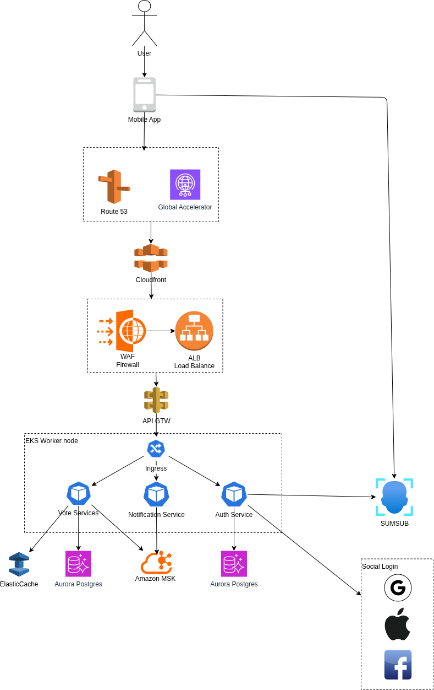
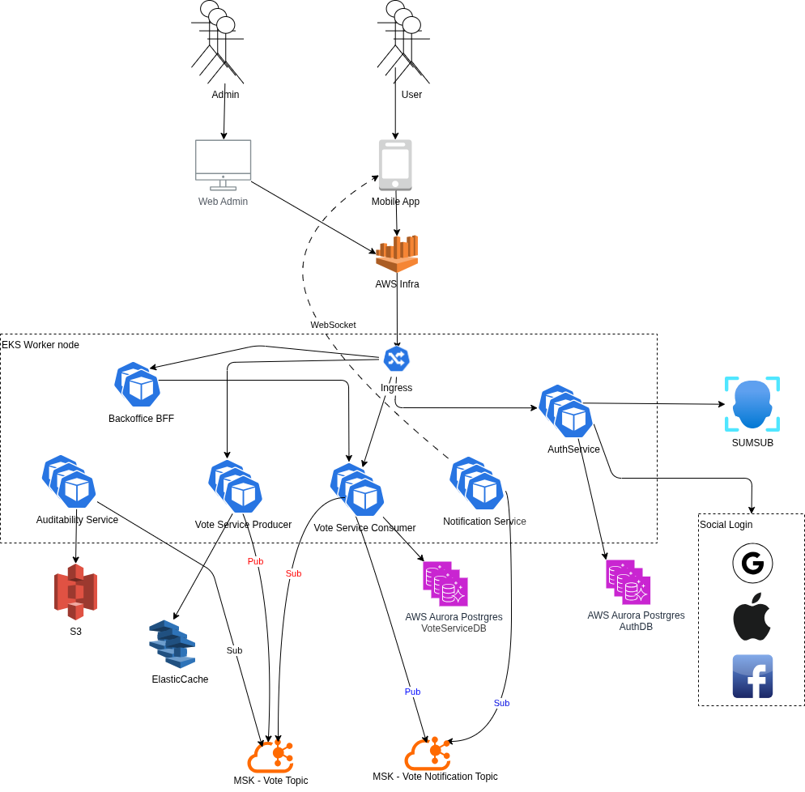
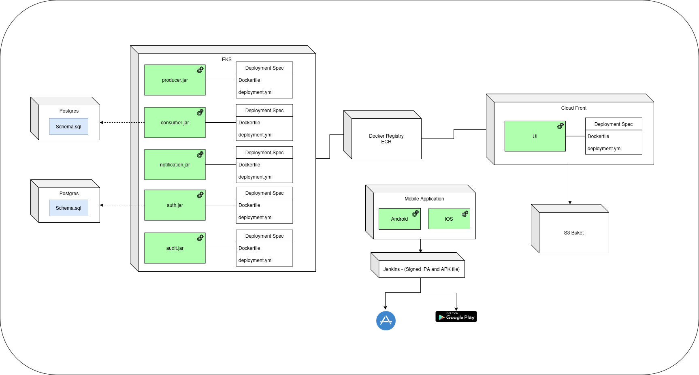
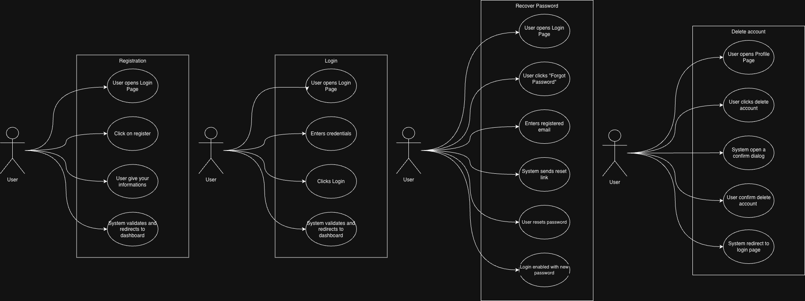
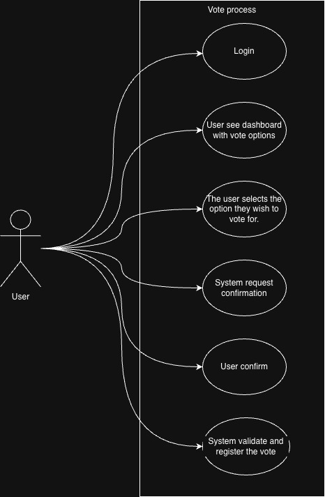
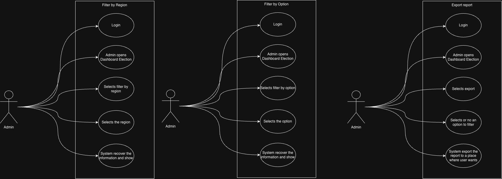
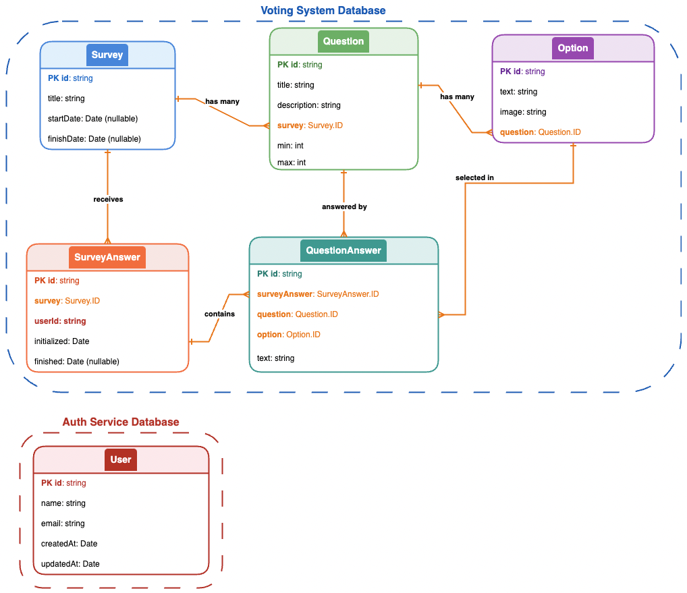

# 🧬 Realtime Voting System -- Architecture Overview

# 1. 🏛️ Structure

## 1.1 🎯 Problem Statement and Context

This document describes the high-level architecture and security
strategy for a global, real-time voting system designed to support:

- Up to 300 million registered users
- Traffic peaks of 240,000 requests per second (RPS)
- Strict consistency and reliability guarantees
- Strong protection against bots, fraud, and abuse
- One-person-one-vote enforcement
- Near real-time result visibility

The system must be fully cloud-native, highly scalable, fault tolerant,
and secure by design, while explicitly avoiding:

## 1.2 Restrictions

- Serverless platforms outside AWS
- MongoDB
- On-premise infrastructure
- Google Cloud & Microsoft Azure
- OpenShift
- Mainframes
- Monolithic architectures

AWS-based, fully distributed, microservices-first architecture is
assumed.

## 1.3 Problem Space

**What is the problem?**

We need to design and build a globally distributed, mission-critical real-time voting system capable of handling 300 million registered users with peak traffic of 240,000 requests per second. The system must guarantee absolute data integrity, enforce strict one-person-one-vote constraints, provide real-time result visibility, and defend against sophisticated fraud, bot attacks, and abuse at scale—all while maintaining near-zero data loss and high availability across multiple geographic regions.

**What is the context of the problem?**

- **Market Context**:
  - Democratic elections and large-scale voting events demand unprecedented levels of trust, transparency, and reliability
  - Growing threat landscape from automated bots, state-sponsored actors, and coordinated fraud campaigns
  - Increasing expectations for instant feedback and real-time results from 300M+ global participants
  - Zero tolerance for data loss, system failures, or security breaches that could undermine election integrity
  - Need for systems that can scale elastically during unpredictable traffic spikes (campaigns, debates, breaking news)

- **Business Context**:
  - Any data loss or security breach creates legal liability, regulatory penalties, and irreparable reputational damage
  - System must support mission-critical operations with financial and legal consequences
  - One-time deployment windows with no room for failure during live voting periods
  - Requirement for complete auditability and tamper-proof logging for legal compliance
  - Cost optimization critical—infrastructure must scale down after peak periods
  - Must support strict SLAs with penalties for downtime or data inconsistency

- **Technical Context**:
  - Peak traffic of 240K RPS eliminates traditional vertical scaling and monolithic architectures
  - 300M users require geo-distributed sharding, multi-region replication, and CDN distribution
  - ACID guarantees required for vote integrity—NoSQL eventually consistent models insufficient for vote records
  - Real-time requirements demand event-driven architecture (Kafka, SSE) with <2 second latency
  - Cloud-native AWS-only restriction eliminates multi-cloud and serverless options
  - Must handle database bottlenecks through strategic sharding (geo-based), read replicas, and caching
  - Defense-in-depth security model required across network, identity, device, behavior, application, and data layers
  - Need for immutable audit logs and write-once-read-many (WORM) compliance

- **User Context**:
  - 300M users spread across multiple geographic regions with varying network conditions
  - Users expect instant confirmation of vote submission and real-time result updates
  - Users must be authenticated securely without friction (prevent credential stuffing, session hijacking)
  - Mobile and web clients require Server-Sent Events (SSE) for efficient real-time updates
  - Users in different time zones create distributed load patterns with unpredictable spikes
  - Accessibility requirements for diverse user populations (language, disability, device types)
  - Users must vote exactly once—any duplicate vote undermines system integrity

**Core Challenges:**

1. **Data Integrity at Scale**
   - Guarantee zero data loss across 240K RPS with multi-region active-active replication
   - Implement synchronous writes with WAL (Write-Ahead Logging) and fsync guarantees
   - Build tamper-proof immutable audit trails using OpenSearch WORM indices
   - Handle database sharding across 300M users without creating consistency gaps
   - Design automatic failover with RPO=0 (Recovery Point Objective) and RTO<60s (Recovery Time Objective)

2. **Security & Fraud Prevention**
   - Detect and block automated bots at 240K RPS without impacting legitimate users
   - Prevent credential stuffing, session hijacking, replay attacks, and DDoS
   - Implement defense-in-depth: WAF, device fingerprinting, behavioral analysis, rate limiting
   - Validate identity uniqueness across 300M users without centralized bottlenecks
   - Build real-time fraud detection with ML models analyzing voting patterns

3. **Horizontal Scalability**
   - Scale API layer from baseline to 240K RPS using Kubernetes HPA and KEDA
   - Implement geo-based database sharding to distribute 300M user records
   - Design stateless microservices that auto-scale without session affinity issues
   - Optimize cache layers (Redis) to absorb read-heavy traffic and reduce DB load
   - Handle cold-start delays during sudden traffic spikes with pre-warming strategies

4. **Strict Idempotency & One-Vote Enforcement**
   - Guarantee exactly-once vote processing despite retries, network failures, and race conditions
   - Implement distributed locks or optimistic concurrency control at database level
   - Design idempotency keys with conflict resolution for duplicate submissions
   - Prevent race conditions when multiple requests arrive simultaneously for same user
   - Build reconciliation mechanisms to detect and resolve any duplicate votes in audit logs

5. **Real-Time Result Distribution**
   - Stream aggregated results to 300M users with <2 second latency using SSE
   - Design event-driven architecture (Kafka) for vote ingestion and aggregation
   - Handle 250K concurrent SSE connections with minimal server resource overhead
   - Implement efficient broadcast patterns using EventEmitter for SSE clients
   - Balance real-time updates with system load—aggregate summaries vs. individual events

6. **Multi-Region Complexity**
   - Synchronize vote data across geographic regions with strong consistency
   - Handle network partitions (split-brain scenarios) without duplicate votes
   - Route users to nearest region while maintaining global vote count accuracy
   - Implement cross-region disaster recovery with automated failover
   - Manage clock skew and distributed transaction coordination across regions

7. **Performance Under Load**
   - Maintain <100ms p99 latency during 240K RPS peak traffic
   - Prevent database saturation through write buffering, connection pooling, and read replicas
   - Optimize Kafka throughput for event streaming without lag buildup
   - Implement backpressure mechanisms to gracefully degrade under extreme load
   - Cache authentication tokens and session data to reduce repeated DB lookups

---


# 2. 🎯 Goals

## 2.1 Never Lose Data

Voting systems are mission-critical. Any data loss leads to: 
- Legal risks 
- Loss of public trust 
- Invalid election outcomes

This requires: 
- Multi-region replication 
- Strong durability guarantees
- Strict write acknowledgements 
- Immutable audit logs

## 2.2 Be Secure and Prevent Bots & Bad Actors (Primary Ownership Area)

This is one of the hardest challenges at global scale. The system must prevent:

- Automated voting (bots)
- Credential stuffing
- Distributed fraud attacks
- Replay attacks
- Session hijacking
- API scraping
- DDoS attacks

Security must be implemented in multiple layers (defense in depth): 
- Network
- Identity 
- Device 
- Behavior 
- Application 
- Data

## 2.3 Handle 300M Users

This implies: 
- Massive horizontal scalability 
- Stateless architectures 
- Global CDNs 
- Partitioned databases 
- Multi-region deployment

---

## 2.4 Handle 240K RPS Peak Traffic

It requires:
- Load-based autoscaling 
- Event-driven processing 
- Front-door traffic absorption 
- Backpressure handling

## 2.5 One Vote per User (Strict Idempotency)

This is a data + security + consistency problem: 

Each identity must be: 
- Verified 
- Unique 
- Non-replayable 

Vote submissions must be: 
- Idempotent 
- Conflict-safe 
- Race-condition proof

## 2.6 Real-Time Results

This creates challenges in: 
- Data streaming 
- Cache invalidation 
- Broadcast consistency 
- Fan-out architectures 
- WebSocket / pub-sub scalability

---


# 3. 🎯 Non-Goals

- On-prem or hybrid operation
- Manual moderation for fraud detection
- Single-region deployment
- Strong coupling between frontend and backend
- Vertical scaling
- Centralized bottlenecks
- Stateful monoliths

---


# 4. 📐 Design Principles

The architecture is guided by seven foundational design principles that address the unique challenges of building a mission-critical, globally distributed voting system. These principles inform every architectural decision, from technology selection to deployment strategies.

## 4.1 Security First (Defense in Depth)

**Principle**: Security is not a feature—it's the foundation. Every layer of the system must assume breach and implement independent security controls.

**Why This Matters**:

- Voting systems are high-value targets for nation-state actors, organized fraud, and automated bot armies
- A single security failure can compromise election integrity and destroy public trust
- Attack vectors evolve constantly—security must be layered and adaptive

## 4.2 Scalability by Default (Horizontal, Stateless, Elastic)

**Principle**: The system must scale horizontally without architectural changes. Every component is designed for elastic scaling from day one.

**Why This Matters**:

- Peak traffic (240K RPS) is 100x baseline load—vertical scaling is impossible
- Voting events create unpredictable traffic spikes (debates, breaking news, election day)
- Cost optimization requires scaling down after peak periods

## 4.3 Event-Driven Architecture (Asynchronous, Decoupled, Resilient)

**Principle**: Decouple producers and consumers through event streams. All critical operations are asynchronous to prevent cascading failures.

**Why This Matters**:

- Synchronous request-response patterns create tight coupling and single points of failure
- Database writes at 240K RPS would saturate any relational database
- Real-time result aggregation requires parallel event processing

## 4.4 Stateless Compute (Immutable, Ephemeral, Replaceable)

**Principle**: Application servers hold no persistent state. Every instance is interchangeable and can be destroyed/recreated without data loss.

**Why This Matters**:

- Stateful servers cannot scale horizontally (sticky sessions create hotspots)
- Server failures with in-memory state cause data loss
- Rolling updates and auto-scaling require killing instances without warning

## 4.5 Multi-Layer Anti-Abuse Protection (Adaptive, ML-Driven, Zero Trust)

**Principle**: Assume every request is malicious until proven otherwise. Defense mechanisms adapt in real-time to emerging threats.

**Why This Matters**:

- Bots evolve to bypass static rules (CAPTCHA solving, residential proxies)
- Credential stuffing attacks leverage millions of stolen username/password pairs
- Distributed attacks from 100K+ IP addresses bypass simple rate limiting

## 4.6 Auditable Data (Immutable, Tamper-Proof, Forensic-Ready)

**Principle**: Every vote and system action is recorded in an append-only, cryptographically verifiable audit log.

**Why This Matters**:

- Legal requirements for election audits and recounts
- Post-incident forensics require complete event reconstruction
- Public trust depends on transparent, verifiable vote counting

**Implementation Strategy**:

### Immutable Audit Infrastructure
- **OpenSearch WORM Indices**: Write-once-read-many storage prevents log tampering
- **Event Sourcing**: Every state change captured as immutable event in Kafka
- **Cryptographic Chaining**: Events hashed and linked to detect unauthorized modifications
- **Multi-Region Replication**: Audit logs replicated across 3+ regions for disaster recovery

### Backoffice & Administrative Controls
- **Admin Panel with RBAC**: Separate roles for auditors, fraud investigators, and system administrators
- **Real-Time Monitoring Dashboard**: Live metrics on voting activity, security alerts, system health
- **Fraud Investigation Console**: Deep-dive voter profiles, device correlation, behavioral analysis
- **Manual Review Workflows**: Queue system for high-risk votes flagged by ML models
- **Audit Trail Queries**: Search and export capabilities for compliance reporting
- **Administrative Actions**: Block/unblock voters, trigger re-verification, adjust fraud thresholds with full logging

**Trade-offs**:
- Storage costs for long-term audit retention (mitigated with tiered storage)
- Manual review becomes bottleneck during mass attacks (mitigated with ML prioritization)
- Admin panel is security-sensitive surface (mitigated with MFA, IP whitelisting, comprehensive logging)

**Success Metrics**:
- 100% of votes traceable from submission to final tally
- <5 minute query response time for audit investigations
- Zero unauthorized admin access
- <1 hour mean time to investigate flagged voters

---

## 4.7 Failure as a Normal Condition (Chaos Engineering, Graceful Degradation)

**Principle**: Expect failures at every level. Design systems that degrade gracefully and self-heal automatically.

**Why This Matters**:

- At 240K RPS, component failures are guaranteed (hardware, network, software bugs)
- Manual intervention is too slow—recovery must be automatic
- Partial availability is better than complete outage

---


# 5. 🏗️ Overall Diagrams

## 5.1 🗂️ Overall architecture



## 5.5 Edge to API

``` text
Mobile App (React Native)
        |
        | HTTPS
        v
CloudFront + Global Edge
        |
        v
AWS WAF (Bot Control + Rate Limits)
        |
        v
AWS Global Accelerator Backbone
        |
        v
API Gateway (Rate Limited)
        |
        v
Microservices
```

## 5.2 🗂️ Solution architecture



## 5.3 🗂️ Deployment



## 5.4 Security & Anti-Bot Strategy (Primary Focus)

### Layer 1: Network & Edge Security

- **AWS WAF**: Block common attack patterns (SQL injection, XSS, CSRF)
- **DDoS Protection**: AWS Shield Advanced for volumetric attack mitigation
- **Geographic Filtering**: Route53 + CloudFront geo-restrictions to block suspicious regions
- **Rate Limiting**: Token bucket algorithm at edge to prevent request flooding

### Layer 2: Identity & Authentication

- **OAuth-based Social Login (Google, Facebook, Apple)**: Multi-factor authentication (SMS, authenticator apps, push notifications)
- **Liveness Detection**: SumSub facial biometrics to prevent fake accounts and deepfakes
- **Document Verification**: Government ID validation with fraud risk scoring
- **Session Binding**: Tokens tied to device fingerprint and IP address

### Layer 3: Device Intelligence

- **FingerprintJS**: Device fingerprinting to detect emulators, VMs, and bot farms
- **Jailbreak/Root Detection**: Block compromised devices
- **Behavioral Biometrics**: Analyze touch patterns, typing speed, mouse movements
- **Challenge-Response**: Cloudflare Turnstile for invisible human verification

### Layer 4: Application Security

- **OAuth-based Social Login Tokens**: Short-lived provider identity tokens validated by the Java Auth Service
- **API Gateway**: AWS API Gateway with request validation and transformation
- **Input Sanitization**: Strict schema validation on all API requests
- **HTTPS Everywhere**: TLS 1.3 with certificate pinning on mobile clients

### Layer 5: Data Protection

- **Encryption at Rest**: AES-256 for database, S3, and backups
- **Encryption in Transit**: TLS 1.3 for all service-to-service communication
- **Field-Level Encryption**: Sensitive PII encrypted at application layer
- **Key Rotation**: Automated rotation via AWS KMS with audit trails

### Layer 6: Audit & Monitoring

- **Immutable Logs**: OpenSearch with WORM (Write-Once-Read-Many) indices
- **Real-Time Anomaly Detection**: Machine learning models flagging suspicious voting patterns
- **SIEM Integration**: AWS Security Hub aggregating security events
- **Forensic Readiness**: Complete audit trail for post-incident investigation

### Liveness Detection & Identity Verification with SumSub

SumSub is used for:

- Facial biometrics
- Liveness detection
- Government document verification
- Global fraud risk scoring

Chosen for:

- High antifraud robustness
- Strong global compliance (KYC/AML)
- Support for multiple countries
- High-quality liveness detection against deepfake, photos, and
  replays

SumSub React Native SDK integration:

Documentation: <https://docs.sumsub.com/docs/react-native-module>

**Mobile Flow with SumSub**

1. User installs and opens the React Native app.
2. During first access or registration:
    - User is asked to capture:
        - A selfie video (liveness)
        - A government-issued document
3. The app sends media directly to SumSub SDK.
4. SumSub performs:
    - Face matching
    - Liveness challenge
    - Document authenticity validation
5. The backend receives:
    - Verification status
    - Risk score
    - Unique document hash
6. Only verified users are allowed to vote.

No raw biometric data is stored directly in the voting backend.

### Secure Authentication with OAuth-based Social Login

OAuth-based Social Login is used for:

- Secure login
- Social SSO
- Passwordless login
- Multi-Factor Authentication (MFA)
- Token lifecycle management


**Authentication Flow**

1. User taps "Login".
2. React Native app redirects the user to the selected OAuth social provider
   (Google, Apple, or Facebook).
3. The provider performs:
    - User authentication
    - Consent validation
    - Provider-native MFA (if enabled by the user)
4. On success, the provider returns an authorization code or identity token.
5. The Auth Service:
    - Validates token signature and claims
    - Verifies issuer, audience, and expiration
    - Links or creates the internal user identity
6. The app receives:
    - Internal Access Token (short-lived)
    - Internal ID Token

### Bot Detection with OAuth-based Login + Turnstile

To prevent credential stuffing, brute-force, and automated accounts:


- Cloudflare Turnstile is used as:
    - Invisible human challenge
    - CAPTCHA replacement
    - Bot traffic filter for mobile and web

The Turnstile token is attached to authentication requests and validated
by the backend before granting access.

### Secure API Requests with Tokens

All API requests use:

- OAuth2 access tokens (Bearer)
- Short TTL (e.g., 15 minutes)
- Secure refresh flow
- Token binding to:
    - Device fingerprint
    - Session
    - Risk score

Example:

``` http
POST /vote
Authorization: Bearer <access_token>
```

All backend services:

- Validate the token signature
- Validate expiration and issuer
- Check device consistency
- Enforce authorization scope

### Device Fingerprinting with FingerprintJS

FingerprintJS is used to:

- Collect passive device signals:
    - OS
    - Browser/Runtime
    - Hardware entropy
    - Emulator detection
- Generate a stable device ID
- Detect:
    - Multi-account abuse
    - Bot emulators
    - Device cloning
    - Session hijacking

How it is used:

1. FingerprintJS runs in the app runtime.
2. A device ID is generated.
3. The device ID is attached to:
    - Login requests
    - Voting requests
4. The backend correlates:
    - User Account
    - Document Hash
    - Face Template
    - Device ID

This allows detection of:

- One user trying to vote from multiple devices
- One device trying to impersonate multiple users


### 5.4.1. CloudFront + AWS WAF Responsibilities

**CloudFront**

- Global Anycast Edge
- TLS Termination
- Static caching
- Initial traffic absorption for 300M users

**AWS WAF**

- IP-based rate limits
- Token-based rate limits
- Header-based rate limits
- Protection against:
    - SQL Injection
    - XSS
    - CSRF
    - API Abuse
- Integrated Bot Control


### 5.4.2. Global Accelerator & Backbone Routing

All traffic between edge and API uses:

- AWS Global Accelerator
- Optimized global routing
- Low-latency backbone
- Automatic regional failover


### 5.4.3. API Gateway Security Model

The API Gateway enforces:

- Rate limits per:
    - API Key
    - User Token
    - Device ID
- Burst protection
- Token verification
- Request signing enforcement
- Request schema validation


# 6. 🧭 Trade-offs

## 6.1 Architecture Tradeoffs

This document captures the key architectural decisions and their tradeoffs for the Vote System.

### Decision Categories

| Category                  | Decision                  | Chosen                                             | Rejected                          | Rationale                                                                          |
|---------------------------|---------------------------|----------------------------------------------------|-----------------------------------|------------------------------------------------------------------------------------|
| **Database**              | Data store                | PostgreSQL (RDS)                                   | MongoDB, MySql                    | Guarantees required for vote integrity                                             |
| **Database**              | Scaling strategy          | Geo-based sharding                                 | Single instance, vertical scaling | 300M users require horizontal scaling                                              |
| **Database**              | Audit/Logs store          | OpenSearch.                                        | PostgreSQL, DynamoDB              | OpenSearch with WORM (Write-Once-Read-Many) indices                                |
| **Database**              | Partitioning              | PostgreSQL                                         | MySQL                             | PostgreSQL natively supports: RANGE, LIST, HASH, Subpartitioning                   |
| **Database**              | Replication               | PostgreSQL                                         | MySQL                             | Physical and Logical replication (streaming replication)                           |
| **Database**              | Security and auditability | PostgreSQL                                         | MySQL                             | WAL is extremely reliable, Strong support for auditing, Extensions such as pgAudit |
| **Cloud Provider**        | Infrastructure            | AWS                                                | GCP, Azure, On-premise            | Add content                                                                        |
| **Architecture**          | Style                     | Microservices                                      | Monolith                          | Scale requirements; independent service scaling                                    |
| **Authentication**        | Provider                  | OAuth-based Social Login (Google, Apple, Facebook) | Auth0, Cognito                    | Direct provider integration; no IAM vendor lock-in; lower cost at scale            |
| **Identity Verification** | Provider                  | SumSub                                             | Jumio, Onfido                     | Add content                                                                        |
| **Bot Detection**         | Human verification        | Cloudflare Turnstile                               | reCAPTCHA, hCaptcha               | Add content                                                                        |
| **Bot Detection**         | Device fingerprinting     | FingerprintJS                                      | Custom solution                   | Add content                                                                        |
| **Compute**               | Runtime                   | Kubernetes (EKS)                                   | ECS, Lambda                       | Add content                                                                        |
| **Messaging**             | Event streaming           | Kafka                                              | SQS, RabbitMQ                     | High throughput for 240k RPS; Add content                                          |
| **Caching**               | Layer                     | Redis                                              | Memcached, ElastiCache            | Real-time counters, session data, rate limiting                                    |
| **Real-time**             | Updates                   | WebSocket + SSE                                    | Polling, Long-polling             | True real-time results; accepts connection management complexity                   |


### OAuth Social Login vs Auth0

| Aspect | OAuth-based Social Login (Custom Java Service) | Auth0 |
|------|-----------------------------------------------|-------|
| **Control** | Full architectural and operational control over authentication flows, token lifecycle, data storage, and domain-specific rules | Control limited to vendor-supported flows, configuration options, and extension points |
| **Cost** | Lower long-term cost at large scale; infrastructure and engineering costs are predictable and internally controlled | Becomes expensive at high MAU due to per-user and per-feature pricing |
| **Vendor Lock-in** | Low; providers can be added or removed independently and implementation is protocol-based | High; deep dependency on vendor APIs, pricing model, and roadmap |
| **Customization** | High; authentication flows can be tailored to voting-domain requirements and security policies | Medium; customization constrained by platform capabilities and policies |
| **Time to Market** | Medium; requires initial engineering effort to implement and validate provider integrations | Fast; ready-to-use authentication flows and UI components |
| **Operational Effort** | Higher; responsibility for monitoring, incident response, key rotation, and provider changes | Lower; IAM operations and availability handled by the vendor |
| **Compliance Scope** | Reduced; no password storage and minimal IAM surface owned by the platform | Broader; platform is responsible for IAM configuration, audits, and vendor compliance |
| **Scalability** | Fully controlled; scaling behavior is predictable and aligned with internal infrastructure | Vendor-dependent; scaling limits, throttling, and outages are external risks |
| **Integration Complexity** | High; requires implementing, testing, and maintaining three distinct OAuth/OIDC integrations (Google, Apple, Facebook), each with different behaviors and edge cases | Low; unified abstraction over providers with consistent behavior |


### OAuth Social Login vs Keycloak

| Aspect | OAuth-based Social Login (Custom Java Service) | Keycloak |
|------|-----------------------------------------------|----------|
| **Control** | Full control over authentication logic, token structure, claim modeling, and domain-specific rules | Control centralized in IAM platform with configuration-driven behavior |
| **Operational Complexity** | Lower infrastructure complexity; no dedicated IAM cluster to operate | Higher; requires operating, patching, scaling, and securing an IAM platform |
| **Integration Model** | Direct integration with social providers (Google, Apple, Facebook) via OAuth/OIDC | Social providers integrated via federation inside Keycloak |
| **Token Issuance** | Tokens issued by the Auth Service, tailored to domain needs | Tokens issued by Keycloak with standardized claims |
| **Customization** | High; flows can be deeply customized in code | Medium; customization constrained to Keycloak extensions and SPI |
| **Time to Market** | Medium; requires custom implementation | Fast; built-in login flows and admin UI |
| **Scalability** | Fully controlled and aligned with internal autoscaling strategies | Requires careful sizing and tuning under high authentication peaks |
| **Failure Domain** | Auth logic failures isolated to a single microservice | IAM becomes a central critical dependency |
| **Integration Complexity** | Higher; three provider integrations maintained in code | Lower; providers abstracted by Keycloak |


### SumSub vs Veriff

| Aspect | SumSub | Veriff |
|------|--------|--------|
| **Primary Focus** | Comprehensive identity verification, liveness, and fraud risk scoring | Identity verification and liveness with simplified workflows |
| **Liveness Detection** | Advanced liveness (deepfake resistance, replay protection) | Strong liveness, slightly less aggressive fraud scoring |
| **Fraud Signals** | Rich risk scoring combining document, biometric, and behavioral data | More limited fraud signal enrichment |
| **Global Coverage** | Broad document support across many countries | Strong coverage, but fewer document types in some regions |
| **Compliance & Audits** | Strong KYC/AML and regulatory support | Good compliance support, simpler audit tooling |
| **Integration Complexity** | Higher; richer APIs and more configuration options | Lower; simpler API and faster integration |
| **User Friction** | Higher; multi-step verification flows | Lower; optimized for conversion |
| **Cost Model** | Higher per-verification cost | More cost-efficient for high-volume verification |


### FingerprintJS vs ThumbmarkJS

| Aspect | FingerprintJS | ThumbmarkJS |
|------|---------------|-------------|
| **Signal Depth** | High; combines browser, OS, hardware, and behavioral entropy | Medium; relies on fewer, mostly passive signals |
| **Emulator & Bot Detection** | Strong emulator, VM, and automation detection | Limited advanced bot detection |
| **Stability of Fingerprint** | High stability across sessions | Less stable across browser updates and OS changes |
| **Privacy Considerations** | Higher compliance complexity (GDPR/consent handling) | Simpler privacy posture |
| **Evasion Resistance** | Better resistance to spoofing and fingerprint randomization | Easier to evade with modern privacy tools |
| **Operational Maturity** | Enterprise-grade tooling, dashboards, and SLAs | Smaller ecosystem and fewer operational tools |
| **Integration Complexity** | Medium; SDK + backend correlation required | Low; lightweight client-side integration |
| **Cost** | Higher, especially at large scale | Lower or free depending on usage |

## EKS vs ECS

| **Aspect**                     | **ECS (Elastic Container Service)**                                    | **EKS (Elastic Kubernetes Service)**                                   | **Trade-off / Notes**                                                                                                  |
|--------------------------------|------------------------------------------------------------------------|------------------------------------------------------------------------|------------------------------------------------------------------------------------------------------------------------|
| **Complexity**                 | Lower – managed container orchestration, simpler setup                 | Higher – Kubernetes has more configurations that can be managed        | ECS is easier for teams new to container orchestration; EKS gives full Kubernetes features but requires more expertise |
| **Flexibility**                | Moderate – AWS-native features, some limitations                       | High – full Kubernetes ecosystem, offers HPA and KEDA for Auto Scaling | EKS allows more customization in term of metrics to use for Auto Scaling                                               |
| **Deployment & Management**    | Simpler – integrates tightly with AWS, less operational overhead       | More complex – need to manage clusters, nodes, and Kubernetes objects  | ECS is faster to deploy; EKS offers more granular control and standardization                                          |
| **Scalability**                | High – integrates with Auto Scaling, Fargate for serverless containers | High – Kubernetes-native autoscaling, multi-cluster management         | Both scale well; EKS gives more control at cost of complexity                                                          |
| **Community & Ecosystem**      | AWS-focused – smaller ecosystem outside AWS                            | Kubernetes ecosystem – large, active community and tools               | EKS benefits from portability and community support; ECS is simpler but AWS-locked                                     |
| **Observability & Monitoring** | AWS CloudWatch integration, simpler metrics/logs                       | Observability tools (Prometheus, Grafana) plus CloudWatch              | ECS offers simplier observability; EKS provides more flexibility for advanced observability setups                     |
| **Cost**                       | Lower for small/simple workloads – less management overhead            | Higher – cluster management costs, but flexible with Fargate           | ECS is cost-efficient for simpler use cases; EKS scales better for complex or multi-team environments                  |
| **Operational Overhead**       | Low – managed service, minimal Kubernetes knowledge required           | Higher – need Kubernetes expertise, more components to maintain        | ECS is “easier to run”; EKS offers powerful orchestration but requires DevOps maturity                                 |


### Infrastructure Tradeoffs: Microservices vs Monolith

| Aspect              | Monolith                          | Microservices                             | Tradeoff                                      |
|---------------------|-----------------------------------|-------------------------------------------|-----------------------------------------------|
| **Complexity**      | Lower; single codebase            | Higher; distributed system challenges     | Accept complexity for independent scaling     |
| **Scaling**         | Vertical; scale entire app        | Horizontal; scale individual services     | Required for 240k RPS peak traffic            |
| **Deployment**      | Single deployment unit            | Independent deployments per service       | Faster iteration; more operational overhead   |
| **Team Structure**  | Single team, shared codebase      | Multiple teams, service ownership         | Better for large teams; coordination overhead |
| **Fault Isolation** | Single failure affects entire app | Failures contained to individual services | Critical for high availability requirements   |
| **Data Management** | Shared database                   | Database per service                      | Accept eventual consistency between services  |


### Auditability and tamper-proof logging
#### S3 Object Lock vs Amazon QLDB

| Aspect | S3 Object Lock | Amazon QLDB |
|--------|----------------|-------------|
| **WORM Implementation** | Native Object Lock (Compliance/Governance mode) | Native append-only journal |
| **Hash Chains** | Must implement in application | Built-in (Merkle tree structure) |
| **Cryptographic Verification** | Must implement | Built-in digest verification |
| **Query Capability** | None (object storage) | PartiQL (SQL-like) queries |
| **Scalability** | Unlimited (S3 scale) | Limited to 10,000 req/sec per ledger |
| **Performance** | High throughput for writes | Lower throughput, optimized for consistency |
| **Cost Structure** | Storage + requests | Storage + I/O + read requests |

## DB-enforced FK vs Application-enforced


| **Aspect**                            | **DB-enforced FK (with indexes & CASCADE)**                                                                                       | **Application-enforced (no DB constraints)**                                                              | **Analysis**                                                                                                                                                                                                               |
|---------------------------------------|-----------------------------------------------------------------------------------------------------------------------------------|-----------------------------------------------------------------------------------------------------------|----------------------------------------------------------------------------------------------------------------------------------------------------------------------------------------------------------------------------|
| **Data Integrity & Consistency**      | **Guaranteed** – ACID-compliant, impossible to create orphaned records. Constraints validated in every transaction.               | **Risk-prone** – depends on application logic. Bugs or race conditions create inconsistencies over time.  | DB-enforced is rigid but mathematically sound. Application-enforced needs eventual consistency patterns and reconciliation. Orphaned data often discovered late. Distributed systems with multiple DBs force app-enforced. |
| **Write Performance & Throughput**    | **Moderate to Low** – FK validation overhead on INSERT/UPDATE (index lookup + lock acquisition per write).                        | **High** – No constraint checks. Critical for >10k writes/sec where FK checks become bottleneck.          | DB FKs add ~10-30% overhead per write. Each INSERT/UPDATE validates relationships. App-enforced wins for write-heavy workloads but sacrifices safety. Measure with production-like volume.                                 |
| **Read Performance & Query Patterns** | **Excellent** – Auto-indexed FK columns, JOINs use index seeks O(log n), optimizer leverages FK metadata.                         | **Same if indexed** – Must manually index FK columns. Without indexes, JOINs = full table scans O(n²).    | Non-indexed FKs catastrophic: 100ms query becomes 30s+. DB-enforced auto-creates indexes. App-enforced needs disciplined index management and monitoring.                                                                  |
| **Scalability & Distribution**        | **Poor for microservices** – FKs cannot span databases. Forces monolithic DB or complex 2PC. Sharding breaks FKs.                 | **Natural fit** – Services own data, manage relationships via APIs/events. Enables polyglot persistence.  | DB FKs lock into single-DB. Moving to microservices requires removing FKs (risky). App-enforced needs saga patterns, event sourcing, idempotency. Choose based on 5-year vision.                                           |
| **Operational Complexity & Risk**     | **High** – Migrations on 100M+ rows take hours with locks. Cascades can accidentally delete millions (production horror stories). | **Lower for changes** – Logic in code, zero-downtime deploys. Higher risk of silent corruption.           | Adding FK to existing data = full scan + lock. Tools like gh-ost help but add complexity. RESTRICT prevents cascade disasters but needs explicit cleanup. App-enforced enables agile deploys.                              |
| **Debugging & Observability**         | **Explicit errors** – FK violations fail fast with clear messages. Root cause immediate. Impossible states prevented.             | **Silent failures** – Issues found late in reports/audits. Needs data quality metrics and reconciliation. | DB FKs = immediate feedback. App-enforced issues manifest as "data doesn't add up". Needs orphaned record detection and dashboards. Long-term cleanup costs can exceed performance gains.                                  |
| **Best For**                          | Monolithic apps, transactional systems, regulated domains (finance/healthcare), small teams, data quality > performance           | Microservices, high-scale writes, eventual consistency OK, mature DevOps teams, flexibility > safety      | **Use DB FKs for**: orders, payments, user accounts. **Use app-enforced for**: cross-service relationships, analytics, >10k writes/sec. Hybrid common. Re-evaluate when scaling. Migration later is painful.               |

### Real-Time Technology Tradeoffs

| Aspect                  | SSE                                      | WebSockets                                | Tradeoff                                           |
|-------------------------|------------------------------------------|-------------------------------------------|----------------------------------------------------|
| **Communication**       | Unidirectional (server→client)           | Bidirectional (full-duplex)               | SSE sufficient for results broadcast; simpler      |
| **Connection Overhead** | 4-8KB per connection                     | 10-20KB per connection                    | Lower memory footprint at 300M user scale          |
| **Reconnection**        | Automatic browser retry + event IDs      | Manual reconnection logic required        | Reduced client complexity and failure recovery     |
| **Firewall/Proxy**      | Standard HTTP; works everywhere          | WebSocket upgrade often blocked           | Better compatibility in enterprise/mobile networks |
| **Scalability**         | HTTP/2 multiplexing supported            | Requires persistent TCP connections       | Easier horizontal scaling with standard HTTP       |
| **Browser Support**     | Native EventSource API                   | Native WebSocket API                      | Both well-supported; SSE simpler for broadcast     |
| **Latency**             | ~100ms for broadcasts                    | ~50ms for bidirectional messages          | Accept minor latency increase for simplicity       |

## Database SQL vs No-SQL

| **Criteria**    | **SQL Databases**                | **No-SQL databases**            | **Notes**                                                                                                                                                                                                                                                                                                                                                                                                                                                        |
|-----------------|----------------------------------|---------------------------------|------------------------------------------------------------------------------------------------------------------------------------------------------------------------------------------------------------------------------------------------------------------------------------------------------------------------------------------------------------------------------------------------------------------------------------------------------------------|
| **Consistency** | Strong (ACID)                    | Eventual (in most cases)        | **SQL**: Guarantees ACID properties (Atomicity, Consistency, Isolation, Durability). Changes are immediately visible to all users after commit. Critical for voting systems where vote counts must be accurate in real-time. **NoSQL**: Most NoSQL databases prioritize availability and partition tolerance (CAP theorem), using eventual consistency where changes propagate over time. Cassandra, DynamoDB offer tunable consistency but at performance cost. |
| **Scalability** | Mainly vertical                  | Horizontal                      | **SQL**: Scales by adding more CPU, RAM, or storage to a single server (vertical scaling). Sharding is possible but complex. **NoSQL**: Designed for horizontal scaling - adding more servers to distribute load. Handles massive data volumes across distributed nodes naturally.                                                                                                                                                                               |
| **Schema**      | Rigid                            | Flexible                        | **SQL**: Requires predefined schema with strict data types and relationships. Changes require migrations (ALTER TABLE). Ensures data integrity but less adaptable. **NoSQL**: Schema-less or flexible schema allows storing varied document structures. Easy to add new fields without migrations, but application must handle data validation.                                                                                                                  |
| **Transaction** | Complex and fully supported      | Limited                         | **SQL**: Full ACID transaction support across multiple tables with JOIN operations, foreign keys, and complex queries. Can handle multi-step operations atomically. **NoSQL**: Most support single-document/row transactions only. Some (MongoDB, DynamoDB) added multi-document transactions but with performance penalties. Complex transactions require application-level coordination.                                                                       |
| **Complexity**  | Lower for relational data        | Higher at the application level | **SQL**: Database handles relationships, constraints, and data integrity. Application code is simpler for relational data. Mature tooling and widespread expertise. **NoSQL**: Application must handle data relationships, consistency checks, and complex queries. Requires careful data modeling and denormalization strategies.                                                                                                                               |
| **Performance** | Good for transactional workloads | Excelent for high data volume   | **SQL**: Optimized for complex queries with JOINs, aggregations, and ACID transactions. Performance degrades with very large datasets without sharding. **NoSQL**: Excels at simple read/write operations on massive datasets. Optimized for high throughput and low latency at scale. Less efficient for complex analytical queries.                                                                                                                            |

## Database PostgreSQL vs MySQL

| **Criteria**       | **PostgreSQL**                                        | **MySQL**                                        | **Notes**                                                                                                                  |
|--------------------|-------------------------------------------------------|--------------------------------------------------|----------------------------------------------------------------------------------------------------------------------------|
| **Scalability**    | Mainly vertical                                       | Mainly Vertical                                  | **PostgreSQL**: More advanced query optimizer. PostgreSQL’s query planner is historically more sophisticated than MySQL’s. |
| **Partitioning**   | Native and declarative partitioning                   | More limited and less powerful                   | **PostgreSQL**: The query planner is partition-aware. Automatic partition pruning. Only relevant partitions are accessed   |
| **P. Replication** | Binary replication at the WAL (Write-Ahead Log) level | Uses binlog-based replication                    | **PostgreSQL**: Exact data copies. Zero data loss (very important on our case)                                             |
| **L. Replication** | Replicating specific tables                           | Logical replication is more limited              | **PostgreSQL**: Independent auditing. Parallel vote counting. Integration with external systems. Zero-downtime migrations  |
| **Security**       | Hierarchical functions                                | Users and basic permissions                      | **PostgreSQL**: Cryptographic functions are native on PostgreSQL, but on MySQL is too basic.                               |
| **Auditability**   | Strong support for auditing                           | Audits exist, but they are often enterprise-paid | **PostgreSQL**: Extensions such as pgAudit.                                                                                |


## 6.1. Security Tools

| Tool                                               | Pros                                                                                                      | Cons                                                                                                                           |
|----------------------------------------------------|-----------------------------------------------------------------------------------------------------------|--------------------------------------------------------------------------------------------------------------------------------|
| **OAuth-based Social Login (Custom Java Service)** | Enterprise-grade authentication; Built-in MFA; Secure token lifecycle; SSO support; High availability     | Expensive at large scale; Vendor lock-in; Limited flexibility for custom flows                                                 |
| **SumSub**                                         | Strong biometric antifraud; Global KYC compliance; High-quality liveness detection; Advanced risk scoring | High user friction; Sensitive biometric data handling; High per-verification cost; Not always legally permitted for voting     |
| **Cloudflare Turnstile**                           | Invisible challenge; Better UX than CAPTCHA; Strong privacy guarantees; Blocks simple automation          | Not sufficient alone against advanced bots; External dependency; Needs backend verification                                    |
| **FingerprintJS**                                  | Passive and invisible; Emulator and device cloning detection; Excellent multi-account detection signal    | Fingerprints can be spoofed by advanced attackers; Privacy and compliance concerns; Device replacement causes identity changes |
| **AWS CloudFront**                                 | Global CDN; Massive traffic absorption; Native integration with AWS security; Edge-level DDoS protection  | Pricing complexity; Cache invalidation cost; Less flexible than software-based proxies                                         |
| **AWS WAF**                                        | Managed OWASP rules; Tight AWS integration; Native CloudFront support; Bot Control included               | Limited advanced behavioral fraud detection; Requires tuning to avoid false positives                                          |
| **AWS Global Accelerator**                         | Very low global latency; Consistent static IPs; Multi-region failover                                     | Additional cost; More complex routing model                                                                                    |
| **API Gateway**                                    | Built-in rate limiting; Strong security posture; Native JWT validation                                    | Cost at very high RPS; Harder to debug than direct ALB setups                                                                  |

---

# 7. 💾 Migrations

We don't have migration for this architecture since its a new system.

---


# 8. 🗂️ Use Cases

1. Users send requests through a global CDN + security edge
2. Traffic is validated, filtered, rate-limited, and inspected
3. Authenticated users submit votes via secure API
4. Votes are processed asynchronously
5. Data is stored redundantly and immutably
6. Real-time updates are published via streaming

Overall User Use Cases: 


- User voting



Overall Admin Use Cases:


# 9. 🧪 Testing strategy

## Frontend Tests

- ReactJS component rendering tests with focus on performance metrics.
- Client-side state management tests.
- WebSocket client implementation tests.


## Mobile testing (React Native)

- Unit: Jest for pure business logic (utils, validators, reducers) and service wrappers.
- Component: React Native Testing Library (RNTL) for UI components (rendering, props, conditional states, snapshots only when stable).
- Navigation: Integration tests validating Expo Router / React Navigation flows (login → onboarding → voting → results).
- API/Contract: MSW (Mock Service Worker) for deterministic HTTP mocking; Pact consumer tests for critical API contracts.
- Real-time: WebSocket/SSE client tests with mocked servers and reconnection/backoff scenarios.
- E2E: Detox for core flows (registration/login, vote submission, real-time updates, logout) on Android and iOS.
- Accessibility: Basic a11y checks for critical screens (labels, roles, focus order), plus manual verification with VoiceOver/TalkBack.


## Chaos tests

- Simulate AWS region failures to test Global Accelerator failover
- Test WebSocket reconnection strategies during network disruptions
- Inject latency between services to identify performance bottlenecks
- Execute in isolated production environment during low-traffic periods

## Contract tests

- Test API contracts between decomposed microservices.
- Verify WebSocket message formats and protocols.

## Performance tests

- Use K6 to simulate the user behavior and check the system's performance.
- Measure database query performance under load
- Measure UI rendering time across device types
- Benchmark WebSocket vs HTTP performance in real usage scenarios
- Track CDN cache hit/miss ratios
- Execute in staging environment with production-like conditions

## Integration tests

- Junit provides the APIs needed to run integrations tests.
- Using test containers to emulate database and or other infra dependency.
- Test WebSocket real-time communication flows.
- Run in isolated environments before production deployment.
- Create test induction APIs on service that will be used during the integration tests to induce certain states, and achive coverage on multiple possible scenarios.
- Focused on happy and unhappy paths

## Unit tests

- Junit provides the APIs needed to run integrations tests.
- Focused on happy and unhappy paths
- Minimizing the usage of mocks

---


# 10. 💿 Data store settings



The system uses a multi-database strategy:

- **PostgreSQL (RDS Multi-AZ)**: Transactional data for voters, elections, and votes with strong ACID guarantees

Each microservice owns its schema, avoiding cross-service queries through event-driven architecture, this alse reduces the need of FKs in database.

## 10.1 Data Integrity & One-Vote Enforcement

- Globally unique voting token
- Single-use cryptographic vote key

Database enforces: 
- Strong uniqueness constraints 
- Atomic conditional writes 
- Conflict detection

---


# 11. 👀 Observability and Monitoring

A robust observability strategy is critical for a system of this scale and criticality. We adopt the **three pillars of observability**: Metrics, Logs, and Traces and all using Open Source tools.

## 11.1 Stack Overview

Real-time result distribution is critical for voter engagement and system transparency. The architecture must stream aggregated vote counts to 300M users with <2 second latency while maintaining system stability under peak load.

## 11.2 Metrics - Prometheus

Prometheus is the core metrics engine, chosen for its Open Source nature and Kubernetes-native design.

**Key Features:**

- Pull-based time-series collection via exporters
- Powerful query language (PromQL)
- Built-in alerting rules
- Service discovery for dynamic environments
- Integration with AWS via CloudWatch Exporter

**Exporters to Deploy:**

- `node_exporter` - Host-level metrics (CPU, memory, disk, network)
- `kube-state-metrics` - Kubernetes object states
- `cloudwatch_exporter` - AWS service metrics (RDS, SQS, ElastiCache, etc.)
- `blackbox_exporter` - Endpoint probing (HTTP, TCP, DNS)
- Custom application exporters for each microservice

**Critical Metrics to Monitor:**

| Category | Metrics |
|----------|---------|
| Application | Request rate, error rate, latency (p50, p95, p99) |
| Business | Votes per second, fraud detection rate, auth success rate |
| Infrastructure | CPU, memory, disk I/O, network throughput |
| Kubernetes | Pod restarts, pending pods, node availability |
| Database | Connection pool, query latency, replication lag |
| Queue | Message age, queue depth, consumer lag |

**Prometheus Architecture for Scale:**

```
┌──────────────────────────────────────────────────────────────────┐
│                     Prometheus Federation                        │
├──────────────────────────────────────────────────────────────────┤
│                                                                  │
│  ┌─────────────┐  ┌─────────────┐  ┌─────────────┐               │
│  │ Prometheus  │  │ Prometheus  │  │ Prometheus  │               │
│  │  Region A   │  │  Region B   │  │  Region C   │               │
│  └──────┬──────┘  └──────┬──────┘  └──────┬──────┘               │
│         │                │                │                      │
│         └────────────────┼────────────────┘                      │
│                          │                                       │
│                          ▼                                       │
│                 ┌─────────────────┐                              │
│                 │ Global Prometheus│                             │
│                 │   (Federation)   │                             │
│                 └────────┬────────┘                              │
│                          │                                       │
│                          ▼                                       │
│                 ┌─────────────────┐                              │
│                 │    Thanos /     │ ← Long-term storage          │
│                 │   Cortex (opt)  │                              │
│                 └─────────────────┘                              │
└──────────────────────────────────────────────────────────────────┘
```

For 300M users and high cardinality, consider **Thanos** or **Cortex** for:

- Long-term metric storage (S3-backed)
- Global query view across regions
- Downsampling for historical data


## 11.3 Visualization - Grafana

Grafana serves as the unified observability frontend.

**Key Features:**

- Multi-datasource support (Prometheus, Loki, Jaeger, CloudWatch)
- Rich dashboard templating
- Alerting integration
- Team-based access control
- Annotation support for deployment markers

**Recommended Dashboards:**

1. **System Overview**
    - Global request rate and error rate
    - Vote submission success rate
    - Active users and concurrent connections
    - Regional health status

2. **Service-Level Dashboards** (per microservice)
    - RED metrics (Rate, Errors, Duration)
    - Dependency health
    - Resource utilization

3. **Security & Fraud Dashboard**
    - Bot detection triggers per minute
    - Fraud check decisions (ALLOW/CHALLENGE/DENY)
    - Auth failures and suspicious patterns
    - WAF block rate

4. **Infrastructure Dashboard**
    - Kubernetes cluster health
    - Node resource saturation
    - Database replication status
    - Queue depths and consumer lag

5. **Business Metrics Dashboard**
    - Total votes cast (real-time)
    - Votes per region/election
    - User registration funnel
    - Peak traffic patterns


## 11.4 Distributed Tracing - Jaeger

For a microservices architecture at this scale, distributed tracing is essential to understand request flow and identify bottlenecks.

**Why Jaeger:**

- Open Source (CNCF graduated project)
- Native OpenTelemetry support
- Scalable architecture with Kafka and Elasticsearch/Cassandra backends
- Adaptive sampling for high-volume systems

**Tracing Architecture:**

```
┌──────────────────────────────────────────────────────────────────────┐
│                         Tracing Flow                                 │
├──────────────────────────────────────────────────────────────────────┤
│                                                                      │
│  ┌─────────┐    ┌─────────┐    ┌─────────┐    ┌─────────┐            │
│  │ Mobile  │───▶│   API   │───▶│  Auth   │───▶│  Vote   │            │
│  │   App   │    │ Gateway │    │ Service │    │ Service │            │
│  └─────────┘    └────┬────┘    └────┬────┘    └────┬────┘            │
│                      │              │              │                 │
│         ┌────────────┴──────────────┴──────────────┘                 │
│         │  trace-id: abc123                                          │
│         │  span-id propagated via headers                            │
│         ▼                                                            │
│  ┌─────────────────────────────────────────────────────────┐         │
│  │              OpenTelemetry Collector                    │         │
│  │  (sampling, batching, export to Jaeger)                 │         │
│  └────────────────────────┬────────────────────────────────┘         │
│                           │                                          │
│                           ▼                                          │
│  ┌─────────────────────────────────────────────────────────┐         │
│  │                    Jaeger Backend                       │         │
│  │  ┌──────────┐    ┌─────────────┐    ┌──────────────┐    │         │
│  │  │Collector │───▶│    Kafka    │───▶│ Elasticsearch│    │         │
│  │  └──────────┘    └─────────────┘    └──────────────┘    │         │
│  └─────────────────────────────────────────────────────────┘         │
│                                                                      │
└──────────────────────────────────────────────────────────────────────┘
```

**Instrumentation Strategy:**

| Service | Instrumentation |
|---------|-----------------|
| API Gateway | Auto-instrumentation via OpenTelemetry |
| Auth Service | Manual spans for OAuth provider calls (Google / Apple / Facebook) and SumSub |
| Vote Service | Manual spans for eligibility check, fraud check, vote persist |
| Fraud Service | Manual spans for risk scoring pipeline |
| Database calls | Auto-instrumentation with query tagging |
| External APIs | Manual spans with timeout tracking |

**Key Spans to Capture:**

- `http.request` - Incoming HTTP requests
- `auth.validate_token` - Token validation
- `auth.check_eligibility` - Voter eligibility check
- `fraud.check_vote` - Fraud risk assessment
- `vote.persist` - Vote storage operation
- `db.query` - Database operations
- `external.oauth_provider` - Auth API calls
- `external.sumsub` - Sumsub API calls

**Sampling Strategy:**

For 240K RPS, full tracing is not feasible. Use adaptive sampling:

- 100% sampling for errors and high-latency requests
- 1% sampling for successful requests
- 100% sampling for fraud-flagged requests
- Head-based sampling with tail-based upgrade for anomalies


## 11.5 Log Aggregation - Loki

Loki provides log aggregation that integrates natively with Grafana and uses the same label model as Prometheus.

**Why Loki:**

- Open Source (Grafana Labs)
- Lightweight - indexes labels only, not full text
- Cost-effective storage (S3-backed)
- Native Grafana integration
- LogQL query language (similar to PromQL)

**Log Architecture:**

```
┌──────────────────────────────────────────────────────────────┐
│                      Log Pipeline                            │
├──────────────────────────────────────────────────────────────┤
│                                                              │
│  ┌──────────────┐                                            │
│  │ Microservice │──┐                                         │
│  └──────────────┘  │                                         │
│  ┌──────────────┐  │    ┌──────────┐    ┌──────────────┐     │
│  │ Microservice │──┼───▶│ Promtail │───▶│     Loki     │     │
│  └──────────────┘  │    │ (Agent)  │    │   (Storage)  │     │
│  ┌──────────────┐  │    └──────────┘    └──────┬───────┘     │
│  │ Microservice │──┘                           │             │
│  └──────────────┘                              ▼             │
│                                          ┌──────────┐        │
│                                          │ Grafana  │        │
│                                          │  (Query) │        │
│                                          └──────────┘        │
└──────────────────────────────────────────────────────────────┘
```

**Structured Logging Standard:**

All services must emit structured JSON logs:

```json
{
  "timestamp": "2026-01-15T10:30:00Z",
  "level": "INFO",
  "service": "vote-service",
  "trace_id": "abc123",
  "span_id": "def456",
  "voter_id": "vtr_789",
  "election_id": "election_2026",
  "message": "Vote recorded successfully",
  "duration_ms": 45
}
```

**Required Log Labels:**

- `service` - Service name
- `environment` - prod/staging/dev
- `region` - AWS region
- `level` - Log level (ERROR, WARN, INFO, DEBUG)

**Log Retention Policy:**

- ERROR logs: 90 days
- WARN logs: 30 days
- INFO logs: 14 days
- DEBUG logs: 3 days (staging only)


## 11.6 Alerting - Alertmanager

Prometheus Alertmanager handles alert routing, deduplication, and notification.

**Alert Categories:**

| Severity | Response Time | Examples |
|----------|---------------|----------|
| Critical (P1) | < 5 min | Service down, data loss risk, security breach |
| High (P2) | < 30 min | High error rate, degraded performance |
| Medium (P3) | < 4 hours | Elevated latency, resource warnings |
| Low (P4) | Next business day | Non-critical warnings |

**Critical Alerts for Voting System:**

```yaml
# Example alert rules
groups:
  - name: voting-critical
    rules:
      - alert: VoteServiceDown
        expr: up{job="vote-service"} == 0
        for: 1m
        labels:
          severity: critical
        annotations:
          summary: "Vote Service is down"

      - alert: HighVoteErrorRate
        expr: rate(vote_errors_total[5m]) / rate(vote_requests_total[5m]) > 0.01
        for: 2m
        labels:
          severity: critical
        annotations:
          summary: "Vote error rate exceeds 1%"

      - alert: FraudSpikeDetected
        expr: rate(fraud_denied_total[5m]) > 100
        for: 5m
        labels:
          severity: high
        annotations:
          summary: "Unusual fraud detection spike"

      - alert: DatabaseReplicationLag
        expr: mysql_slave_lag_seconds > 5
        for: 3m
        labels:
          severity: critical
        annotations:
          summary: "Database replication lag exceeds 5 seconds"
```

**Notification Channels:**

- Critical: PagerDuty + Slack + SMS
- High: Slack + Email
- Medium: Slack
- Low: Email digest


## 11.7 Instrumentation Standard - OpenTelemetry

OpenTelemetry (OTel) provides a vendor-neutral instrumentation standard across all services.

**Why OpenTelemetry:**

- CNCF standard
- Unified API for metrics, traces, and logs
- Auto-instrumentation for common frameworks
- Collector for processing and routing telemetry

**OpenTelemetry Collector Configuration:**

```
┌─────────────────────────────────────────────────────────────────┐
│                 OpenTelemetry Collector                         │
├─────────────────────────────────────────────────────────────────┤
│                                                                 │
│  Receivers          Processors           Exporters              │
│  ┌─────────┐       ┌───────────┐       ┌────────────┐           │
│  │  OTLP   │──────▶│  Batch    │──────▶│ Prometheus │           │
│  │  gRPC   │       │  Sampling │       │   (metrics)│           │
│  └─────────┘       │  Filter   │       ├────────────┤           │
│  ┌─────────┐       └───────────┘       │   Jaeger   │           │
│  │  OTLP   │────────────────────────▶  │  (traces)  │           │
│  │  HTTP   │                           ├────────────┤           │
│  └─────────┘                           │    Loki    │           │
│                                        │   (logs)   │           │
│                                        └────────────┘           │
└─────────────────────────────────────────────────────────────────┘
```

**SDK Integration per Language:**

- Node.js: `@opentelemetry/sdk-node`
- Go: `go.opentelemetry.io/otel`
- Python: `opentelemetry-sdk`
- Java: `opentelemetry-java`


## 11.8 Correlation and Context Propagation

For effective debugging, all telemetry must be correlated:

**Correlation IDs:**

- `trace_id` - Unique per request, propagated across services
- `span_id` - Unique per operation
- `voter_id` - Business context
- `election_id` - Business context
- `request_id` - API Gateway assigned

**Context Propagation:**

- HTTP: W3C Trace Context headers (`traceparent`, `tracestate`)
- Kafka: Headers with trace context
- gRPC: Metadata with trace context

**Grafana Correlation:**

- Click on metric → Jump to related traces
- Click on trace → Jump to related logs
- Unified view with `trace_id` as the correlation key


## 11.9 Observability for Specific Components

**WebSocket Connections (Real-time Results):**

- Active connection count per region
- Message throughput (in/out)
- Connection duration histogram
- Reconnection rate

**Fraud Service:**

- Risk score distribution
- Decision latency (p99 < 100ms)
- False positive rate (requires manual labeling)
- Model inference time

**External Dependencies:**

- OAuth provider API latency and error rate
- Sumsub API latency and error rate
- AWS service health (via CloudWatch)


## 11.10 Observability Infrastructure Sizing

| Component | Sizing Recommendation |
|-----------|----------------------|
| Prometheus | 3 replicas per region, 500GB storage each |
| Thanos | Sidecar per Prometheus, centralized Query + Store |
| Jaeger Collector | 3 replicas, auto-scaling on CPU |
| Jaeger Storage | Elasticsearch 3-node cluster, 1TB+ |
| Loki | 3 ingesters, 3 queriers, S3 storage |
| Grafana | 2 replicas behind LB, PostgreSQL backend |
| OTel Collector | DaemonSet on all nodes |


## 11.11 Runbooks and SLOs

**Service Level Objectives:**

| Service | SLO | Error Budget |
|---------|-----|--------------|
| Vote Submission | 99.99% success rate | 0.01% (~26 min/month) |
| Vote Latency | p99 < 500ms | - |
| Auth Service | 99.95% availability | 0.05% |
| Real-time Results | 99.9% availability | 0.1% |
| Fraud Check Latency | p99 < 200ms | - |

**Runbooks to Create:**

- Vote Service degradation
- Database failover
- Fraud spike response
- DDoS attack response
- Regional failover procedure

---
# 12. Auditablitity

# Immutable Audit Storage Architecture for Voting System
## Supporting 300M Users with PostgreSQL Sharding

---


### 12.1.1 Cost Analysis (Estimates for 300M users)

**Assumptions:**
- 300M votes over 24 hours
- Average vote record: 1KB (JSON with hash chains)
- Retention: 10 years
- Total storage: ~300GB

#### S3 Object Lock Costs

```
Storage (S3 Standard):
- 300GB × $0.023/GB/month = $6.90/month
- Annual: $82.80

PUT Requests:
- 300M votes × $0.005/1000 = $1,500 (one-time)

GET Requests (auditing):
- Assuming 1% verification rate
- 3M reads × $0.0004/1000 = $1.20/month

Total First Year: ~$1,600
Total Annual (after year 1): ~$100
```

#### Amazon QLDB Costs

```
Storage:
- 300GB × $0.10/GB/month = $30/month
- Annual: $360

I/O Requests (Writes):
- 300M × $0.40/1M = $120

Read Requests (auditing):
- 3M reads × $0.15/1M = $0.45/month

Total First Year: ~$485
Total Annual (after year 1): ~$365
```

**Cost Verdict:** S3 is **~3-5x cheaper** than QLDB for this use case.

### 12.1.2 Tradeoffs Summary

#### Choose S3 Object Lock when:
✅ Cost is a primary concern  
✅ You need unlimited scale  
✅ Simple append-only audit log is sufficient  
✅ You can implement hash chains in application  
✅ You don't need to query the audit logs directly  

#### Choose QLDB when:
✅ You need built-in cryptographic verification  
✅ You want to query audit history with SQL-like syntax  
✅ You need automatic hash chain management  
✅ Budget allows for higher costs  
✅ Throughput requirements are < 10K req/sec  

---

## 12.2. Why NOT to Use PostgreSQL for WORM

### 12.2.1 PostgreSQL Limitations

PostgreSQL is a **transactional database**, not an immutable ledger. Key issues:

**Unrestricted Modifications:**
- Database administrators can UPDATE any record
- DELETE operations can remove audit evidence
- Entire tables can be dropped, including audit tables
- Triggers can be disabled to bypass audit mechanisms

**No Built-in WORM:**
- PostgreSQL is designed for CRUD operations (Create, Read, Update, Delete)
- The "UD" (Update, Delete) directly conflicts with WORM requirements
- No native immutability features

### 12.2.2 Attempted Solutions and Why They Fail

#### Attempt 1: Audit Tables with Triggers

**Approach:** Create a separate audit table that logs all changes via database triggers.

**Problems:**
- ❌ DBA can disable triggers
- ❌ DBA can delete audit table
- ❌ No cryptographic proof of integrity
- ❌ No WORM guarantee

#### Attempt 2: Revoke DELETE/UPDATE Permissions

**Approach:** Remove modification permissions from all users, including application users.

**Problems:**
- ❌ Superuser/owner can still modify
- ❌ Can drop and recreate table
- ❌ Physical file access on server
- ❌ Backup restoration can rollback state

#### Attempt 3: Use Write-Ahead Log (WAL)

**Approach:** Rely on PostgreSQL's write-ahead log for audit trail.

**Problems:**
- ❌ WAL is for crash recovery, not auditing
- ❌ WAL files are rotated/deleted
- ❌ Not designed for long-term retention
- ❌ Can be manipulated with physical access

### 12.2.3 Fundamental Issue

PostgreSQL's purpose is **mutable transactional data**, not immutability:

```
PostgreSQL Philosophy:
┌─────────────────────────────────────┐
│ ACID Transactions                   │
│ - Atomicity                         │
│ - Consistency                       │
│ - Isolation                         │
│ - Durability                        │
│                                     │
│ BUT: Allows modification by design  │
└─────────────────────────────────────┘

WORM Philosophy:
┌─────────────────────────────────────┐
│ Append-Only                         │
│ - Write once                        │
│ - Never modify                      │
│ - Never delete                      │
│ - Cryptographic proof               │
└─────────────────────────────────────┘
```

**Conclusion:** Use PostgreSQL for operational data, use dedicated WORM storage (S3/QLDB) for audit trail.

---

## 12.3. Recommended Architecture: PostgreSQL + S3 Hybrid

### 12.3.1 Architecture Overview

```
┌──────────────────────────────────────────────────────────────┐
│                    Vote Service (Microservice)                │
│                                                               │
│  ┌────────────────────────────────────────────────────────┐  │
│  │              Vote Processing Logic                      │  │
│  │                                                         │  │
│  │  1. Validate vote                                      │  │
│  │  2. Calculate hash chain                               │  │
│  │  3. Write to PostgreSQL (transactional)                │  │
│  │  4. Async write to S3 (audit trail)                    │  │
│  └────────────────────────────────────────────────────────┘  │
└───────────────────┬──────────────────┬───────────────────────┘
                    │                  │
         ┌──────────▼────────┐    ┌───▼──────────────────────┐
         │   PostgreSQL      │    │   Message Queue          │
         │   (Sharded)       │    │   (Kafka/RabbitMQ/SQS)   │
         │                   │    │                          │
         │  - Operational    │    └───┬──────────────────────┘
         │    queries        │        │
         │  - Fast reads     │        │
         │  - Sharded by     │        ▼
         │    region/voter   │    ┌──────────────────────────┐
         └───────────────────┘    │  Audit Writer Service    │
                                  │                          │
                                  │  - Consume from queue    │
                                  │  - Batch writes to S3    │
                                  │  - Checkpoint hashes     │
                                  └───┬──────────────────────┘
                                      │
                                      ▼
                              ┌────────────────────────────┐
                              │   S3 Object Lock (WORM)    │
                              │                            │
                              │   Bucket Structure:        │
                              │   /votes/                  │
                              │     checkpoint_0001/       │
                              │       vote_0000001.json    │
                              │       vote_0000002.json    │
                              │       ...                  │
                              │     checkpoint_0002/       │
                              │       checkpoint.json      │
                              │       vote_0010001.json    │
                              └────────────────────────────┘
```

### 12.3.2 Detailed Component Design

#### 12.3.2.1 PostgreSQL Sharding Strategy

**Sharding Key Options:**

**Option 1: Shard by Region** (if voting is geographically distributed)
- Create separate tables for each geographic region (US_EAST, US_WEST, EU, etc.)
- Simple routing based on voter location
- Good for compliance requirements with data locality

**Option 2: Shard by voter_id hash** (uniform distribution)
- Hash the voter_id and use modulo operation to determine shard
- Creates uniform distribution across shards
- Example: shard_id = hash(voter_id) % 16
- Better load balancing across all shards

**Recommended:** 16 shards initially, can increase as needed based on load patterns.

#### 12.3.2.2 Vote Service Implementation

**Core Responsibilities:**
1. **Vote validation** - Ensure voter hasn't already voted
2. **Shard determination** - Calculate which PostgreSQL shard to use based on voter_id hash
3. **Transactional write** - Insert vote into appropriate PostgreSQL shard
4. **Hash chain calculation** - Retrieve previous hash and calculate current hash
5. **Async audit publishing** - Send audit log to message queue for S3 persistence

**Hash Chain Logic:**
- Retrieve the hash of the previous vote (from cache or S3)
- Calculate current hash: SHA256(prev_hash + vote_id + voter_id + candidate_id + timestamp)
- This creates a tamper-evident chain where any modification breaks the sequence

**Error Handling:**
- PostgreSQL write failure → Vote is rejected, return error to client
- Message queue publish failure → Log error but don't fail the vote (will be retried)
- This ensures votes are never lost due to audit system issues

#### 12.3.2.3 Audit Writer Service (S3 Consumer)

**Core Responsibilities:**
1. **Consume from message queue** - Read audit log messages from Kafka/RabbitMQ/SQS
2. **Write to S3 with Object Lock** - Persist audit logs as immutable objects
3. **Create checkpoints** - Every 10,000 votes, create a checkpoint file with cumulative hash
4. **Retry logic** - Handle failures and retry S3 writes to ensure no audit logs are lost

**S3 Organization Structure:**
```
s3://voting-audit-bucket/
  votes/
    checkpoint_0000000001/
      vote_0000000001.json
      vote_0000000002.json
      ...
      vote_0000010000.json
      checkpoint.json         ← Summary with final hash
    checkpoint_0000000002/
      vote_0000010001.json
      ...
```

**Object Lock Configuration:**
- Mode: COMPLIANCE (cannot be deleted even by root account)
- Retention: 10 years from creation date
- Ensures true WORM behavior

**Checkpoint Files:**
- Created every 10,000 votes
- Contains: checkpoint_id, last_vote_id, last_hash, timestamp
- Enables fast verification without reading all individual vote files
- Can be digitally signed for additional security

#### 12.3.2.4 S3 Bucket Configuration

**Required Settings:**

**1. Object Lock Enabled**
- Must be enabled at bucket creation (cannot be added later)
- Provides WORM capability

**2. Versioning Enabled**
- Required for Object Lock to work
- Maintains all versions of objects

**3. Object Lock Configuration**
- Mode: COMPLIANCE (strongest protection - even root cannot delete)
- Default Retention: 10 years
- Alternative: GOVERNANCE mode (allows privileged users to override)

**4. Lifecycle Policies**
- Transition to Glacier after 90 days to reduce costs
- S3 Standard: $0.023/GB/month
- Glacier: $0.004/GB/month (saves ~83%)
- Objects remain accessible but with longer retrieval time

**Cost Optimization:**
- First 90 days: S3 Standard (fast access for recent audits)
- After 90 days: Glacier (cold storage for compliance)
- Deep Archive option: $0.00099/GB/month for long-term archival

### 12.3.3 Data Flow

#### Write Path (Synchronous)

```
1. Client → Vote Service
   └─ POST /api/v1/votes
      {
        "voter_id": "voter_abc123",
        "candidate_id": "candidate_xyz"
      }

2. Vote Service:
   ├─ Validate voter (not duplicate)
   ├─ Determine shard: hash(voter_id) % 16 = shard_7
   ├─ PostgreSQL INSERT into votes_shard_7
   │  └─ Returns vote.id = 12345678
   ├─ Get prev_hash from Redis/S3
   ├─ Calculate current_hash
   └─ Publish to Kafka topic "audit-logs"

3. Response to Client:
   └─ 201 Created
      {
        "vote_id": 12345678,
        "status": "recorded"
      }
   
   Duration: ~50-100ms
```

#### Audit Path (Asynchronous)

```
1. Kafka Consumer (Audit Writer Service):
   ├─ Consume message from "audit-logs"
   ├─ Prepare JSON with hash chain
   └─ S3 PUT with Object Lock
      └─ Key: votes/checkpoint_0001234/vote_0012345678.json

2. Every 10,000 votes:
   └─ Create checkpoint file
      └─ Key: votes/checkpoint_0001234/checkpoint.json

Duration: ~500ms-2s (async, doesn't block vote)
```

### 12.3.4 Verification Process

**Hash Chain Integrity Verification:**

The verification process ensures no tampering has occurred by validating the entire hash chain:

1. **Retrieve all votes in a checkpoint** - List all vote files from S3 for a given checkpoint
2. **Sort chronologically** - Order votes by their ID to follow the chain sequence
3. **Verify each link** - For each vote, confirm:
   - The prev_hash matches the previous vote's current_hash
   - Recalculating the current_hash produces the same result
4. **Detect tampering** - Any modification to vote data or hash values will break the chain

**Types of Verification:**

**Real-time Verification:**
- Performed during vote submission
- Validates the last N votes in the chain
- Catches issues immediately

**Batch Verification:**
- Run periodically (e.g., end of each checkpoint)
- Validates entire checkpoint from first to last vote
- Confirms no retroactive tampering

**Full Audit:**
- Validates the complete voting history
- Can be performed by independent auditors
- Checkpoint files enable faster validation by verifying checkpoint summaries first

**Public Verifiability:**
- Checkpoint digests can be published publicly
- Third parties can verify without accessing individual votes
- Enables transparent auditing while protecting voter privacy

### 12.3.5 Why This Architecture?

✅ **Separation of Concerns:**
- PostgreSQL: Fast operational queries, sharded for scale
- S3: Immutable audit trail, cryptographic proof
- Kafka: Decouples write paths, enables retries

✅ **Scalability:**
- PostgreSQL sharding: 16 shards × 10K writes/sec = 160K votes/sec
- S3: Unlimited storage, high throughput
- Kafka: Buffer for traffic spikes

✅ **Cost-Effective:**
- PostgreSQL: Standard RDS pricing
- S3: ~$100/year for 300M votes
- Kafka: Managed service (MSK) or self-hosted

✅ **Reliability:**
- Async S3 writes don't block votes
- Kafka provides durability and retries
- Object Lock prevents tampering

✅ **No Lambda Required:**
- Dedicated microservices for control
- Easier debugging and monitoring
- Can deploy in Kubernetes/ECS

---

## 12.4. Summary and Recommendations

### For a 300M User Voting System:

**✅ Recommended: PostgreSQL (sharded) + S3 Object Lock**

- **PostgreSQL:** Operational data, fast queries, proven scalability
- **S3 Object Lock:** Immutable audit trail, lowest cost, unlimited scale
- **Message Queue:** Decouple write paths, enable async processing
- **Microservices:** Full control, no Lambda cold starts

**Cost:** ~$100-500/year for audit storage (vs. $60K+ for Datomic)

**Why NOT QLDB:** 3-5x more expensive, throughput limits

**Why NOT Datomic:** 500-1800x more expensive, write bottleneck, overkill

**Why NOT PostgreSQL alone:** No true WORM, admin can tamper

---

# 13. ⚙️ Core Services

This document describes the core domain services of the secure voting platform.

---

## 12.1 Auth Service

**Scope:**
The Auth Service is the **internal identity authority** of the voting platform.

It acts as a **custom OAuth-based identity service**, integrating directly with
social identity providers (Google, Apple, Facebook) and applying voting-domain
business rules.

The platform does **not** rely on external IAM providers such as Auth0 or Cognito.
All authentication flows, token validation, and session issuance are handled
internally by this service.

**Responsibilities:**
- User registration and identity verification
- Session management and token issuance
- Integration with OAuth-based Social Login providers (Google, Facebook, Apple)
- Integration with Sumsub for KYC/liveness validation
- Device fingerprint binding to user sessions
- Token refresh and revocation

**Key Interactions:**
- Receives authentication callbacks from OAuth providers
- Receives verification results from Sumsub
- Issues internal JWT tokens for downstream services


#### Provider Integrations

**Google**
- Protocol: OpenID Connect
- Token Type: ID Token (JWT)
- Validation Strategy:
  - Signature validation
  - Issuer, audience, and expiration checks
- Java Libraries:
  - `com.google.api-client:google-api-client`
  - `GoogleIdTokenVerifier`

**Apple**
- Protocol: OAuth 2.0 + OpenID Connect
- Token Type: ID Token (JWT)
- Validation Strategy:
  - JWT signature validation using Apple public keys (JWK)
  - Issuer, audience, and expiration checks
- Java Libraries:
  - `com.nimbusds:nimbus-jose-jwt`
  - Standard JWK fetching via HTTPS

**Facebook**
- Protocol: OAuth 2.0
- Token Type: Access Token
- Validation Strategy:
  - Token introspection using Facebook Graph API (`debug_token`)
- Java Libraries:
  - No mandatory SDK required
  - Standard Java HTTP client (e.g., `java.net.http.HttpClient` or OkHttp)

#### Token Validation Without SDKs (Protocol-only Option)

All providers can be integrated without official SDKs by implementing
OAuth 2.0 / OpenID Connect directly:

- Authorization Code Flow
- HTTPS calls to token endpoints
- JWK retrieval and caching
- JWT signature and claim validation
- Strict issuer and audience enforcement

This approach minimizes third-party dependencies and vendor lock-in,
at the cost of increased implementation complexity.
---

## 12.2 Vote Service

**Scope:**
The Vote Service is the **core voting engine** of the platform. It operates as both **Kafka producer and consumer**, handling the full vote lifecycle from submission to persistence.

**Producer Responsibilities (API Layer):**
- Receives vote submissions from authenticated users
- Validates vote payload structure and eligibility
- Enforces idempotency through Redis cache (vote deduplication)
- Publishes vote events to Kafka topic
- Returns immediate acknowledgment to client

**Consumer Responsibilities (Processing Layer):**
- Consumes vote events from Kafka
- Performs final vote validation and fraud check integration
- Persists vote to PostgreSQL with unique constraints
- Updates real-time vote counters in Redis
- Publishes vote counted events for downstream consumers
- Handles retry logic for transient failures

**Survey Management:**
- Survey creation and management (CRUD operations)
- Survey lifecycle (draft → published → finished)
- Eligibility rules configuration per survey

**Key Guarantees:**
- Exactly-once vote processing via idempotency keys
- One vote per user per survey enforced at DB level

---

## 12.3 Notification Service

**Scope:**
The Notification Service handles **real-time result broadcasting** to connected clients via Server-Sent Events (SSE).

**Responsibilities:**
- Consumes `vote.counted` events from Kafka
- Aggregates vote counts per survey/option
- Broadcasts real-time updates to SSE clients

**Notification Types:**
- Vote count updates (real-time totals)
- Survey status changes (published, finished)
- System announcements

---

## 12.4 Auditability Service

**Scope:**
The Auditability Service maintains the **immutable audit trail** for all voting activity, ensuring legal compliance and forensic readiness.

**Responsibilities:**
- Consumes all domain events from Kafka (votes, fraud, auth)
- Archives events to S3 for long-term retention
- Provides query API for audit investigations

**Events Captured:**
- `vote.submitted`, `vote.counted`, `vote.rejected`
- `fraud.detected`, `fraud.blocked`
- `user.registered`, `user.verified`, `user.blocked`
- `survey.created`, `survey.published`, `survey.finished`

**Retention Policy:**
- Cold storage (S3 Glacier): 7 years (legal compliance)

---

## 12.5 Backoffice Service

**Scope:**
The Backoffice Service provides **administrative controls and operational tools** for system operators, auditors, and fraud investigators.

**Responsibilities:**
- Admin panel with Role-Based Access Control (RBAC)
- Real-time monitoring dashboard (voting activity, system health)
- Survey management interface (create, publish, finish surveys)

**User Roles:**
| Role | Permissions |
|------|-------------|
| **System Admin** | Full system configuration, user management, service health |
| **Election Manager** | Survey CRUD, publish/finish surveys, view results |
| **Fraud Investigator** | View flagged votes, analyze patterns, block suspicious users |

**Key Features:**
- MFA required for all admin access

**Security Controls:**
- Separate network segment (internal only, no public access)


### Management Endpoints

| Method   | Endpoint                           | Description         |
|----------|------------------------------------|---------------------|
| `POST`   | `/v1/internal/surveys`             | Create a new survey |
| `PUT`    | `/v1/internal/surveys/:id`         | Update survey       |
| `PUT`    | `/v1/internal/surveys/:id/publish` | Publish survey      |
| `PUT`    | `/v1/internal/surveys/:id/finish`  | Close survey        |
| `DELETE` | `/v1/internal/surveys/:id`         | Delete survey       |
| `GET`    | `/v1/internal/surveys/:id/results` | Get survey results  |

### Public Endpoints

| Method | Endpoint                                   | Description             |
|--------|--------------------------------------------|-------------------------|
| `GET`  | `/v1/surveys/:id`                          | Get survey details      |
| `POST` | `/v1/surveys/:id/answers`                  | Submit an answer        |
| `PUT`  | `/v1/surveys/:id/answers/:answerId/finish` | Complete survey session |


### Key Endpoints

#### Create Survey

`POST` `/v1/internal/surveys`

**Payload**

```json
{
  "title": "Elections Survey",
  "questions": [
    {
      "title": "Who would you vote for president?",
      "min": 1,
      "max": 2,
      "order": 0,
      "options": [
        {
          "text": "Homer Simpsom",
          "image": "https://example.com/homer.jpg",
          "order": 0
        },
        {
          "text": "Ned Flanders",
          "image": "https://example.com/ned.jpg",
          "order": 1
        }
      ]
    }
  ]
}
```

**Response**

```json
{
  "id": "1",
  "title": "Elections Survey",
  "startDate": null,
  "finishDate": null,
  "questions": [
      {
        "id": "1",
        "title": "Who would you vote for president?",
        "min": 1,
        "max": 2,
        "order": 0,
        "options": [
          {
            "id": "1",
            "text": "Homer Simpsom",
            "image": "https://example.com/homer.jpg",
            "order": 0
          },
          {
            "id": "2",
            "text": "Ned Flanders",
            "image": "https://example.com/ned.jpg",
            "order": 1
          }
        ]
      }
    ]
}
```

#### Update Survey

`PUT` `/v1/internal/surveys/:id`

**Payload**

You can update the survey title, add/update/remove questions and their options all in one request.

- To update existing questions/options, include their `id`
- To create new questions/options, omit the `id` field
- To delete questions/options, omit them from the payload

**Example:** This request updates the survey title, updates question 1 (keeps options 1 and 2, adds a new option "Marge Simpson"), and creates a new question 2 with two new options.

```json
{
  "title": "Elections Survey For President",
  "questions": [
    {
      "id": "1",
      "title": "Who would you vote for president?",
      "min": 1,
      "max": 2,
      "order": 0,
      "options": [
        {
          "id": "1",
          "text": "Homer Simpson",
          "image": "https://example.com/homer.jpg",
          "order": 0
        },
        {
          "id": "2",
          "text": "Ned Flanders",
          "image": "https://example.com/ned.jpg",
          "order": 1
        },
        {
          "text": "Marge Simpson",
          "image": "https://example.com/marge.jpg",
          "order": 2
        }
      ]
    },
    {
      "title": "Who would you vote for minister?",
      "min": 1,
      "max": 1,
      "order": 1,
      "options": [
        {
          "text": "Montgomery Burns",
          "image": "https://example.com/burns.jpg",
          "order": 0
        },
        {
          "text": "Sideshow Bob",
          "image": "https://example.com/bob.jpg",
          "order": 1
        }
      ]
    }
  ]
}
```

**Response**

```json
{
  "id": "1",
  "title": "Elections Survey For President",
  "startDate": null,
  "finishDate": null,
  "questions": [
    {
      "id": "1",
      "title": "Who would you vote for president?",
      "min": 1,
      "max": 2,
      "order": 0,
      "options": [
        {
          "id": "1",
          "text": "Homer Simpson",
          "image": "https://example.com/homer.jpg",
          "order": 0
        },
        {
          "id": "2",
          "text": "Ned Flanders",
          "image": "https://example.com/ned.jpg",
          "order": 1
        },
        {
          "id": "5",
          "text": "Marge Simpson",
          "image": "https://example.com/marge.jpg",
          "order": 2
        }
      ]
    },
    {
      "id": "2",
      "title": "Who would you vote for minister?",
      "min": 1,
      "max": 1,
      "order": 1,
      "options": [
        {
          "id": "3",
          "text": "Montgomery Burns",
          "image": "https://example.com/burns.jpg",
          "order": 0
        },
        {
          "id": "4",
          "text": "Sideshow Bob",
          "image": "https://example.com/bob.jpg",
          "order": 1
        }
      ]
    }
  ]
}
```

#### Publish Survey

`PUT` `/v1/internal/surveys/:id/publish`

Publish a survey making it available for public responses. Sets the startDate to current timestamp.

**Response**

```json
{
  "id": "1",
  "title": "Elections Survey For President",
  "startDate": "2025-12-09T10:00:00Z",
  "finishDate": null
}
```

#### Finish Survey

`PUT` `/v1/internal/surveys/:id/finish`

Close a survey, preventing new responses. Sets the finishDate to current timestamp.

**Response**

```json
{
  "id": "1",
  "title": "Elections Survey For President",
  "startDate": "2025-12-09T10:00:00Z",
  "finishDate": "2025-12-09T18:00:00Z"
}
```

#### Delete Survey

`DELETE` `/v1/internal/surveys/:id`

**Response**

`204 No Content`


#### Get Survey Results

`GET` `/v1/internal/surveys/:id/results`

**Response**

```json
{
"survey": {
"id": "1",
"title": "Elections Survey"
},
"totalResponses": 150,
"questions": [
  {
    "id": "1",
    "title": "Who would you vote for president?",
    "order": 0,
    "options": [
      {
        "id": "1",
        "text": "Homer Simpson",
        "image": "https://example.com/homer.jpg",
        "order": 0,
        "votes": 85
      },
      {
        "id": "2",
        "text": "Ned Flanders",
        "image": "https://example.com/ned.jpg",
        "order": 1,
        "votes": 65
      }
    ]
  },
  {
    "id": "2",
    "title": "Who would you vote for minister?",
    "order": 1,
    "options": [
      {
        "id": "3",
        "text": "Montgomery Burns",
        "image": "https://example.com/burns.jpg",
        "order": 0,
        "votes": 70
      },
      {
        "id": "4",
        "text": "Sideshow Bob",
        "image": "https://example.com/bob.jpg",
        "order": 1,
        "votes": 80
      }
    ]
  }
]
}
```

#### Get Survey Details

`GET` `/v1/surveys/:id`

Get public survey details including all questions and options.

**Response**

```json
{
  "id": "1",
  "title": "Elections Survey",
  "startDate": "2025-12-09T10:00:00Z",
  "finishDate": null,
  "questions": [
    {
      "id": "1",
      "title": "Who would you vote for president?",
      "min": 1,
      "max": 2,
      "order": 0,
      "options": [
        {
          "id": "1",
          "text": "Homer Simpson",
          "image": "https://example.com/homer.jpg",
          "order": 0
        },
        {
          "id": "2",
          "text": "Ned Flanders",
          "image": "https://example.com/ned.jpg",
          "order": 1
        }
      ]
    }
  ]
}
```

#### Submit Answer

`POST` `/v1/surveys/:id/answers`

Submit an answer to a question. On the first answer submission, a SurveyAnswer is automatically created. Include the `surveyAnswerId` in subsequent requests to add more answers to the same survey session.

**Payload (First Answer)**

```json
{
  "question": "1",
  "option": "1",
  "text": ""
}
```

**Response**

```json
{
  "surveyAnswer": {
    "id": "1",
    "survey": "1",
    "initialized": "2025-11-21T10:30:00Z",
    "finished": null
  },
  "questionAnswer": {
    "id": "1",
    "surveyAnswer": "1",
    "question": "1",
    "option": "1",
    "text": ""
  }
}
```

**Payload (Subsequent Answers)**

```json
{
  "surveyAnswerId": "1",
  "question": "2",
  "option": "3",
  "text": ""
}
```

**Response**

```json
{
  "id": "2",
  "surveyAnswer": "1",
  "question": "2",
  "option": "3",
  "text": ""
}
```

#### Finish Survey Session

`PUT` `/v1/surveys/:id/answers/:answerId/finish`

Mark a survey answer session as completed.

**Response**

```json
{
  "id": "1",
  "survey": "1",
  "initialized": "2025-11-21T10:30:00Z",
  "finished": "2025-11-21T10:35:00Z"
}
```

---


# 14. 🥞 Technology Stack

## Backend Services

### Primary Language
- **Scala (Latest Stable Version)**
    - Strong static typing for reliability
    - Functional and object-oriented paradigms
    - Excellent concurrency support and mature web ecosystem

### Framework
- **ZIO**
    - Simplifies asynchronous and concurrent programming
    - Strong type safety and functional principles
    - Robust error handling and deterministic resource management (ZIO Scope)
    - Minimal external dependencies when using the ZIO ecosystem

### Build Tool
- **SBT**
    - Native Scala support and incremental compilation
    - Rich plugin ecosystem and multi-project build capabilities
    - Well suited for CI pipelines and artifact publishing

### AI Assistant
- **GitHub Copilot**
    - Accelerates development with context-aware code suggestions
    - Helps generate boilerplate and supports learning new libraries
    - Use as a developer aid; do not rely on it as the sole validator for security-sensitive code

---

## Tests

### Performance Testing
- **K6**
    - Easy scenario scripting and built-in metrics
    - Integrates with CI/CD and Grafana for results visualization

### Unit / Integration Testing
- **ZIO Test**
    - Type-safe assertions with compile-time checks
    - Scoped resource management and concurrency-friendly test execution
    - Native integration with ZIO effects (no blocking awaits)

### API Mocking & Contract Simulation
- **MockServer**
    - Simulates external APIs for faster, deterministic tests
    - Useful for contract validation, debugging, and WAF egress security testing

### Network Failure Simulation
- **Toxiproxy**
    - Injects latency, timeouts, and packet loss to validate resilience
    - Tests retry logic, circuit breakers, and idempotency under failure conditions


