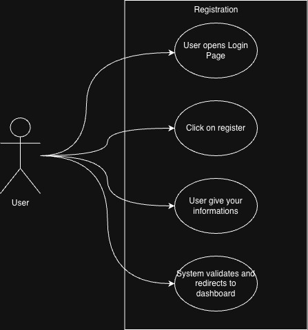
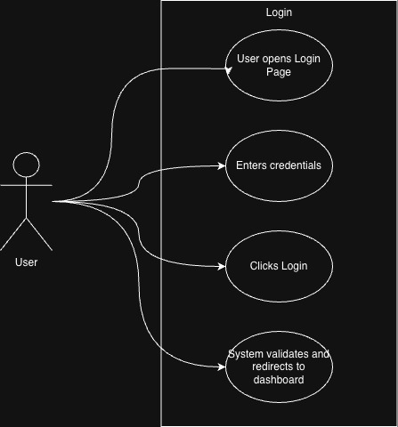
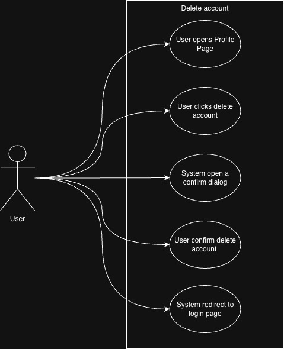
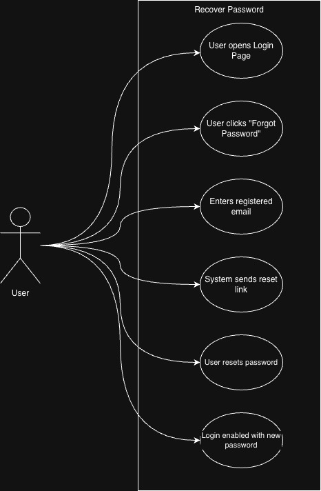
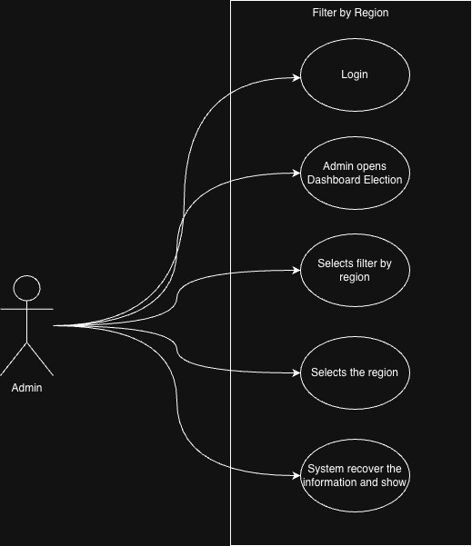
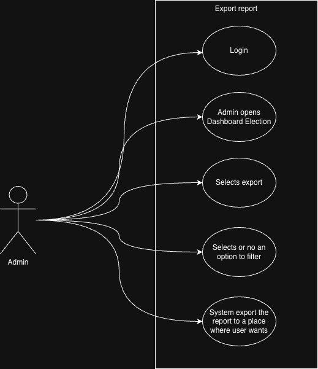

# 🧬 Realtime Voting System -- Architecture Overview

# 1. 🏛️ Structure

## 1.1 🎯 Problem Statement and Context

This document describes the high-level architecture and security
strategy for a global, real-time voting system designed to support:

- Up to 300 million registered users
- Traffic peaks of 240,000 requests per second (RPS)
- Strict consistency and reliability guarantees
- Strong protection against bots, fraud, and abuse
- One-person-one-vote enforcement
- Near real-time result visibility

The system must be fully cloud-native, highly scalable, fault tolerant,
and secure by design, while explicitly avoiding:

## 1.2 Restrictions

- Serverless platforms outside AWS
- MongoDB
- On-premise infrastructure
- Google Cloud & Microsoft Azure
- OpenShift
- Mainframes
- Monolithic architectures

AWS-based, fully distributed, microservices-first architecture is
assumed.

## 1.3 Problem Space

**What is the problem?**

We need to design and build a globally distributed, mission-critical real-time voting system capable of handling 300 million registered users with peak traffic of 240,000 requests per second. The system must guarantee absolute data integrity, enforce strict one-person-one-vote constraints, provide real-time result visibility, and defend against sophisticated fraud, bot attacks, and abuse at scale—all while maintaining near-zero data loss and high availability across multiple geographic regions.

**What is the context of the problem?**

- **Market Context**:
  - Democratic elections and large-scale voting events demand unprecedented levels of trust, transparency, and reliability
  - Growing threat landscape from automated bots, state-sponsored actors, and coordinated fraud campaigns
  - Increasing expectations for instant feedback and real-time results from 300M+ global participants
  - Zero tolerance for data loss, system failures, or security breaches that could undermine election integrity
  - Need for systems that can scale elastically during unpredictable traffic spikes (campaigns, debates, breaking news)

- **Business Context**:
  - Any data loss or security breach creates legal liability, regulatory penalties, and irreparable reputational damage
  - System must support mission-critical operations with financial and legal consequences
  - One-time deployment windows with no room for failure during live voting periods
  - Requirement for complete auditability and tamper-proof logging for legal compliance
  - Cost optimization critical—infrastructure must scale down after peak periods
  - Must support strict SLAs with penalties for downtime or data inconsistency

- **Technical Context**:
  - Peak traffic of 240K RPS eliminates traditional vertical scaling and monolithic architectures
  - 300M users require geo-distributed sharding, multi-region replication, and CDN distribution
  - ACID guarantees required for vote integrity—NoSQL eventually consistent models insufficient for vote records
  - Real-time requirements demand event-driven architecture (Kafka, SSE) with <2 second latency
  - Cloud-native AWS-only restriction eliminates multi-cloud and serverless options
  - Must handle database bottlenecks through strategic sharding (geo-based), read replicas, and caching
  - Defense-in-depth security model required across network, identity, device, behavior, application, and data layers
  - Need for immutable audit logs and write-once-read-many (WORM) compliance

- **User Context**:
  - 300M users spread across multiple geographic regions with varying network conditions
  - Users expect instant confirmation of vote submission and real-time result updates
  - Users must be authenticated securely without friction (prevent credential stuffing, session hijacking)
  - Mobile and web clients require Server-Sent Events (SSE) for efficient real-time updates
  - Users in different time zones create distributed load patterns with unpredictable spikes
  - Accessibility requirements for diverse user populations (language, disability, device types)
  - Users must vote exactly once—any duplicate vote undermines system integrity

**Core Challenges:**

1. **Data Integrity at Scale**
   - Guarantee zero data loss across 240K RPS with multi-region active-active replication
   - Implement synchronous writes with WAL (Write-Ahead Logging) and fsync guarantees
   - Build tamper-proof immutable audit trails using OpenSearch WORM indices
   - Handle database sharding across 300M users without creating consistency gaps
   - Design automatic failover with RPO=0 (Recovery Point Objective) and RTO<60s (Recovery Time Objective)

2. **Security & Fraud Prevention**
   - Detect and block automated bots at 240K RPS without impacting legitimate users
   - Prevent credential stuffing, session hijacking, replay attacks, and DDoS
   - Implement defense-in-depth: WAF, device fingerprinting, behavioral analysis, rate limiting
   - Validate identity uniqueness across 300M users without centralized bottlenecks
   - Build real-time fraud detection with ML models analyzing voting patterns

3. **Horizontal Scalability**
   - Scale API layer from baseline to 240K RPS using Kubernetes HPA and KEDA
   - Implement geo-based database sharding to distribute 300M user records
   - Design stateless microservices that auto-scale without session affinity issues
   - Optimize cache layers (Redis) to absorb read-heavy traffic and reduce DB load
   - Handle cold-start delays during sudden traffic spikes with pre-warming strategies

4. **Strict Idempotency & One-Vote Enforcement**
   - Guarantee exactly-once vote processing despite retries, network failures, and race conditions
   - Implement distributed locks or optimistic concurrency control at database level
   - Design idempotency keys with conflict resolution for duplicate submissions
   - Prevent race conditions when multiple requests arrive simultaneously for same user
   - Build reconciliation mechanisms to detect and resolve any duplicate votes in audit logs

5. **Real-Time Result Distribution**
   - Stream aggregated results to 300M users with <2 second latency using SSE
   - Design event-driven architecture (Kafka) for vote ingestion and aggregation
   - Handle 250K concurrent SSE connections with minimal server resource overhead
   - Implement efficient broadcast patterns using EventEmitter for SSE clients
   - Balance real-time updates with system load—aggregate summaries vs. individual events

6. **Multi-Region Complexity**
   - Synchronize vote data across geographic regions with strong consistency
   - Handle network partitions (split-brain scenarios) without duplicate votes
   - Route users to nearest region while maintaining global vote count accuracy
   - Implement cross-region disaster recovery with automated failover
   - Manage clock skew and distributed transaction coordination across regions

7. **Performance Under Load**
   - Maintain <100ms p99 latency during 240K RPS peak traffic
   - Prevent database saturation through write buffering, connection pooling, and read replicas
   - Optimize Kafka throughput for event streaming without lag buildup
   - Implement backpressure mechanisms to gracefully degrade under extreme load
   - Cache authentication tokens and session data to reduce repeated DB lookups

---


# 2. 🎯 Goals

## 2.1 Never Lose Data

Voting systems are mission-critical. Any data loss leads to: 
- Legal risks 
- Loss of public trust 
- Invalid election outcomes

This requires: 
- Multi-region replication 
- Strong durability guarantees
- Strict write acknowledgements 
- Immutable audit logs

## 2.2 Be Secure and Prevent Bots & Bad Actors (Primary Ownership Area)

This is one of the hardest challenges at global scale. The system must prevent:

- Automated voting (bots)
- Credential stuffing
- Distributed fraud attacks
- Replay attacks
- Session hijacking
- API scraping
- DDoS attacks

Security must be implemented in multiple layers (defense in depth): 
- Network
- Identity 
- Device 
- Behavior 
- Application 
- Data

## 2.3 Handle 300M Users

This implies: 
- Massive horizontal scalability 
- Stateless architectures 
- Global CDNs 
- Partitioned databases 
- Multi-region deployment

---

## 2.4 Handle 240K RPS Peak Traffic

It requires:
- Load-based autoscaling 
- Event-driven processing 
- Front-door traffic absorption 
- Backpressure handling

## 2.5 One Vote per User (Strict Idempotency)

This is a data + security + consistency problem: 

Each identity must be: 
- Verified 
- Unique 
- Non-replayable 

Vote submissions must be: 
- Idempotent 
- Conflict-safe 
- Race-condition proof

## 2.6 Real-Time Results

This creates challenges in: 
- Data streaming 
- Cache invalidation 
- Broadcast consistency 
- Fan-out architectures 
- WebSocket / pub-sub scalability

---


# 3. 🎯 Non-Goals

- On-prem or hybrid operation
- Manual moderation for fraud detection
- Single-region deployment
- Strong coupling between frontend and backend
- Vertical scaling
- Centralized bottlenecks
- Stateful monoliths

---


# 4. 📐 Design Principles

The architecture is guided by seven foundational design principles that address the unique challenges of building a mission-critical, globally distributed voting system. These principles inform every architectural decision, from technology selection to deployment strategies.

## 4.1 Security First (Defense in Depth)

**Principle**: Security is not a feature—it's the foundation. Every layer of the system must assume breach and implement independent security controls.

**Why This Matters**:

- Voting systems are high-value targets for nation-state actors, organized fraud, and automated bot armies
- A single security failure can compromise election integrity and destroy public trust
- Attack vectors evolve constantly—security must be layered and adaptive

## 4.2 Scalability by Default (Horizontal, Stateless, Elastic)

**Principle**: The system must scale horizontally without architectural changes. Every component is designed for elastic scaling from day one.

**Why This Matters**:

- Peak traffic (240K RPS) is 100x baseline load—vertical scaling is impossible
- Voting events create unpredictable traffic spikes (debates, breaking news, election day)
- Cost optimization requires scaling down after peak periods

## 4.3 Event-Driven Architecture (Asynchronous, Decoupled, Resilient)

**Principle**: Decouple producers and consumers through event streams. All critical operations are asynchronous to prevent cascading failures.

**Why This Matters**:

- Synchronous request-response patterns create tight coupling and single points of failure
- Database writes at 240K RPS would saturate any relational database
- Real-time result aggregation requires parallel event processing

## 4.4 Stateless Compute (Immutable, Ephemeral, Replaceable)

**Principle**: Application servers hold no persistent state. Every instance is interchangeable and can be destroyed/recreated without data loss.

**Why This Matters**:

- Stateful servers cannot scale horizontally (sticky sessions create hotspots)
- Server failures with in-memory state cause data loss
- Rolling updates and auto-scaling require killing instances without warning

## 4.5 Multi-Layer Anti-Abuse Protection (Adaptive, ML-Driven, Zero Trust)

**Principle**: Assume every request is malicious until proven otherwise. Defense mechanisms adapt in real-time to emerging threats.

**Why This Matters**:

- Bots evolve to bypass static rules (CAPTCHA solving, residential proxies)
- Credential stuffing attacks leverage millions of stolen username/password pairs
- Distributed attacks from 100K+ IP addresses bypass simple rate limiting

## 4.6 Auditable Data (Immutable, Tamper-Proof, Forensic-Ready)

**Principle**: Every vote and system action is recorded in an append-only, cryptographically verifiable audit log.

**Why This Matters**:

- Legal requirements for election audits and recounts
- Post-incident forensics require complete event reconstruction
- Public trust depends on transparent, verifiable vote counting

## 4.7 Failure as a Normal Condition (Chaos Engineering, Graceful Degradation)

**Principle**: Expect failures at every level. Design systems that degrade gracefully and self-heal automatically.

**Why This Matters**:

- At 240K RPS, component failures are guaranteed (hardware, network, software bugs)
- Manual intervention is too slow—recovery must be automatic
- Partial availability is better than complete outage

---


# 5. 🏗️ Overall Diagrams

## 5.1 🗂️ Overall architecture


## 5.2 🗂️ Solution architecture


## 5.3 🗂️ Deployment


## 5.4 Security & Anti-Bot Strategy (Primary Focus)

### Layer 1: Network & Edge Security

- **AWS WAF**: Block common attack patterns (SQL injection, XSS, CSRF)
- **DDoS Protection**: AWS Shield Advanced for volumetric attack mitigation
- **Geographic Filtering**: Route53 + CloudFront geo-restrictions to block suspicious regions
- **Rate Limiting**: Token bucket algorithm at edge to prevent request flooding

### Layer 2: Identity & Authentication

- **Auth0 SSO + MFA**: Multi-factor authentication (SMS, authenticator apps, push notifications)
- **Liveness Detection**: SumSub facial biometrics to prevent fake accounts and deepfakes
- **Document Verification**: Government ID validation with fraud risk scoring
- **Session Binding**: Tokens tied to device fingerprint and IP address

### Layer 3: Device Intelligence

- **FingerprintJS**: Device fingerprinting to detect emulators, VMs, and bot farms
- **Jailbreak/Root Detection**: Block compromised devices
- **Behavioral Biometrics**: Analyze touch patterns, typing speed, mouse movements
- **Challenge-Response**: Cloudflare Turnstile for invisible human verification

### Layer 4: Application Security

- **OAuth2 Bearer Tokens**: Short-lived access tokens (15 min TTL) with secure refresh flows
- **API Gateway**: AWS API Gateway with request validation and transformation
- **Input Sanitization**: Strict schema validation on all API requests
- **HTTPS Everywhere**: TLS 1.3 with certificate pinning on mobile clients

### Layer 5: Data Protection

- **Encryption at Rest**: AES-256 for database, S3, and backups
- **Encryption in Transit**: TLS 1.3 for all service-to-service communication
- **Field-Level Encryption**: Sensitive PII encrypted at application layer
- **Key Rotation**: Automated rotation via AWS KMS with audit trails

### Layer 6: Audit & Monitoring

- **Immutable Logs**: OpenSearch with WORM (Write-Once-Read-Many) indices
- **Real-Time Anomaly Detection**: Machine learning models flagging suspicious voting patterns
- **SIEM Integration**: AWS Security Hub aggregating security events
- **Forensic Readiness**: Complete audit trail for post-incident investigation

### Liveness Detection & Identity Verification with SumSub

SumSub is used for:

- Facial biometrics
- Liveness detection
- Government document verification
- Global fraud risk scoring

Chosen for:

- High antifraud robustness
- Strong global compliance (KYC/AML)
- Support for multiple countries
- High-quality liveness detection against deepfake, photos, and
  replays

SumSub React Native SDK integration:

Documentation: <https://docs.sumsub.com/docs/react-native-module>

**Mobile Flow with SumSub**

1. User installs and opens the React Native app.
2. During first access or registration:
    - User is asked to capture:
        - A selfie video (liveness)
        - A government-issued document
3. The app sends media directly to SumSub SDK.
4. SumSub performs:
    - Face matching
    - Liveness challenge
    - Document authenticity validation
5. The backend receives:
    - Verification status
    - Risk score
    - Unique document hash
6. Only verified users are allowed to vote.

No raw biometric data is stored directly in the voting backend.

### Secure Authentication with Auth0 (SSO + MFA)

Auth0 is used for:

- Secure login
- Social SSO
- Passwordless login
- Multi-Factor Authentication (MFA)
- Token lifecycle management

Documentation: <https://auth0.com/docs/quickstart/native/react-native>

**Authentication Flow**

1. User taps "Login".
2. React Native app redirects to Auth0 universal login.
3. Auth0 performs:
    - Credential validation
    - Social login (if enabled)
    - MFA (Authenticator App, SMS, Push, etc.)
4. On success, the app receives:
    - Access Token (short-lived)
    - ID Token
    - Refresh Token (secure storage only)

### Bot Detection with Auth0 Challenge + Turnstile

To prevent credential stuffing, brute-force, and automated accounts:

- Auth0 Challenges are applied during:
    - Login
    - Registration
    - Password reset
- Cloudflare Turnstile is used as:
    - Invisible human challenge
    - CAPTCHA replacement
    - Bot traffic filter for mobile and web

The Turnstile token is attached to authentication requests and validated
by the backend before granting access.

### Secure API Requests with Tokens

All API requests use:

- OAuth2 access tokens (Bearer)
- Short TTL (e.g., 15 minutes)
- Secure refresh flow
- Token binding to:
    - Device fingerprint
    - Session
    - Risk score

Example:

``` http
POST /vote
Authorization: Bearer <access_token>
```

All backend services:

- Validate the token signature
- Validate expiration and issuer
- Check device consistency
- Enforce authorization scope

### Device Fingerprinting with FingerprintJS

FingerprintJS is used to:

- Collect passive device signals:
    - OS
    - Browser/Runtime
    - Hardware entropy
    - Emulator detection
- Generate a stable device ID
- Detect:
    - Multi-account abuse
    - Bot emulators
    - Device cloning
    - Session hijacking

How it is used:

1. FingerprintJS runs in the app runtime.
2. A device ID is generated.
3. The device ID is attached to:
    - Login requests
    - Voting requests
4. The backend correlates:
    - User Account
    - Document Hash
    - Face Template
    - Device ID

This allows detection of:

- One user trying to vote from multiple devices
- One device trying to impersonate multiple users

## 5.5 Edge to API

``` text
Mobile App (React Native)
        |
        | HTTPS
        v
CloudFront + Global Edge
        |
        v
AWS WAF (Bot Control + Rate Limits)
        |
        v
AWS Global Accelerator Backbone
        |
        v
API Gateway (Rate Limited)
        |
        v
Microservices (Auth, Voting, Fraud)
```

### 5.4.1. CloudFront + AWS WAF Responsibilities

**CloudFront**

- Global Anycast Edge
- TLS Termination
- Static caching
- Initial traffic absorption for 300M users

**AWS WAF**

- IP-based rate limits
- Token-based rate limits
- Header-based rate limits
- Protection against:
    - SQL Injection
    - XSS
    - CSRF
    - API Abuse
- Integrated Bot Control


### 5.4.2. Global Accelerator & Backbone Routing

All traffic between edge and API uses:

- AWS Global Accelerator
- Optimized global routing
- Low-latency backbone
- Automatic regional failover


### 5.4.3. API Gateway Security Model

The API Gateway enforces:

- Rate limits per:
    - API Key
    - User Token
    - Device ID
- Burst protection
- Token verification
- Request signing enforcement
- Request schema validation


# 6. 🧭 Trade-offs

TODO: Please complete the trade-offs analysis for the security tools used in this architecture. It must follow the table format below:

[ ] Cireneu, need to convert the Security Tools section into trade-offs table format.
[ ] Pedro
[ ] Vitor
[ ] Gabriel
[ ] Deivid
[ ] Lima
[ ] Felipe
[ ] Kilpp


## 6.1 Architecture Tradeoffs

This document captures the key architectural decisions and their tradeoffs for the Vote System.

### Decision Categories

| Category                  | Decision              | Chosen               | Rejected                          | Rationale                                                        |
| ------------------------- | --------------------- | -------------------- | --------------------------------- | ---------------------------------------------------------------- |
| **Database**              | Data store            | PostgreSQL (RDS)     | MongoDB, NoSQL                    | Guarantees required for vote integrity                           |
| **Database**              | Scaling strategy      | Geo-based sharding   | Single instance, vertical scaling | 300M users require horizontal scaling                            |
| **Database**              | Audit/Logs store      | OpenSearch.          | PostgreSQL, DynamoDB              | Add content                                                      |
| **Cloud Provider**        | Infrastructure        | AWS                  | GCP, Azure, On-premise            | Add content                                                      |
| **Architecture**          | Style                 | Microservices        | Monolith                          | Scale requirements; independent service scaling                  |
| **Authentication**        | Provider              | Social Login (Gmail) | Auth0, Cognito, Custom            | Direct provider integration; lower cost                          |
| **Identity Verification** | Provider              | SumSub               | Jumio, Onfido                     | Add content                                                      |
| **Bot Detection**         | Human verification    | Cloudflare Turnstile | reCAPTCHA, hCaptcha               | Add content                                                      |
| **Bot Detection**         | Device fingerprinting | FingerprintJS        | Custom solution                   | Add content                                                      |
| **Compute**               | Runtime               | Kubernetes (EKS)     | ECS, Lambda                       | Add content                                                      |
| **Messaging**             | Event streaming       | Kafka                | SQS, RabbitMQ                     | High throughput for 240k RPS; Add content                        |
| **Caching**               | Layer                 | Redis                | Memcached, ElastiCache            | Real-time counters, session data, rate limiting                  |
| **Real-time**             | Updates               | WebSocket + SSE      | Polling, Long-polling             | True real-time results; accepts connection management complexity |

### Security Tradeoffs Summary

| Tool              | Pros                                    | Cons     | Risk Accepted |
| ----------------- | --------------------------------------- | -------- | ------------- |
| **Social Login**  | Direct provider integration, lower cost | add cons | add risk      |
| **SumSub**        | Strong biometric antifraud, global KYC  | add cons | add risk      |
| **Turnstile**     | Good UX                                 | add cons | add risk      |
| **FingerprintJS** | Passive, emulator detection             | add cons | add risk      |
| **AWS WAF**       | Managed rules, native integration       | add cons | add risk      |

### Scalability Tradeoffs

| Requirement       | Solution                                 | Tradeoff |
| ----------------- | ---------------------------------------- | -------- |
| 300M users        | Geo-based DB sharding                    | Add      |
| 240k RPS          | HPA + KEDA autoscaling                   | Add      |
| Zero data loss    | Synchronous replication, WAL             | Add      |
| One-vote-per-user | DB unique constraints + idempotency keys | Add      |
| Real-time results | Event streaming + WebSocket fan-out      | Add      |

### Infrastructure Tradeoffs: Microservices vs Monolith

| Aspect              | Monolith                          | Microservices                             | Tradeoff                                      |
| ------------------- | --------------------------------- | ----------------------------------------- | --------------------------------------------- |
| **Complexity**      | Lower; single codebase            | Higher; distributed system challenges     | Accept complexity for independent scaling     |
| **Scaling**         | Vertical; scale entire app        | Horizontal; scale individual services     | Required for 240k RPS peak traffic            |
| **Deployment**      | Single deployment unit            | Independent deployments per service       | Faster iteration; more operational overhead   |
| **Team Structure**  | Single team, shared codebase      | Multiple teams, service ownership         | Better for large teams; coordination overhead |
| **Fault Isolation** | Single failure affects entire app | Failures contained to individual services | Critical for high availability requirements   |
| **Data Management** | Shared database                   | Database per service                      | Accept eventual consistency between services  |

### Key Principles Applied

1. **Security over convenience**
2. **Consistency over availability**
3. **Managed services over custom**
4. **Horizontal over vertical scaling**


## 6.1. Security Tools

### Auth0

Pros: - Enterprise-grade authentication - Built-in MFA - Secure token
lifecycle - SSO support - High availability

Cons: - Expensive at large scale - Vendor lock-in - Limited
flexibility for custom flows

### SumSub

Pros: - Strong biometric antifraud - Global KYC compliance -
High-quality liveness detection - Advanced risk scoring

Cons: - High user friction - Sensitive biometric data handling - High per-verification cost - Not always legally permitted for voting


### Cloudflare Turnstile

Pros: - Invisible challenge - Better UX than CAPTCHA - Strong privacy
guarantees - Blocks simple automation

Cons: - Not sufficient alone against advanced bots - External
dependency - Needs backend verification


### FingerprintJS

Pros: - Passive and invisible - Emulator and device cloning
detection - Excellent multi-account detection signal

Cons: - Fingerprints can be spoofed by advanced attackers - Privacy
and compliance concerns - Device replacement causes identity changes


### AWS CloudFront

Pros: - Global CDN - Massive traffic absorption - Native integration
with AWS security - Edge-level DDoS protection

Cons: - Pricing complexity - Cache invalidation cost - Less flexible
than software-based proxies


### AWS WAF

Pros: - Managed OWASP rules - Tight AWS integration - Native
CloudFront support - Bot Control included

Cons: - Limited advanced behavioral fraud detection - Requires tuning
to avoid false positives


### AWS Global Accelerator

Pros: - Very low global latency - Consistent static IPs -
Multi-region failover

Cons: - Additional cost - More complex routing model


### API Gateway

Pros: - Built-in rate limiting - Strong security posture - Native JWT
validation

Cons: - Cost at very high RPS - Harder to debug than direct ALB
setups

---

## DB-enforced FK vs Application-enforced

| **Aspect**                           | **DB-enforced FK (with indexes & CASCADE)**                                                                             | **Application-enforced (no DB constraints)**                                                             | **Analysis**                                                                                                                                                                                               |
|--------------------------------------|-------------------------------------------------------------------------------------------------------------------------|----------------------------------------------------------------------------------------------------------|-----------------------------------------------------------------------------------------------------------------------------------------------------------------------------------------------------------------------------|
| **Data Integrity & Consistency**     | **Guaranteed** – ACID-compliant, impossible to create orphaned records. Constraints validated in every transaction.     | **Risk-prone** – depends on application logic. Bugs or race conditions create inconsistencies over time. | DB-enforced is rigid but mathematically sound. Application-enforced needs eventual consistency patterns and reconciliation. Orphaned data often discovered late. Distributed systems with multiple DBs force app-enforced. |
| **Write Performance & Throughput**   | **Moderate to Low** – FK validation overhead on INSERT/UPDATE (index lookup + lock acquisition per write).              | **High** – No constraint checks. Critical for >10k writes/sec where FK checks become bottleneck.         | DB FKs add ~10-30% overhead per write. Each INSERT/UPDATE validates relationships. App-enforced wins for write-heavy workloads but sacrifices safety. Measure with production-like volume.                                  |
| **Read Performance & Query Patterns** | **Excellent** – Auto-indexed FK columns, JOINs use index seeks O(log n), optimizer leverages FK metadata.               | **Same if indexed** – Must manually index FK columns. Without indexes, JOINs = full table scans O(n²).   | Non-indexed FKs catastrophic: 100ms query becomes 30s+. DB-enforced auto-creates indexes. App-enforced needs disciplined index management and monitoring.                                                                   |
| **Scalability & Distribution**       | **Poor for microservices** – FKs cannot span databases. Forces monolithic DB or complex 2PC. Sharding breaks FKs.       | **Natural fit** – Services own data, manage relationships via APIs/events. Enables polyglot persistence. | DB FKs lock into single-DB. Moving to microservices requires removing FKs (risky). App-enforced needs saga patterns, event sourcing, idempotency. Choose based on 5-year vision.                                           |
| **Operational Complexity & Risk**    | **High** – Migrations on 100M+ rows take hours with locks. Cascades can accidentally delete millions (production horror stories). | **Lower for changes** – Logic in code, zero-downtime deploys. Higher risk of silent corruption.          | Adding FK to existing data = full scan + lock. Tools like gh-ost help but add complexity. RESTRICT prevents cascade disasters but needs explicit cleanup. App-enforced enables agile deploys.                               |
| **Debugging & Observability**        | **Explicit errors** – FK violations fail fast with clear messages. Root cause immediate. Impossible states prevented.   | **Silent failures** – Issues found late in reports/audits. Needs data quality metrics and reconciliation. | DB FKs = immediate feedback. App-enforced issues manifest as "data doesn't add up". Needs orphaned record detection and dashboards. Long-term cleanup costs can exceed performance gains.                                  |
| **Best For**                         | Monolithic apps, transactional systems, regulated domains (finance/healthcare), small teams, data quality > performance | Microservices, high-scale writes, eventual consistency OK, mature DevOps teams, flexibility > safety     | **Use DB FKs for**: orders, payments, user accounts. **Use app-enforced for**: cross-service relationships, analytics, >10k writes/sec. Hybrid common. Re-evaluate when scaling. Migration later is painful.                |


# 7. 💾 Migrations

We don't have migration for this architecture since its a new system.

---


# 8. 🗂️ Use Cases

1. Users send requests through a global CDN + security edge
2. Traffic is validated, filtered, rate-limited, and inspected
3. Authenticated users submit votes via secure API
4. Votes are processed asynchronously
5. Data is stored redundantly and immutably
6. Real-time updates are published via streaming

Overall User Use Cases: 


- Registration



- Login



- Deleting Account



- Recover Password



- User voting


- Filter by region



- Filter by Option


- Export Results



# 9. 🧪 Testing strategy

## Frontend Tests

- ReactJS component rendering tests with focus on performance metrics.
- Client-side state management tests.
- WebSocket client implementation tests.

## Mobile testing

- Unit Android: ViewModel/repository with JUnit.
- Unit iOS: XCTest with async/await; mocks per protocol.
- UI Android: Espresso for flows (login, search, dojo).
- UI iOS: XCUITest with LaunchArguments for mocks.
- Network/Contract: MockWebServer (Android) / URLProtocol stub (iOS); Pact consumer tests for contracts with the backend.
- Performance: Cold start and WS connection times measured in CI (staging).
- Accessibility: Basic TalkBack/VoiceOver per critical screen.

## Chaos tests

- Simulate AWS region failures to test Global Accelerator failover
- Test WebSocket reconnection strategies during network disruptions
- Inject latency between services to identify performance bottlenecks
- Execute in isolated production environment during low-traffic periods

## Contract tests

- Test API contracts between decomposed microservices.
- Verify WebSocket message formats and protocols.

## Performance tests

- Use K6 to simulate the user behavior and check the system's performance.
- Measure database query performance under load
- Measure UI rendering time across device types
- Benchmark WebSocket vs HTTP performance in real usage scenarios
- Track CDN cache hit/miss ratios
- Execute in staging environment with production-like conditions

## Integration tests

- Junit provides the APIs needed to run integrations tests.
- Using test containers to emulate database and or other infra dependency.
- Test WebSocket real-time communication flows.
- Run in isolated environments before production deployment.
- Create test induction APIs on service that will be used during the integration tests to induce certain states, and achive coverage on multiple possible scenarios.
- Focused on happy and unhappy paths

## Unit tests

- Junit provides the APIs needed to run integrations tests.
- Focused on happy and unhappy paths
- Minimizing the usage of mocks

---


# 10. 💿 Data store settings


The system uses a multi-database strategy:

- **PostgreSQL (RDS Multi-AZ)**: Transactional data for voters, elections, and votes with strong ACID guarantees

Each microservice owns its schema, avoiding cross-service queries through event-driven architecture, this alse reduces the need of FKs in database.

## 10.1 Data Integrity & One-Vote Enforcement

- Globally unique voting token
- Single-use cryptographic vote key

Database enforces: 
- Strong uniqueness constraints 
- Atomic conditional writes 
- Conflict detection

---


# 11. 👀 Observability and Monitoring

A robust observability strategy is critical for a system of this scale and criticality. We adopt the **three pillars of observability**: Metrics, Logs, and Traces and all using Open Source tools.

## 11.1 Stack Overview

| Pillar | Tool | Purpose |
|--------|------|---------|
| Metrics | Prometheus | Time-series collection and alerting |
| Visualization | Grafana | Dashboards and unified observability UI |
| Tracing | Jaeger | Distributed tracing |
| Logs | Loki | Log aggregation (Prometheus-native) |
| Alerting | Alertmanager | Alert routing and notification |
| Service Mesh Observability | OpenTelemetry | Instrumentation standard |


## 11.2 Metrics - Prometheus

Prometheus is the core metrics engine, chosen for its Open Source nature and Kubernetes-native design.

**Key Features:**

- Pull-based time-series collection via exporters
- Powerful query language (PromQL)
- Built-in alerting rules
- Service discovery for dynamic environments
- Integration with AWS via CloudWatch Exporter

**Exporters to Deploy:**

- `node_exporter` - Host-level metrics (CPU, memory, disk, network)
- `kube-state-metrics` - Kubernetes object states
- `cloudwatch_exporter` - AWS service metrics (RDS, SQS, ElastiCache, etc.)
- `blackbox_exporter` - Endpoint probing (HTTP, TCP, DNS)
- Custom application exporters for each microservice

**Critical Metrics to Monitor:**

| Category | Metrics |
|----------|---------|
| Application | Request rate, error rate, latency (p50, p95, p99) |
| Business | Votes per second, fraud detection rate, auth success rate |
| Infrastructure | CPU, memory, disk I/O, network throughput |
| Kubernetes | Pod restarts, pending pods, node availability |
| Database | Connection pool, query latency, replication lag |
| Queue | Message age, queue depth, consumer lag |

**Prometheus Architecture for Scale:**

```
┌─────────────────────────────────────────────────────────────────┐
│                     Prometheus Federation                        │
├─────────────────────────────────────────────────────────────────┤
│                                                                   │
│  ┌─────────────┐  ┌─────────────┐  ┌─────────────┐              │
│  │ Prometheus  │  │ Prometheus  │  │ Prometheus  │              │
│  │  Region A   │  │  Region B   │  │  Region C   │              │
│  └──────┬──────┘  └──────┬──────┘  └──────┬──────┘              │
│         │                │                │                      │
│         └────────────────┼────────────────┘                      │
│                          │                                        │
│                          ▼                                        │
│                 ┌─────────────────┐                              │
│                 │ Global Prometheus│                              │
│                 │   (Federation)   │                              │
│                 └────────┬────────┘                              │
│                          │                                        │
│                          ▼                                        │
│                 ┌─────────────────┐                              │
│                 │    Thanos /     │ ← Long-term storage          │
│                 │   Cortex (opt)  │                              │
│                 └─────────────────┘                              │
└─────────────────────────────────────────────────────────────────┘
```

For 300M users and high cardinality, consider **Thanos** or **Cortex** for:

- Long-term metric storage (S3-backed)
- Global query view across regions
- Downsampling for historical data


## 11.3 Visualization - Grafana

Grafana serves as the unified observability frontend.

**Key Features:**

- Multi-datasource support (Prometheus, Loki, Jaeger, CloudWatch)
- Rich dashboard templating
- Alerting integration
- Team-based access control
- Annotation support for deployment markers

**Recommended Dashboards:**

1. **System Overview**
    - Global request rate and error rate
    - Vote submission success rate
    - Active users and concurrent connections
    - Regional health status

2. **Service-Level Dashboards** (per microservice)
    - RED metrics (Rate, Errors, Duration)
    - Dependency health
    - Resource utilization

3. **Security & Fraud Dashboard**
    - Bot detection triggers per minute
    - Fraud check decisions (ALLOW/CHALLENGE/DENY)
    - Auth failures and suspicious patterns
    - WAF block rate

4. **Infrastructure Dashboard**
    - Kubernetes cluster health
    - Node resource saturation
    - Database replication status
    - Queue depths and consumer lag

5. **Business Metrics Dashboard**
    - Total votes cast (real-time)
    - Votes per region/election
    - User registration funnel
    - Peak traffic patterns


## 11.4 Distributed Tracing - Jaeger

For a microservices architecture at this scale, distributed tracing is essential to understand request flow and identify bottlenecks.

**Why Jaeger:**

- Open Source (CNCF graduated project)
- Native OpenTelemetry support
- Scalable architecture with Kafka and Elasticsearch/Cassandra backends
- Adaptive sampling for high-volume systems

**Tracing Architecture:**

```
┌──────────────────────────────────────────────────────────────────────┐
│                         Tracing Flow                                  │
├──────────────────────────────────────────────────────────────────────┤
│                                                                        │
│  ┌─────────┐    ┌─────────┐    ┌─────────┐    ┌─────────┐           │
│  │ Mobile  │───▶│   API   │───▶│  Auth   │───▶│  Vote   │           │
│  │   App   │    │ Gateway │    │ Service │    │ Service │           │
│  └─────────┘    └────┬────┘    └────┬────┘    └────┬────┘           │
│                      │              │              │                  │
│         ┌────────────┴──────────────┴──────────────┘                 │
│         │  trace-id: abc123                                           │
│         │  span-id propagated via headers                            │
│         ▼                                                             │
│  ┌─────────────────────────────────────────────────────────┐         │
│  │              OpenTelemetry Collector                     │         │
│  │  (sampling, batching, export to Jaeger)                 │         │
│  └────────────────────────┬────────────────────────────────┘         │
│                           │                                           │
│                           ▼                                           │
│  ┌─────────────────────────────────────────────────────────┐         │
│  │                    Jaeger Backend                        │         │
│  │  ┌──────────┐    ┌─────────────┐    ┌──────────────┐   │         │
│  │  │Collector │───▶│    Kafka    │───▶│ Elasticsearch│   │         │
│  │  └──────────┘    └─────────────┘    └──────────────┘   │         │
│  └─────────────────────────────────────────────────────────┘         │
│                                                                        │
└──────────────────────────────────────────────────────────────────────┘
```

**Instrumentation Strategy:**

| Service | Instrumentation |
|---------|-----------------|
| API Gateway | Auto-instrumentation via OpenTelemetry |
| Auth Service | Manual spans for Auth0/Sumsub calls |
| Vote Service | Manual spans for eligibility check, fraud check, vote persist |
| Fraud Service | Manual spans for risk scoring pipeline |
| Database calls | Auto-instrumentation with query tagging |
| External APIs | Manual spans with timeout tracking |

**Key Spans to Capture:**

- `http.request` - Incoming HTTP requests
- `auth.validate_token` - Token validation
- `auth.check_eligibility` - Voter eligibility check
- `fraud.check_vote` - Fraud risk assessment
- `vote.persist` - Vote storage operation
- `db.query` - Database operations
- `external.auth0` - Auth0 API calls
- `external.sumsub` - Sumsub API calls

**Sampling Strategy:**

For 240K RPS, full tracing is not feasible. Use adaptive sampling:

- 100% sampling for errors and high-latency requests
- 1% sampling for successful requests
- 100% sampling for fraud-flagged requests
- Head-based sampling with tail-based upgrade for anomalies


## 11.5 Log Aggregation - Loki

Loki provides log aggregation that integrates natively with Grafana and uses the same label model as Prometheus.

**Why Loki:**

- Open Source (Grafana Labs)
- Lightweight - indexes labels only, not full text
- Cost-effective storage (S3-backed)
- Native Grafana integration
- LogQL query language (similar to PromQL)

**Log Architecture:**

```
┌──────────────────────────────────────────────────────────────┐
│                      Log Pipeline                             │
├──────────────────────────────────────────────────────────────┤
│                                                                │
│  ┌──────────────┐                                             │
│  │ Microservice │──┐                                          │
│  └──────────────┘  │                                          │
│  ┌──────────────┐  │    ┌──────────┐    ┌──────────────┐     │
│  │ Microservice │──┼───▶│ Promtail │───▶│     Loki     │     │
│  └──────────────┘  │    │ (Agent)  │    │   (Storage)  │     │
│  ┌──────────────┐  │    └──────────┘    └──────┬───────┘     │
│  │ Microservice │──┘                           │              │
│  └──────────────┘                              ▼              │
│                                          ┌──────────┐         │
│                                          │ Grafana  │         │
│                                          │  (Query) │         │
│                                          └──────────┘         │
└──────────────────────────────────────────────────────────────┘
```

**Structured Logging Standard:**

All services must emit structured JSON logs:

```json
{
  "timestamp": "2026-01-15T10:30:00Z",
  "level": "INFO",
  "service": "vote-service",
  "trace_id": "abc123",
  "span_id": "def456",
  "voter_id": "vtr_789",
  "election_id": "election_2026",
  "message": "Vote recorded successfully",
  "duration_ms": 45
}
```

**Required Log Labels:**

- `service` - Service name
- `environment` - prod/staging/dev
- `region` - AWS region
- `level` - Log level (ERROR, WARN, INFO, DEBUG)

**Log Retention Policy:**

- ERROR logs: 90 days
- WARN logs: 30 days
- INFO logs: 14 days
- DEBUG logs: 3 days (staging only)


## 11.6 Alerting - Alertmanager

Prometheus Alertmanager handles alert routing, deduplication, and notification.

**Alert Categories:**

| Severity | Response Time | Examples |
|----------|---------------|----------|
| Critical (P1) | < 5 min | Service down, data loss risk, security breach |
| High (P2) | < 30 min | High error rate, degraded performance |
| Medium (P3) | < 4 hours | Elevated latency, resource warnings |
| Low (P4) | Next business day | Non-critical warnings |

**Critical Alerts for Voting System:**

```yaml
# Example alert rules
groups:
  - name: voting-critical
    rules:
      - alert: VoteServiceDown
        expr: up{job="vote-service"} == 0
        for: 1m
        labels:
          severity: critical
        annotations:
          summary: "Vote Service is down"

      - alert: HighVoteErrorRate
        expr: rate(vote_errors_total[5m]) / rate(vote_requests_total[5m]) > 0.01
        for: 2m
        labels:
          severity: critical
        annotations:
          summary: "Vote error rate exceeds 1%"

      - alert: FraudSpikeDetected
        expr: rate(fraud_denied_total[5m]) > 100
        for: 5m
        labels:
          severity: high
        annotations:
          summary: "Unusual fraud detection spike"

      - alert: DatabaseReplicationLag
        expr: mysql_slave_lag_seconds > 5
        for: 3m
        labels:
          severity: critical
        annotations:
          summary: "Database replication lag exceeds 5 seconds"
```

**Notification Channels:**

- Critical: PagerDuty + Slack + SMS
- High: Slack + Email
- Medium: Slack
- Low: Email digest


## 11.7 Instrumentation Standard - OpenTelemetry

OpenTelemetry (OTel) provides a vendor-neutral instrumentation standard across all services.

**Why OpenTelemetry:**

- CNCF standard
- Unified API for metrics, traces, and logs
- Auto-instrumentation for common frameworks
- Collector for processing and routing telemetry

**OpenTelemetry Collector Configuration:**

```
┌─────────────────────────────────────────────────────────────────┐
│                 OpenTelemetry Collector                          │
├─────────────────────────────────────────────────────────────────┤
│                                                                   │
│  Receivers          Processors           Exporters               │
│  ┌─────────┐       ┌───────────┐       ┌────────────┐           │
│  │  OTLP   │──────▶│  Batch    │──────▶│ Prometheus │           │
│  │  gRPC   │       │  Sampling │       │   (metrics)│           │
│  └─────────┘       │  Filter   │       ├────────────┤           │
│  ┌─────────┐       └───────────┘       │   Jaeger   │           │
│  │  OTLP   │────────────────────────▶  │  (traces)  │           │
│  │  HTTP   │                           ├────────────┤           │
│  └─────────┘                           │    Loki    │           │
│                                        │   (logs)   │           │
│                                        └────────────┘           │
└─────────────────────────────────────────────────────────────────┘
```

**SDK Integration per Language:**

- Node.js: `@opentelemetry/sdk-node`
- Go: `go.opentelemetry.io/otel`
- Python: `opentelemetry-sdk`
- Java: `opentelemetry-java`


## 11.8 Correlation and Context Propagation

For effective debugging, all telemetry must be correlated:

**Correlation IDs:**

- `trace_id` - Unique per request, propagated across services
- `span_id` - Unique per operation
- `voter_id` - Business context
- `election_id` - Business context
- `request_id` - API Gateway assigned

**Context Propagation:**

- HTTP: W3C Trace Context headers (`traceparent`, `tracestate`)
- Kafka: Headers with trace context
- gRPC: Metadata with trace context

**Grafana Correlation:**

- Click on metric → Jump to related traces
- Click on trace → Jump to related logs
- Unified view with `trace_id` as the correlation key


## 11.9 Observability for Specific Components

**WebSocket Connections (Real-time Results):**

- Active connection count per region
- Message throughput (in/out)
- Connection duration histogram
- Reconnection rate

**Fraud Service:**

- Risk score distribution
- Decision latency (p99 < 100ms)
- False positive rate (requires manual labeling)
- Model inference time

**External Dependencies:**

- Auth0 API latency and error rate
- Sumsub API latency and error rate
- AWS service health (via CloudWatch)


## 11.10 Observability Infrastructure Sizing

| Component | Sizing Recommendation |
|-----------|----------------------|
| Prometheus | 3 replicas per region, 500GB storage each |
| Thanos | Sidecar per Prometheus, centralized Query + Store |
| Jaeger Collector | 3 replicas, auto-scaling on CPU |
| Jaeger Storage | Elasticsearch 3-node cluster, 1TB+ |
| Loki | 3 ingesters, 3 queriers, S3 storage |
| Grafana | 2 replicas behind LB, PostgreSQL backend |
| OTel Collector | DaemonSet on all nodes |


## 11.11 Runbooks and SLOs

**Service Level Objectives:**

| Service | SLO | Error Budget |
|---------|-----|--------------|
| Vote Submission | 99.99% success rate | 0.01% (~26 min/month) |
| Vote Latency | p99 < 500ms | - |
| Auth Service | 99.95% availability | 0.05% |
| Real-time Results | 99.9% availability | 0.1% |
| Fraud Check Latency | p99 < 200ms | - |

**Runbooks to Create:**

- Vote Service degradation
- Database failover
- Fraud spike response
- DDoS attack response
- Regional failover procedure

---


# 12. ⚙️ Core Services

This document describes the core domain services of the secure voting platform.

## 12.1 Auth Service

The Auth Service is the **internal identity authority** of the voting
platform.

It does NOT replace Auth0 or Sumsub. Instead, it **connects them to the
voting domain** and applies business rules.

It answers one main question: \> "Who is this user inside the voting


## 12.2 Vote Service

### Management Endpoints

| Method   | Endpoint                           | Description         |
| -------- | ---------------------------------- | ------------------- |
| `POST`   | `/v1/internal/surveys`             | Create a new survey |
| `PUT`    | `/v1/internal/surveys/:id`         | Update survey       |
| `PUT`    | `/v1/internal/surveys/:id/publish` | Publish survey      |
| `PUT`    | `/v1/internal/surveys/:id/finish`  | Close survey        |
| `DELETE` | `/v1/internal/surveys/:id`         | Delete survey       |
| `GET`    | `/v1/internal/surveys/:id/results` | Get survey results  |

### Public Endpoints

| Method | Endpoint                                   | Description             |
| ------ | ------------------------------------------ | ----------------------- |
| `GET`  | `/v1/surveys/:id`                          | Get survey details      |
| `POST` | `/v1/surveys/:id/answers`                  | Submit an answer        |
| `PUT`  | `/v1/surveys/:id/answers/:answerId/finish` | Complete survey session |


### Key Endpoints

#### Create Survey

`POST` `/v1/internal/surveys`

**Payload**

```json
{
  "title": "Elections Survey",
  "questions": [
    {
      "title": "Who would you vote for president?",
      "min": 1,
      "max": 2,
      "order": 0,
      "options": [
        {
          "text": "Homer Simpsom",
          "image": "https://example.com/homer.jpg",
          "order": 0
        },
        {
          "text": "Ned Flanders",
          "image": "https://example.com/ned.jpg",
          "order": 1
        }
      ]
    }
  ]
}
```

**Response**

```json
{
  "id": "1"
  "title": "Elections Survey",
  "startDate": null,
  "finishDate": null,
  "questions": [
      {
        "id": "1"
        "title": "Who would you vote for president?",
        "min": 1,
        "max": 2,
        "order": 0,
        "options": [
          {
            "id": "1"
            "text": "Homer Simpsom",
            "image": "https://example.com/homer.jpg",
            "order": 0
          },
          {
            "id": "2"
            "text": "Ned Flanders",
            "image": "https://example.com/ned.jpg",
            "order": 1
          }
        ]
      }
    ]
}
```

#### Update Survey

`PUT` `/v1/internal/surveys/:id`

**Payload**

You can update the survey title, add/update/remove questions and their options all in one request.

- To update existing questions/options, include their `id`
- To create new questions/options, omit the `id` field
- To delete questions/options, omit them from the payload

**Example:** This request updates the survey title, updates question 1 (keeps options 1 and 2, adds a new option "Marge Simpson"), and creates a new question 2 with two new options.

```json
{
  "title": "Elections Survey For President",
  "questions": [
    {
      "id": "1",
      "title": "Who would you vote for president?",
      "min": 1,
      "max": 2,
      "order": 0,
      "options": [
        {
          "id": "1",
          "text": "Homer Simpson",
          "image": "https://example.com/homer.jpg",
          "order": 0
        },
        {
          "id": "2",
          "text": "Ned Flanders",
          "image": "https://example.com/ned.jpg",
          "order": 1
        },
        {
          "text": "Marge Simpson",
          "image": "https://example.com/marge.jpg",
          "order": 2
        }
      ]
    },
    {
      "title": "Who would you vote for minister?",
      "min": 1,
      "max": 1,
      "order": 1,
      "options": [
        {
          "text": "Montgomery Burns",
          "image": "https://example.com/burns.jpg",
          "order": 0
        },
        {
          "text": "Sideshow Bob",
          "image": "https://example.com/bob.jpg",
          "order": 1
        }
      ]
    }
  ]
}
```

**Response**

```json
{
  "id": "1",
  "title": "Elections Survey For President",
  "startDate": null,
  "finishDate": null,
  "questions": [
    {
      "id": "1",
      "title": "Who would you vote for president?",
      "min": 1,
      "max": 2,
      "order": 0,
      "options": [
        {
          "id": "1",
          "text": "Homer Simpson",
          "image": "https://example.com/homer.jpg",
          "order": 0
        },
        {
          "id": "2",
          "text": "Ned Flanders",
          "image": "https://example.com/ned.jpg",
          "order": 1
        },
        {
          "id": "5",
          "text": "Marge Simpson",
          "image": "https://example.com/marge.jpg",
          "order": 2
        }
      ]
    },
    {
      "id": "2",
      "title": "Who would you vote for minister?",
      "min": 1,
      "max": 1,
      "order": 1,
      "options": [
        {
          "id": "3",
          "text": "Montgomery Burns",
          "image": "https://example.com/burns.jpg",
          "order": 0
        },
        {
          "id": "4",
          "text": "Sideshow Bob",
          "image": "https://example.com/bob.jpg",
          "order": 1
        }
      ]
    }
  ]
}
```

#### Publish Survey

`PUT` `/v1/internal/surveys/:id/publish`

Publish a survey making it available for public responses. Sets the startDate to current timestamp.

**Response**

```json
{
  "id": "1",
  "title": "Elections Survey For President",
  "startDate": "2025-12-09T10:00:00Z",
  "finishDate": null
}
```

#### Finish Survey

`PUT` `/v1/internal/surveys/:id/finish`

Close a survey, preventing new responses. Sets the finishDate to current timestamp.

**Response**

```json
{
  "id": "1",
  "title": "Elections Survey For President",
  "startDate": "2025-12-09T10:00:00Z",
  "finishDate": "2025-12-09T18:00:00Z"
}
```

#### Delete Survey

`DELETE` `/v1/internal/surveys/:id`

**Response**

`204 No Content`


#### Get Survey Results

`GET` `/v1/internal/surveys/:id/results`

**Response**

```json
{
  "survey": {
    "id": "1",
    "title": "Elections Survey"
  },
  "totalResponses": 150,
  "questions": [
      {
        "id": "1",
        "title": "Who would you vote for president?",
        "order": 0,
        "options": [
          {
            "id": "1",
            "text": "Homer Simpson",
            "image": "https://example.com/homer.jpg",
            "order": 0,
            "votes": 85
          },
          {
            "id": "2",
            "text": "Ned Flanders",
            "image": "https://example.com/ned.jpg",
            "order": 1,
            "votes": 65
          }
        ]
      },
      {
        "id": "2",
        "title": "Who would you vote for minister?",
        "order": 1,
        "options": [
          {
            "id": "3",
            "text": "Montgomery Burns",
            "image": "https://example.com/burns.jpg",
            "order": 0,
            "votes": 70
          },
          {
            "id": "4",
            "text": "Sideshow Bob",
            "image": "https://example.com/bob.jpg",
            "order": 1,
            "votes": 80
          }
        ]
      }
    ]
  }
}
```

#### Get Survey Details

`GET` `/v1/surveys/:id`

Get public survey details including all questions and options.

**Response**

```json
{
  "id": "1",
  "title": "Elections Survey",
  "startDate": "2025-12-09T10:00:00Z",
  "finishDate": null,
  "questions": [
    {
      "id": "1",
      "title": "Who would you vote for president?",
      "min": 1,
      "max": 2,
      "order": 0,
      "options": [
        {
          "id": "1",
          "text": "Homer Simpson",
          "image": "https://example.com/homer.jpg",
          "order": 0
        },
        {
          "id": "2",
          "text": "Ned Flanders",
          "image": "https://example.com/ned.jpg",
          "order": 1
        }
      ]
    }
  ]
}
```

#### Submit Answer

`POST` `/v1/surveys/:id/answers`

Submit an answer to a question. On the first answer submission, a SurveyAnswer is automatically created. Include the `surveyAnswerId` in subsequent requests to add more answers to the same survey session.

**Payload (First Answer)**

```json
{
  "question": "1",
  "option": "1",
  "text": ""
}
```

**Response**

```json
{
  "surveyAnswer": {
    "id": "1",
    "survey": "1",
    "initialized": "2025-11-21T10:30:00Z",
    "finished": null
  },
  "questionAnswer": {
    "id": "1",
    "surveyAnswer": "1",
    "question": "1",
    "option": "1",
    "text": ""
  }
}
```

**Payload (Subsequent Answers)**

```json
{
  "surveyAnswerId": "1",
  "question": "2",
  "option": "3",
  "text": ""
}
```

**Response**

```json
{
  "id": "2",
  "surveyAnswer": "1",
  "question": "2",
  "option": "3",
  "text": ""
}
```

#### Finish Survey Session

`PUT` `/v1/surveys/:id/answers/:answerId/finish`

Mark a survey answer session as completed.

**Response**

```json
{
  "id": "1",
  "survey": "1",
  "initialized": "2025-11-21T10:30:00Z",
  "finished": "2025-11-21T10:35:00Z"
}
```

## 12.3 Notification Service


## 12.4 Producer Service


## 12.5 Consumer Service

---


# 13. 🥞 Technology Stack

## Services & Infrastructure
- Architecture: microservices, stateless compute
- Orchestration: Kubernetes (HPA, KEDA)
- Containers: Docker (immutable images)
- Front door / Edge: CloudFront + AWS WAF + AWS Global Accelerator
- API Gateway: gateway with validation and rate limiting
- Messaging / Streaming: Kafka (topics for ingestion, aggregation and audit)
- Cache / Sessions: Redis
- Transactional database: PostgreSQL (RDS Multi‑AZ)
- Authentication / Identity: Auth0, JWT
- Logs / Backup storage: S3 (retention and WORM for audit)

## Frontend / Mobile
- Web: ReactJS
- Mobile: React Native + Expo
- Human verification / anti-bot: Cloudflare Turnstile
- Device intelligence: FingerprintJS
- Liveness / KYC: SumSub

## Observability
- Metrics: Prometheus (federation / Thanos or Cortex optional)
- Visualization: Grafana
- Tracing: Jaeger (via OpenTelemetry)
- Logs: Loki
- Instrumentation: OpenTelemetry Collector / SDKs

## Testing & Quality
- Performance: k6 (load and smoke tests)
- Unit / Integration: JUnit (mobile and services), integration tests with testcontainers
- Mobile UI / E2E: Espresso (Android), XCUITest (iOS)
- Mobile network / contract: MockWebServer (Android), URLProtocol stub (iOS)
- Chaos / Resilience: failure injection in controlled environments (simulate AZ/region, latency, etc.)

## Quick Rationale
- Kubernetes + containers enable automatic horizontal scalability and immutable deployments.
- Kafka decouples ingestion and aggregation, providing resilience and high throughput.
- PostgreSQL RDS Multi‑AZ ensures ACID for votes; Redis externalizes session state to keep compute stateless.
- Observability (Prometheus/Grafana/Jaeger/Loki + OTel) provides correlation between metrics, traces and logs for incident response and audit.
- Testing tools cover performance, integration, contracts and resilience essential for a large-scale system.

## Operational Notes
- CI/CD should run linters, unit tests, integration tests (with testcontainers), contract tests and k6 smoke tests.
- Staging environments instrumented with Prometheus/Grafana/OTel for correlation of load tests and anomaly detection.
- Plan runbooks and playbooks for DB failover, Kafka recovery and response to attacks blocked by the WAF.
