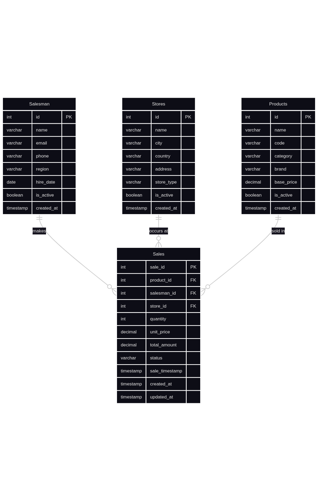
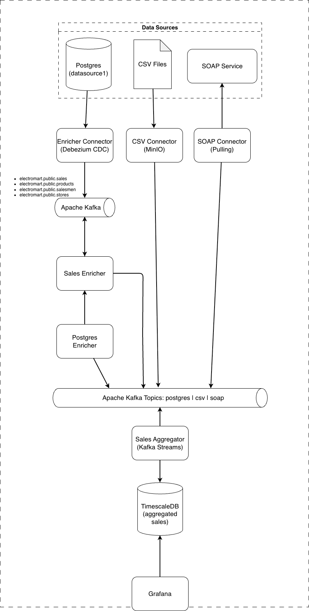
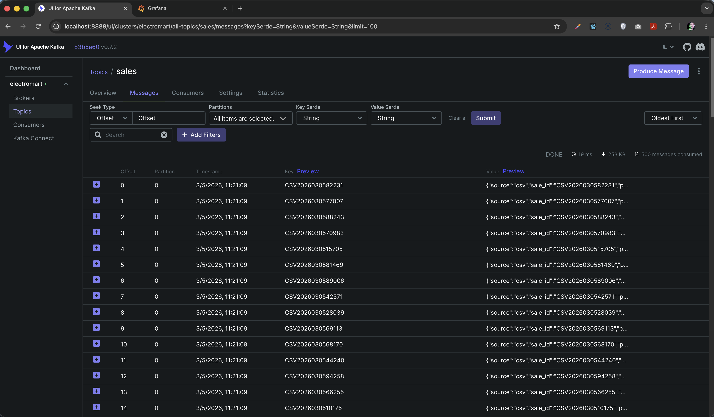
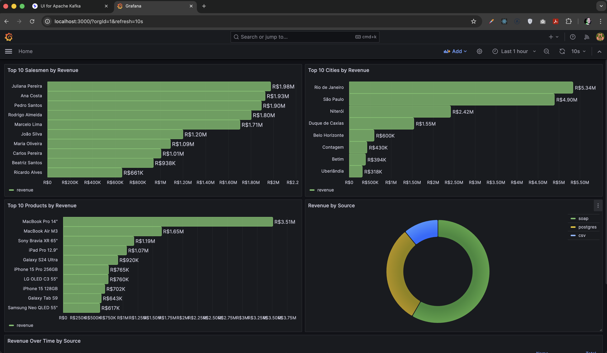
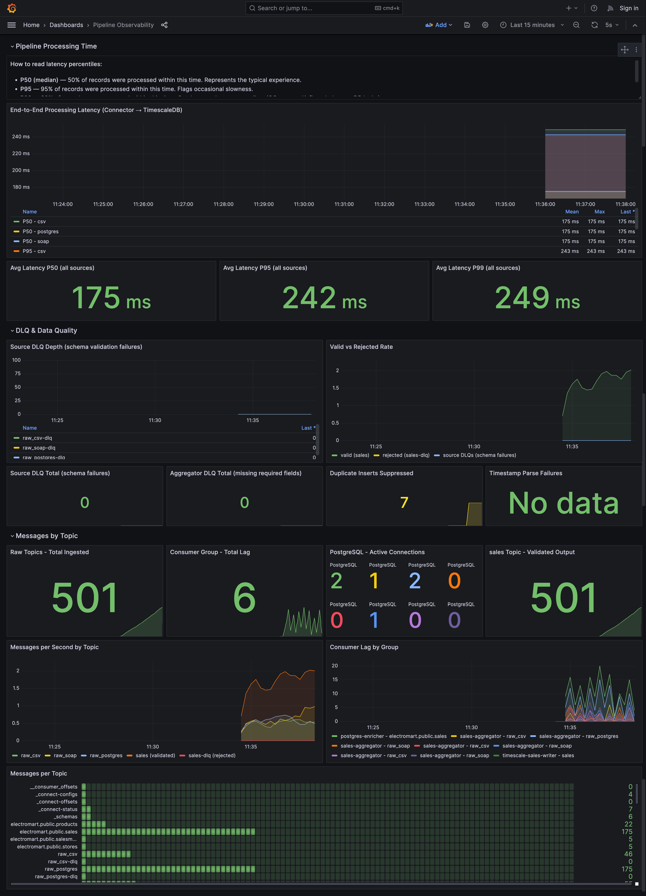
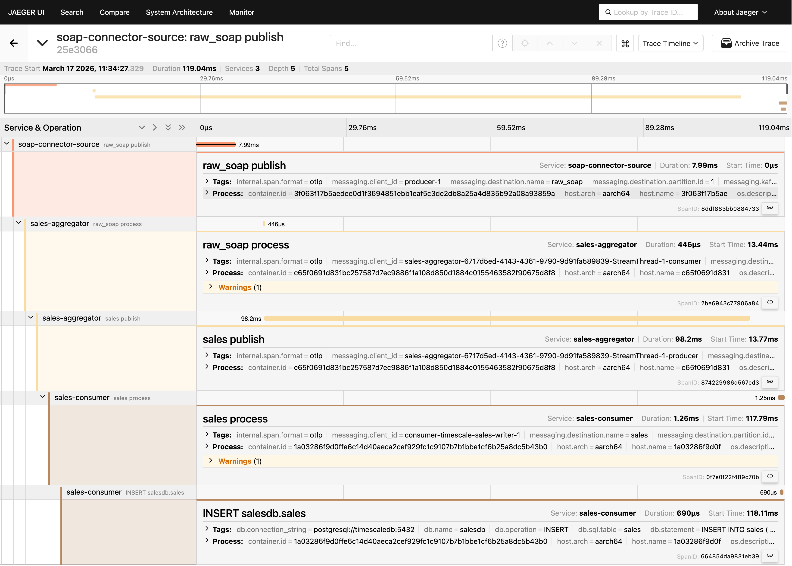

# TOP Salesman - Data KATA

## Solution

### Data Sources

All three data sources share the same consistent master data: **22 products**, **15 salesmen**, and **18 stores**.

#### Postgresql

Update freq: Real-time (continuous, every 5 seconds)<br/>
Database: `electromart`

Schema is initialized automatically via `init.sql` mounted into the PostgreSQL container (`/docker-entrypoint-initdb.d/`). The Node.js generator only inserts new sales.

**Tables:** `products`, `salesmen`, `stores`, `sales`

  

#### CSV Files (via MinIO S3)

Update freq: Every 5 seconds<br/>
Storage: MinIO (S3-compatible object storage)<br/>
Bucket: `sales-csv`

**Architecture:**

```
[CSV Generator] ──▶ [MinIO S3 Bucket] ──webhook──▶ [CSV Connector] ──▶ [Kafka]
```

The CSV connector is event-driven: MinIO sends webhook notifications when new files are uploaded, eliminating polling and enabling true real-time streaming.

```csv
sale_id,product_code,product_name,category,brand,salesman_name,salesman_email,region,store_name,city,store_type,quantity,unit_price,total_amount,status,sale_date
CSV2024011543210,IPHONE15PRO256,iPhone 15 Pro 256GB,SMARTPHONE,Apple,João Silva,joao.silva@electromart.com.br,São Paulo,Magazine Luiza Paulista,São Paulo,RETAIL,2,8999.00,17998.00,PENDING,2024-01-15 10:32:15
CSV2024011554321,GALAXYS24ULTRA,Galaxy S24 Ultra,SMARTPHONE,Samsung,Maria Oliveira,maria.oliveira@electromart.com.br,São Paulo,Fast Shop Morumbi,São Paulo,RETAIL,1,7999.00,7999.00,CONFIRMED,2024-01-15 11:05:42
CSV2024011565432,MACBOOKPRO14,MacBook Pro 14",LAPTOP,Apple,Pedro Santos,pedro.santos@electromart.com.br,Rio de Janeiro,Magazine Luiza Copacabana,Rio de Janeiro,RETAIL,1,18999.00,18999.00,CANCELLED,2024-01-15 14:22:08
```

#### SOAP

Update freq: Polled every 5 seconds<br/>
Protocol: SOAP 1.1 / XML

```
URL: http://localhost:8080/sales
Method: POST
Content-Type: text/xml
```

**Example SOAP Response**

```xml
<soapenv:Envelope xmlns:soapenv="http://schemas.xmlsoap.org/soap/envelope/"
                  xmlns:sale="http://electromart.com/sales">
  <soapenv:Body>
    <sale:GetSalesResponse>
      <sale:totalRecords>3</sale:totalRecords>
      <sale:nextCursor>SOAP-20240115-00003</sale:nextCursor>
      <sale:hasMore>false</sale:hasMore>
      <sale:sales>
        <sale:record>
          <sale:saleId>SOAP-20240115-00001</sale:saleId>
          <sale:productCode>IPHONE15PRO256</sale:productCode>
          <sale:productName>iPhone 15 Pro 256GB</sale:productName>
          <sale:category>SMARTPHONE</sale:category>
          <sale:brand>Apple</sale:brand>
          <sale:salesmanName>João Silva</sale:salesmanName>
          <sale:salesmanEmail>joao.silva@electromart.com.br</sale:salesmanEmail>
          <sale:region>São Paulo</sale:region>
          <sale:storeName>Magazine Luiza Paulista</sale:storeName>
          <sale:city>São Paulo</sale:city>
          <sale:storeType>RETAIL</sale:storeType>
          <sale:quantity>2</sale:quantity>
          <sale:unitPrice>8999.00</sale:unitPrice>
          <sale:totalAmount>17998.00</sale:totalAmount>
          <sale:status>PENDING</sale:status>
          <sale:saleTimestamp>2024-01-15T10:32:15Z</sale:saleTimestamp>
        </sale:record>
      </sale:sales>
    </sale:GetSalesResponse>
  </soapenv:Body>
</soapenv:Envelope>
```

### Architecture Overview



### Kafka Topics

| Topic                         | Source                              | Description                                  |
| ----------------------------- | ----------------------------------- | -------------------------------------------- |
| `electromart.public.sales`    | Debezium CDC                        | CDC events from PostgreSQL sales table       |
| `electromart.public.products` | Debezium CDC                        | CDC events from PostgreSQL products table    |
| `electromart.public.salesmen` | Debezium CDC                        | CDC events from PostgreSQL salesmen table    |
| `electromart.public.stores`   | Debezium CDC                        | CDC events from PostgreSQL stores table      |
| `raw_csv`                     | CSV Connector                       | Raw sales from CSV files                     |
| `raw_soap`                    | SOAP Connector                      | Raw sales from SOAP service                  |
| `raw_postgres`                | Postgres Enricher                   | Enriched sales from PostgreSQL CDC           |
| `aggregated.sales`          | Sales Aggregator                    | Normalized and validated sales               |
| `aggregated.sales-dlq`      | Sales Aggregator                    | Records that failed validation               |

## How to Run

```bash
# From the repository root
cd data/salesman-kata-v2

# Build and start all services
docker compose up -d --build

# Check running containers
docker compose ps

# View logs from the full stack
docker compose logs -f

# Stop all services
docker compose down

# Stop and remove all data (clean start)
docker compose down -v
```

### First Checks

Wait until the main services are healthy, then test:

```bash
# Sales Consumer API
curl http://localhost:8090/health

# SOAP service
curl http://localhost:8080/health

# Kafka Connect
curl http://localhost:8083/
```

### Query Aggregated Results

```bash
# Latest top cities snapshot
curl http://localhost:8090/api/aggregates/top-sales-per-city

# Latest top salesmen snapshot
curl http://localhost:8090/api/aggregates/top-salesman-country

# Combined response
curl http://localhost:8090/api/aggregates/summary

# Aggregated results for a specific time range

curl "http://localhost:8090/api/aggregates/summary?from=2026-03-13T00:00:00Z&to=2026-03-13T23:59:59Z"
```

### Access Points

| Service | URL / Port | Purpose | Credentials |
| ------- | ---------- | ------- | ----------- |
| Sales Consumer API | http://localhost:8090 | Kafka consumer that writes to TimescaleDB and exposes aggregated query endpoints | - |
| Grafana | http://localhost:3000 | Dashboards and observability | `admin / admin` |
| Kafka UI | http://localhost:8888 | Browse topics, messages, and Kafka Connect | - |
| Kafka Connect | http://localhost:8083 | Debezium/connectors API | - |
| SOAP Service | http://localhost:8080/sales | Mock SOAP sales source | - |
| MinIO API | http://localhost:9000 | S3-compatible object storage | `minioadmin / minioadmin123` |
| MinIO Console | http://localhost:9001 | MinIO web console | `minioadmin / minioadmin123` |
| PostgreSQL | `localhost:5432` | Source ERP database | `electromart / electromart123` |
| TimescaleDB | `localhost:5433` | Aggregated warehouse database | `sales / sales123` |
| Kafka Broker | `localhost:19092` | External Kafka bootstrap server | - |

### Main Internal Services

These services run inside Docker and are part of the pipeline even when they do not expose ports directly on the host:

| Service | Responsibility |
| ------- | -------------- |
| `postgres-data-generator` | Generates sample sales in PostgreSQL |
| `postgres-connector-source` | Registers the PostgreSQL Debezium connector |
| `postgres-enricher` | Enriches PostgreSQL CDC events into `raw_postgres` |
| `csv-files` | Generates CSV sales files |
| `csv-connector-source` | Receives MinIO webhook events and publishes CSV sales to Kafka |
| `soap-connector-source` | Polls the SOAP service and publishes sales to Kafka |
| `sales-aggregator` | Consumes `raw_csv`, `raw_soap`, `raw_postgres`, normalizes records and publishes canonical sales events |
| `sales-consumer` | Consumes `sales`, writes to TimescaleDB, and exposes the aggregate query API on port `8090` |

## Results

**Messages on Kafka UI**


**Results on Grafana**


**Observability on Grafana**


**OpenTelemetry Trace**


**Demo**
* https://youtu.be/9x2s_bN0z1k