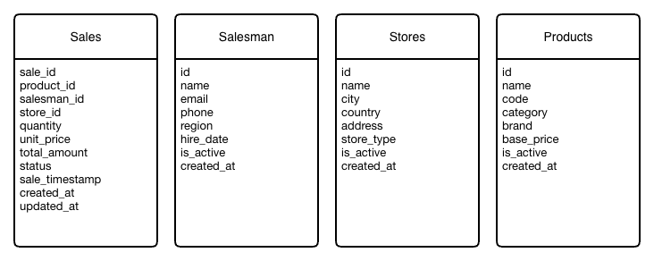

# TOP Salesman - Data KATA

## Problem Context

We are building software for a multi-warehouse, multi-salesperson electronics store that sells cell phones, computers, and related products across multiple retailers. Every Monday the CEO asks for revenue and top-salesperson reports, but today a data analyst spends nearly two days manually exporting data from PostgreSQL, downloading CSV files, polling a legacy SOAP service, merging everything in Excel, and building charts before the report is finally delivered on Wednesday evening. The goal is to replace this manual process with a real-time data pipeline that ingests from all three sources, unifies the data, and delivers live dashboards.

## Solution

### Data Sources

All three data sources share the same consistent master data: **22 products**, **15 salesmen**, and **18 stores**.

#### Postgresql

Origin: Original ERP system (SAP on PostgreSQL)<br/>
Data: Real-time sales from POS terminals<br/>
Volume: ~50,000 transactions per day<br/>
Update freq: Real-time (continuous, every 5 seconds)<br/>
Database: `electromart`

Schema is initialized automatically via `init.sql` mounted into the PostgreSQL container (`/docker-entrypoint-initdb.d/`). The Node.js generator only inserts new sales.

**Tables:** `products`, `salesmen`, `stores`, `sales`

```sql
-- Sales table structure
sale_id     BIGSERIAL PRIMARY KEY
product_id  INTEGER  (FK → products)
salesman_id INTEGER  (FK → salesmen)
store_id    INTEGER  (FK → stores)
quantity    INTEGER
unit_price  DECIMAL(10,2)
total_amount DECIMAL(12,2)
status      VARCHAR(20)  -- PENDING | CONFIRMED | CANCELLED
sale_timestamp TIMESTAMP
```



#### CSV Files (via MinIO S3)

Origin: Acquired company's legacy system (2018)<br/>
Data: Daily sales export<br/>
Volume: 1-5 records per file<br/>
Update freq: Every 5 seconds<br/>
Storage: MinIO (S3-compatible object storage)<br/>
Bucket: `sales-csv`

**Architecture:**

```
[CSV Generator] ──▶ [MinIO S3 Bucket] ──webhook──▶ [CSV Connector] ──▶ [Kafka]
```

The CSV connector is event-driven: MinIO sends webhook notifications when new files are uploaded, eliminating polling and enabling true real-time streaming.

**MinIO Console:** http://localhost:9001 (minioadmin / minioadmin123)

```csv
sale_id,product_code,product_name,category,brand,salesman_name,salesman_email,region,store_name,city,store_type,quantity,unit_price,total_amount,status,sale_date
CSV2024011543210,IPHONE15PRO256,iPhone 15 Pro 256GB,SMARTPHONE,Apple,João Silva,joao.silva@electromart.com.br,São Paulo,Magazine Luiza Paulista,São Paulo,RETAIL,2,8999.00,17998.00,PENDING,2024-01-15 10:32:15
CSV2024011554321,GALAXYS24ULTRA,Galaxy S24 Ultra,SMARTPHONE,Samsung,Maria Oliveira,maria.oliveira@electromart.com.br,São Paulo,Fast Shop Morumbi,São Paulo,RETAIL,1,7999.00,7999.00,CONFIRMED,2024-01-15 11:05:42
CSV2024011565432,MACBOOKPRO14,MacBook Pro 14",LAPTOP,Apple,Pedro Santos,pedro.santos@electromart.com.br,Rio de Janeiro,Magazine Luiza Copacabana,Rio de Janeiro,RETAIL,1,18999.00,18999.00,CANCELLED,2024-01-15 14:22:08
```

#### SOAP

Origin: Legacy sales system (2012)<br/>
Data: Sales transactions (mocked/generated on-demand)<br/>
Volume: 1-5 records per request<br/>
Update freq: Polled every 5 seconds<br/>
Protocol: SOAP 1.1 / XML

```
URL: http://localhost:8080/sales
Method: POST
Content-Type: text/xml
```

**Request (cursor-based pagination)**

```xml
<cursor>SOAP-20240115-00050</cursor>
<pageSize>100</pageSize>
```

**Example SOAP Response**

```xml
<soapenv:Envelope xmlns:soapenv="http://schemas.xmlsoap.org/soap/envelope/"
                  xmlns:sale="http://electromart.com/sales">
  <soapenv:Body>
    <sale:GetSalesResponse>
      <sale:totalRecords>3</sale:totalRecords>
      <sale:nextCursor>SOAP-20240115-00003</sale:nextCursor>
      <sale:hasMore>false</sale:hasMore>
      <sale:sales>
        <sale:record>
          <sale:saleId>SOAP-20240115-00001</sale:saleId>
          <sale:productCode>IPHONE15PRO256</sale:productCode>
          <sale:productName>iPhone 15 Pro 256GB</sale:productName>
          <sale:category>SMARTPHONE</sale:category>
          <sale:brand>Apple</sale:brand>
          <sale:salesmanName>João Silva</sale:salesmanName>
          <sale:salesmanEmail>joao.silva@electromart.com.br</sale:salesmanEmail>
          <sale:region>São Paulo</sale:region>
          <sale:storeName>Magazine Luiza Paulista</sale:storeName>
          <sale:city>São Paulo</sale:city>
          <sale:storeType>RETAIL</sale:storeType>
          <sale:quantity>2</sale:quantity>
          <sale:unitPrice>8999.00</sale:unitPrice>
          <sale:totalAmount>17998.00</sale:totalAmount>
          <sale:status>PENDING</sale:status>
          <sale:saleTimestamp>2024-01-15T10:32:15Z</sale:saleTimestamp>
        </sale:record>
        <sale:record>
          <sale:saleId>SOAP-20240115-00002</sale:saleId>
          <sale:productCode>GALAXYS24ULTRA</sale:productCode>
          <sale:productName>Galaxy S24 Ultra</sale:productName>
          <sale:category>SMARTPHONE</sale:category>
          <sale:brand>Samsung</sale:brand>
          <sale:salesmanName>Pedro Santos</sale:salesmanName>
          <sale:salesmanEmail>pedro.santos@electromart.com.br</sale:salesmanEmail>
          <sale:region>Rio de Janeiro</sale:region>
          <sale:storeName>Casas Bahia Madureira</sale:storeName>
          <sale:city>Rio de Janeiro</sale:city>
          <sale:storeType>RETAIL</sale:storeType>
          <sale:quantity>1</sale:quantity>
          <sale:unitPrice>7999.00</sale:unitPrice>
          <sale:totalAmount>7999.00</sale:totalAmount>
          <sale:status>CONFIRMED</sale:status>
          <sale:saleTimestamp>2024-01-15T11:05:42Z</sale:saleTimestamp>
        </sale:record>
      </sale:sales>
    </sale:GetSalesResponse>
  </soapenv:Body>
</soapenv:Envelope>
```

## Services needed

| #   | Service/Component                | Purpose                                      | Implemented |
| --- | -------------------------------- | -------------------------------------------- | ----------- |
| 1   | PostgreSQL                       | Source 1 - Sales transactions                | ✅ Yes      |
| 2   | CSV Files (Local Volume)         | Source 2 - Sales from legacy system          | ✅ Yes      |
| 3   | SOAP Service                     | Source 3 - Legacy sales                      | ✅ Yes      |
| 4   | Message Broker (Kafka)           | Event streaming backbone                     | ✅ Yes      |
| 5   | Kafka Connect (Debezium)         | CDC connector for PostgreSQL                 | ✅ Yes      |
| 6   | CSV Connector                    | Reads CSV files and publishes to Kafka       | ✅ Yes      |
| 7   | SOAP Connector                   | Polls SOAP service and publishes to Kafka    | ✅ Yes      |
| 8   | Postgres Connector               | Enriches PostgreSQL CDC events               | ✅ Yes      |
| 9   | Sales Aggregator (Kafka Streams) | Aggregates all sources into unified topic    | ✅ Yes      |
| 10  | TimescaleDB                      | Time-series database for aggregated results  | ✅ Yes      |
| 11  | Grafana                          | Dashboard & visualization                    | ✅ Yes      |
| 12  | Kafka UI                         | Kafka monitoring and management              | ✅ Yes      |

### Architecture Overview


```
┌─────────────────────────────────────────────────────────────────────────────┐
│                              DATA SOURCES                                   │
├─────────────────┬─────────────────────┬─────────────────────────────────────┤
│   PostgreSQL    │     CSV Files       │         SOAP Service                │
│                 │                     │                                     │
└────────┬────────┴──────────┬──────────┴──────────────┬──────────────────────┘
         │                   │                         │
         ▼                   ▼                         ▼
┌─────────────────┐ ┌─────────────────┐ ┌─────────────────────────────────────┐
│ Kafka Connect   │ │ CSV Connector   │ │       SOAP Connector                │
│ (Debezium CDC)  │ │                 │ │                                     │
└────────┬────────┘ └────────┬────────┘ └──────────────┬──────────────────────┘
         │                   │                         │
         ▼                   ▼                         ▼
┌─────────────────────────────────────────────────────────────────────────────┐
│                           APACHE KAFKA                                      │
│  Topics: electromart.public.* | raw-sales | sales | sales-dlq | lineage    │
└─────────────────────────────────────────────────────────────────────────────┘
         │                   │                         │
         └───────────────────┼─────────────────────────┘
                             ▼
┌─────────────────────────────────────────────────────────────────────────────┐
│                      SALES AGGREGATOR (Kafka Streams)                       │
│         Consumes: raw-sales → Produces: unified "sales" topic               │
└─────────────────────────────────────────────────────────────────────────────┘
                             │
                             ▼
┌─────────────────────────────────────────────────────────────────────────────┐
│                          TIMESCALEDB                                        │
│              Time-series database for aggregated sales data                 │
│                    Tables: sales (hypertable)                               │
└─────────────────────────────────────────────────────────────────────────────┘
                             │
                             ▼
┌─────────────────────────────────────────────────────────────────────────────┐
│                            GRAFANA                                          │
│                   Real-time dashboards and analytics                        │
└─────────────────────────────────────────────────────────────────────────────┘
```

### Kafka Topics

| Topic                         | Source                              | Description                                  |
| ----------------------------- | ----------------------------------- | -------------------------------------------- |
| `electromart.public.sales`    | Debezium CDC                        | CDC events from PostgreSQL sales table       |
| `electromart.public.products` | Debezium CDC                        | CDC events from PostgreSQL products table    |
| `electromart.public.salesmen` | Debezium CDC                        | CDC events from PostgreSQL salesmen table    |
| `electromart.public.stores`   | Debezium CDC                        | CDC events from PostgreSQL stores table      |
| `raw-sales`                   | CSV, SOAP, and Postgres Connectors  | Raw sales from all sources                   |
| `sales`                       | Sales Aggregator                    | Unified/aggregated sales from all sources    |
| `sales-dlq`                   | Sales Aggregator                    | Dead letter queue for invalid records        |
| `lineage`                     | All Connectors / Aggregator         | Data lineage tracking metadata               |

## How to Run

```bash
# Start all services
docker-compose up -d

# Check running containers
docker-compose ps

# View logs
docker-compose logs -f

# Stop all services
docker-compose down

# Stop and remove all data (clean start)
docker-compose down -v
```

### Access Points

| Service       | URL                         | Credentials                  |
| ------------- | --------------------------- | ---------------------------- |
| Kafka UI      | http://localhost:8888       | -                            |
| Grafana       | http://localhost:3000       | admin / admin                |
| PostgreSQL    | localhost:5432              | electromart / electromart123 |
| TimescaleDB   | localhost:5433              | sales / sales123             |
| SOAP Service  | http://localhost:8080/sales | -                            |
| Kafka Connect | http://localhost:8083       | -                            |

## Results

**Messages on Kafka UI**


**Results on Grafana**


**Observability on Grafana**

