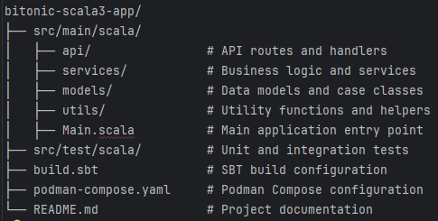

## Introduction

This project provides an API for generating bitonic sequences using the Bitonic algorithm. A **bitonic sequence** is a sequence of numbers that first increases and then decreases, or vice versa. Bitonic sequences are commonly used in sorting algorithms, such as the Bitonic Sort, which is efficient for parallel processing and hardware implementations.

The main goal of this project is to demonstrate how to generate bitonic sequences and expose this functionality through a simple HTTP API.

### About ZIO

This project is built using **ZIO**, a powerful library for asynchronous and concurrent programming in Scala. ZIO provides a type-safe, composable way to manage effects such as I/O, concurrency, and resource management. We use ZIO in this project to:

- Structure the application using layers and services
- Handle asynchronous operations safely
- Build a robust and scalable HTTP API

ZIO was chosen for its strong support for functional programming, reliability, and its ecosystem for building modern Scala applications.

## How to Run the Project

1. **Prerequisites**
   - [Podman] (https://podman.io/) or [Docker](https://www.docker.com/) installed.
   - Scala 3.7.3 installed.
   - SBT (Scala Build Tool) installed.
   - Java 11 or higher installed.

2. **Clone the repository**
    ```sh
     git clone https://github.com/codegik/team-red.git
     cd team-red/bitonic-scala3-app
    ```
3. **Build the project**
    ```sh
     sbt clean compile
     sbt assembly
      ```
4. **Create a `podman-compose.yaml` file** in the root directory of the project with the following content:
5. ```yaml
   version: '3.8'

   services:
     redis:
       image: redis:latest
       container_name: redis
       ports:
         - "6379:6379"

     memcached:
       image: memcached:latest
       container_name: memcached
       ports:
         - "11211:11211"

     bitonic-scala3-app:
       image: openjdk:11-jre-slim
       container_name: bitonic-scala3-app
       ports:
         - "8080:8080"
       volumes:
         - ./target/scala-3.7.3/bitonic-scala3-app-assembly-0.1.0-SNAPSHOT.jar:/app/bitonic-scala3-app-assembly-0.1.0-SNAPSHOT.jar
       command: ["java", "-jar", "/app/bitonic-scala3-app-assembly-0.1.0-SNAPSHOT.jar"]
       depends_on:
         - redis
         - memcached
   ```
   
6. **Start compose**
   ```sh
   podman compose up
   ```
Compose will create and run 3 containers:

* redis
* memcached
* bitonic-scala3-app
The `bitonic-scala3-app` container will be accessible at `http://localhost:8080`.
  * The Redis server will be accessible at `localhost:6379`.
  * The Memcached server will be accessible at `localhost:11211`.
  * You can stop the containers by running:
  ```sh
   podman compose down
  ```

## How to Test the API

### Health Check

```sh
curl http://localhost:8080/health-check
```

### Generate Bitonic Sequence

```sh
curl -X POST "http://localhost:8080/bitonic?n=5&l=1&r=10"
```

The result will be a JSON array with the generated sequence.

---

**Note:**  
If you are using a different port, adjust the URLs in the commands above.

## Verify Redis Cache

To verify if the app are saving the requests in the Redis Cache, you need to access the Redis Container

### Access the Redis container

```
podman exec -it redis sh
```

### Check the Redis cache

```
redis-cli --scan --pattern "*"
```
This command will list all keys stored in the Redis cache.
You can then use the `GET` command to retrieve the value of a specific key.
```
GET <key>
```
Replace `<key>` with the actual key you want to retrieve.
### Verify Memcached Cache
To verify if the app are saving the requests in the Memcached Cache, you need to access the Memcached Container
### Access the Memcached container
```
podman exec -it memcached sh
```
### Check the Memcached cache
```
 echo "stats items" | nc localhost 11211 
- This command will list all items stored in the Memcached cache.
- You can then use the `stats cachedump` command to retrieve the keys of a specific slab
 echo "stats cachedump <slab_id> <limit>" | nc localhost 11211
 Replace `<slab_id>` with the actual slab id you want to retrieve and `<limit>` with the number of keys you want to retrieve.
- You can then use the `get` command to retrieve the value of a specific key.
 echo "get <key>" | nc localhost 11211
- Replace `<key>` with the actual key you want to retrieve.
```

```
## Project Structure
The project is structured as follows:
```

```
## Contributing
Contributions are welcome! Please follow these steps to contribute:
1. Fork the repository.
2. Create a new branch for your feature or bugfix.
3. Make your changes and commit them with clear messages.
4. Push your changes to your forked repository.
5. Open a pull request to the main repository.
6. Ensure your code passes all tests and adheres to the project's coding standards.

